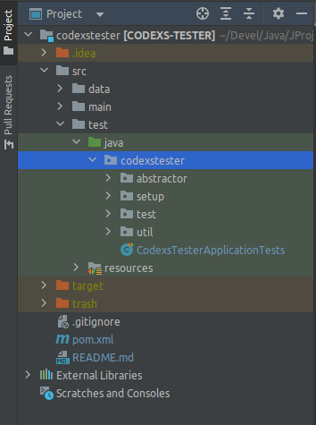
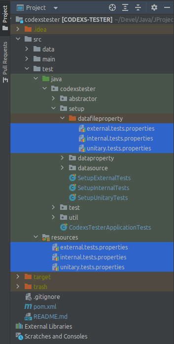
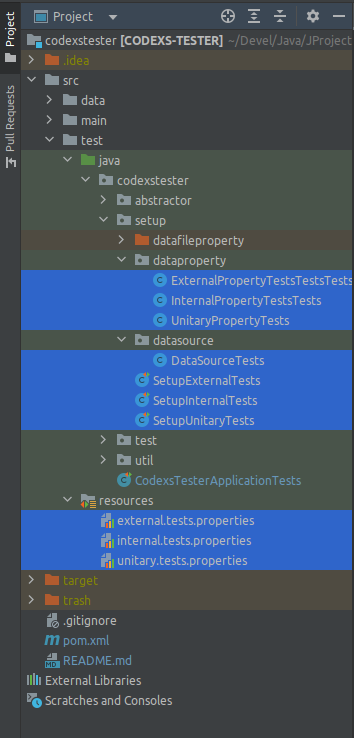
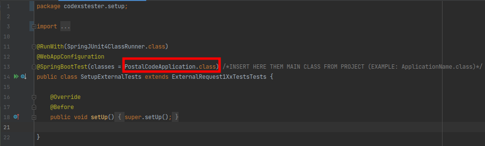
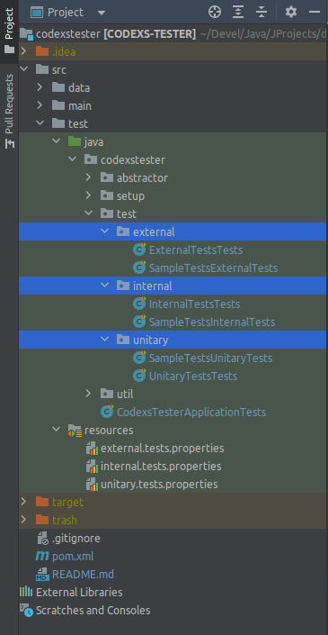
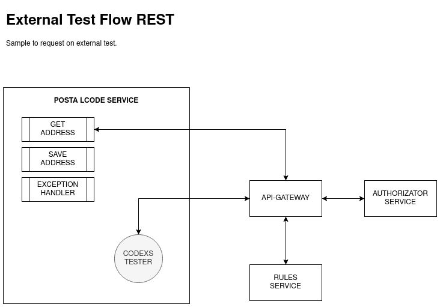
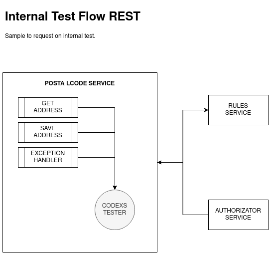

# Codex Tester
A complete workspace for unit and integration testing in your project

# License

This project is free and can be used as a basis for other projects by anyone under the MIT license.

# Languages

- Language: <a href="README.md">Portuguese Brazil (pt-br)</a> | English

# Pre Requirements

- MVC Concept
- Maven Project 4.0.0
- Spring Boot 2.0.1.RELEASE
- Java Version 1.8 (jdk1.8.0_212)

> see more details in the pom.xml file of this project

# About http status codes

This project offers all http codes for REST request handling, for more details on the Status Code in
requests see: https://developer.mozilla.org/pt-BR/docs/Web/HTTP/Status

# How to use

- Dependencies

First, import the following dependencies into your project's pom.xml file:

<pre>
		&lt;dependency&gt;
			&lt;groupId>org.springframework.boot&lt;/groupId&gt;
			&lt;artifactId>spring-boot-starter-test&lt;/artifactId&gt;
			&lt;scope>test&lt;/scope&gt;
		&lt;/dependency&gt;
		&lt;dependency&gt;
			&lt;groupId>io.projectreactor&lt;/groupId&gt;
			&lt;artifactId>reactor-test&lt;/artifactId&gt;
			&lt;scope>test&lt;/scope&gt;
		&lt;/dependency&gt;
		&lt;dependency&gt;
			&lt;groupId>org.springframework.restdocs&lt;/groupId&gt;
			&lt;artifactId>spring-restdocs-mockmvc&lt;/artifactId&gt;
			&lt;scope>test&lt;/scope&gt;
		&lt;/dependency&gt;
		&lt;dependency&gt;
			&lt;groupId>io.rest-assured&lt;/groupId&gt;
			&lt;artifactId>spring-mock-mvc&lt;/artifactId&gt;
			&lt;scope>test&lt;/scope&gt;
		&lt;/dependency&gt;
		&lt;dependency&gt;
			&lt;groupId>junit&lt;/groupId&gt;
			&lt;artifactId>junit&lt;/artifactId&gt;
			&lt;scope>test&lt;/scope&gt;
		&lt;/dependency&gt;
</pre>

- Configuração

> O procedimento de configuração pode ser resumido nos seguintes passos:

<pre>
cd {PROJECT_ROOT_PATH}/src/test/java
git clone https://github.com/huntercodexs/codexstester.git
cd codexstester
git checkout release
</pre>

NOTA: ***Caso o procedimento pelo GIT não funcione, siga as instruções abaixo***

After importing the dependencies in your project, check if the folder (package) "test" already exists in your project, if not
exists create this package in the following path:

<pre>
     {PROJECT_ROOT_PATH}/src/test
</pre>

Inside the "test" path created, make sure that the "java" and "resources" folders exist, as shown in the image below:

Then in the project where the tests will be executed copy the folder (package) "codexstester" into the folder "java"
shown above, and the "codexstester" folder is the same as the one inside this Codexs Tester project

NOTE

> It is recommended to do this with the help of an IDE such as IntelliJ, as this tool is capable of copying all the
> files and folders correctly renaming the "packages" and references within the project, this avoids failures
> and unexpected errors as well as causing a lot of confusion. You can just drag the entire folder into your
> project in the specified path src/test/java

The image below shows how the scenario should look

At this point you need to copy the "properties" files that are inside the path src/test/java/codexstester/setup/datafileproperty
into the src/test/resources path as shown in the image below

These files will be used to perform a part of the test settings, for example the url for requests
and the uri or endpoint of an API.

Now we have the workspace ready to be configured and it should be as shown in the image below, and in this
image it is possible to observe the following setup features:

- path: dataproperty (here are the settings related to the test properties file)
  - file: ExternalPropertyTestsTestsTests
  - file: InternalPropertyTestsTests
  - file: UnitaryPropertyTests
- path: datasource (this is where test data should be inserted, such as expected responses in a request)
  - file: DataSourceTests
- file: SetupExternalTests
- file: SetupInternalTests
- file: SetupUnitaryTests

In the SetupExternalTests, SetupInternalTests and SetupUnitaryTests files you need to change the following line of code

Put the name of the main class of your spring boot project, which in this case is PostalCodeApplication.class, this is the
class that contains the main method of the project called "main".

NOTE

> Be careful when editing the DataSourceTests file as it contains an OAuth2 authentication integration with the
> rest of the Codexs Tester workspace, and in case you need to make a call with this type of authentication
> you will have to use this feature

NOTE

> Be careful with the credentials that will be used in the DataSourceTests file so that they are not exposed
> in inappropriate places.

- Understanding the features of the Codexs Tester workspace

The following is an image where we can see the main files to run the tests, separated by:

- External
- Internal
- Unitary

For each of the tests we have an example file called SampleTestsExternalTests, SampleTestsInternalTests and
SampleTestsUnitaryTests, but they are just examples to speed up the learning process of how tests work.

> About tests of type External

"External" tests are also known as integration tests, they have the ability to run tests
in completely segregated environments and spread over any infrastructure, that is, the main objective
of this test and also its main attraction is being able to execute a test through a call made to a
API GATEAWAY (for example Zuul from Netflix) which redirects calls to a specific resource
within a safe environment.

Below is a graphic demonstration of how this works.

> About tests of the Internal type

Regarding "internal" type tests, they can also be used and called integration tests, that is, it is
It is possible that the test target service may contain a resource integrated with some external environment, as in the case of
POSTAL CODE sample project that makes a REST call through a "client" to an external resource known as
VIA CEP CORREIOS.

However, the tests can be merely internal to the target service of the tests, that is, REST calls to the "endpoints"
contained in the service, which makes it different from unit tests.

The image below illustrates the processing flow for tests of type internal:

> About Unitary type tests

In the case of "unitary" tests, we have the premise that the tests will be done on any unit
contained in a service, that is, we will practically be testing if a method of a class is working correctly,
if an instance is correct or even if the sum of two numbers is being done correctly by any calculation.

To exemplify this scenario, we have the following image, which shows in a simple and summarized way how the tests are performed
unitarios with the Codexs Tester workspace.

# Programming a test with the Codexs Tester workspace

> TIP: All available tests and resources that Codexs Tester offers start with the word codexsTester, being
> so when you start typing in your IDE it will list a huge list of available resources.

> REMINDER: Don't forget that the DataSourceTests.class file is essential in testing and can be used in any
> situation and in any of the three types of Codexs Tester tests. Nor can we forget the files of
> external.tests.properties, internal.tests.properties and unitary.tests.properties properties, which are very
> important in the Codexs Tester workspace.

We will now see situations where the Codexs Tester can be used, being in a sum unit test, an external test for
query an address and an internal test to also query an address.

The tests will be merely illustrative, but they are tests that have already been done and their correct functioning has been verified,
and with these tests it is already possible to understand the working methodology of Codexs Tester.

- Sum (Unitary Tests)

If you open the SampleTestsUnitaryTests.class file you can see that the first test is a simple sum of two numbers,
as shown below:

<pre>
1    @Test
2    public void whenSumAnyNumbersTest() {
3        int result = postalCodeService.sum(1000, 10);
4        codexsTesterAssertInt(result, 1010);
5    }
</pre>

Unit type tests are very simple and don't need much explanation, if necessary, calmly analyze the
sample file SampleTestsUnitaryTests.class and see for yourself how easy it is to use.

> Address Query (External Tests)

To demonstrate a test example of the "external" type, an address query will be performed using a postal code
valid and that can return the code http 200 (Status Code 200 OK).

In the SampleTestsExternalTests.class file there are many examples, but only 2 will be presented, both for the same
use case, one with authentication via OAuth2 and the other without any authentication.

Below is the example test mentioned above:

<pre>
 1    @Test
 2    public void whenAnyOkRequest_WithNoAuth_RetrieveOk_StatusCode200_ByHttpMethodGET() throws Exception {
 3        JSONObject dataRequest = DataSourceTests.dataSourceOkRequest();
 4
 5        HeadersDto headersDto = new HeadersDto();
 6        headersDto.setContentType("application/json;charset=UTF-8");
 7        headersDto.setHttpMethod(HTTP_METHOD_GET);
 8
 9        RequestDto requestDto = new RequestDto();
10        requestDto.setUri(externalProp.getProperty("external.tests.base-uri"));
11        requestDto.setId("");
12        requestDto.setDataRequest(dataRequest.toString());
13        requestDto.setExpectedMessage(null);
14
15        codexsTesterExternal_StatusCode200_RetrieveOK(headersDto, requestDto);
16    }
</pre>

Looking at the test above, it is clear what the purpose of this test is, given its name, which although it is very long
accurately delivers what is being tested. The body of this contains the standard structure used by Codexs Tester to
mount the tests, and this structure is defined by:

- Request data (BODY REQUEST)
- Request header (HEADER REQUEST)
- Codexs Tester method to perform the request (CODEXS TESTER)

It is also possible to observe that there is a line of code (line 3) that makes use of the DataSourceTests.class file which
contains all the data for the tests, whether to test requests, responses or unit values. This data for
request is used further down in the code (line 12) as BODY REQUEST, and this data will be sent for testing
in text format (String).

The HEADER configuration, lines 5, 6 and 7 show that the request will use the http GET method (line 7) and that its
content is application/json (line 6).

Finishing the body of this test on line 15, we effectively call codexsTesterExternal_StatusCode200_RetrieveOK
which in turn also makes it clear what its purpose is, that is: An external test that expects a "200 OK" code like
result, and that it has already been defined that it will be done using the http GET method.

> Address query using OAuth2 as authentication (External Tests)

The test below follows the same principle as the test above, but with additional information, having a defined method for
authentication with OAuth2 (line 4) and who all your credential and url setup once again in the data file
DataSourceTest.class

Note that the instructions that build HEADER are more detailed, containing the authentication method and additional headers,
as well as the http POST method (HTTP_METHOD_POST: line 12).

Finally, the rest of the code doesn't need any comments, as it works the same way as in the test above.

<pre>
 1    @Test
 2    public void whenAnyOkRequest_WithOAuth2_RetrieveOk_StatusCode200_ByHttpMethodPOST() throws Exception {
 3        Oauth2RequestTokenDto oauth2RequestTokenDto = DataSourceTests.dataSourceOAuth2Token();
 4        ResponseEntity&lt;Oauth2ResponseTokenDto&gt; response = codexsTesterExternalOAuth2GetToken(oauth2RequestTokenDto);
 5        JSONObject dataRequest = DataSourceTests.dataSourceOkRequest();
 6
 7        HeadersDto headersDto = new HeadersDto();
 8        headersDto.setAuthorizationBearer(response.getBody().getAccess_token());
 9        headersDto.setContentType("application/json;charset=UTF-8");
10        headersDto.setAddtionalName("Access-Code");
11        headersDto.setAddtionalValue("XYZ-123");
12        headersDto.setHttpMethod(HTTP_METHOD_POST);
13
14        RequestDto requestDto = new RequestDto();
15        requestDto.setUri(externalProp.getProperty("external.tests.base-uri"));
16        requestDto.setId("");
17        requestDto.setDataRequest(dataRequest.toString());
18        requestDto.setExpectedMessage(null);
19
20        codexsTesterExternal_StatusCode200_RetrieveOK(headersDto, requestDto);
21    }
</pre>

> Address Query (Internal Tests)

The difference that a test of the "internal" type has in relation to the "external" type is almost invisible, because the "magic"
occurs in the "backend" of Codexs Tester and not when writing the code. This allows the same concept of code and tests
be used in both situations.

<pre>
 1    @Test
 2    public void whenAnyOkRequest_WithNoAuth_RetrieveOk_StatusCode200_ByHttpMethodPOST() throws Exception {
 3        JSONObject dataRequest = DataSourceTests.dataSourceOkRequest();
 4
 5        HeadersDto headersDto = new HeadersDto();
 6        headersDto.setContentType("application/json;charset=UTF-8");
 7        headersDto.setHttpMethod(HTTP_METHOD_POST);
 8
 9        RequestDto requestDto = new RequestDto();
10        requestDto.setUri(internalProp.getProperty("internal.tests.base-uri"));
11        requestDto.setId("");
12        requestDto.setDataRequest(dataRequest.toString());
13        requestDto.setExpectedMessage(null);
14
15        codexsTesterInternal_StatusCode200_RetrieveOK(headersDto, requestDto);
16    }
</pre>

> Address query using OAuth2 as authentication (Intenal Tests)

<pre>
 1    @Test
 2    public void whenAnyOkRequest_WithOAuth2_RetrieveOk_StatusCode200_ByHttpMethodPOST() throws Exception {
 3        Oauth2RequestTokenDto oauth2RequestTokenDto = DataSourceTests.dataSourceOAuth2Token();
 4        ResponseEntity&lt;Oauth2ResponseTokenDto&gt; response = codexsTesterInternalOAuth2GetToken(oauth2RequestTokenDto);
 5        JSONObject dataRequest = DataSourceTests.dataSourceOkRequest();
 6
 7        HeadersDto headersDto = new HeadersDto();
 8        headersDto.setAuthorizationBasic(response.getBody().getAccess_token());
 9        headersDto.setContentType("application/json;charset=UTF-8");
10        headersDto.setHttpMethod(HTTP_METHOD_POST);
11
12        RequestDto requestDto = new RequestDto();
13        requestDto.setUri(internalProp.getProperty("internal.tests.base-uri"));
14        requestDto.setId("");
15        requestDto.setDataRequest(dataRequest.toString());
16        requestDto.setExpectedMessage(null);
17
18        codexsTesterInternal_StatusCode200_RetrieveOK(headersDto, requestDto);
19    }
</pre>

# Codexs Tester code structure

As already mentioned, the structure of the tests is composed of HEADER, BODY and TESTE, which are detailed below.

> HEADER

The HEADER of requests are defined by using the HeadersDto.class class that contains all the necessary fields for
perform a REST request, these fields being described below:

- contentType
- httpMethod
- statusCode
- crossOrigin
- origin
- hostname
- ip
- osname
- authorizationBasic
- authorizationBearer
- apiKeyToken
- apiKeyAppName
- apiKeySecret
- apiKeyValue
- apiKeyGeneric
- addtionalName
- addtionalValue

The fields above are self-described and do not need further details, however some points need to be clarified.
If you need to use an authentication method such as OAuth2, the authorizationBasic field and authorizationBearer
will be compromised and cannot be used in a call, for example

<pre>
headersDto.setAuthorizationBasic("Basic YXJjaF9kZW1vX2NsaWVudF8xOjExMTExMTExLTIyMjItMzMzMy00NDQ0LTU1NTU1NTU1NTU1NQ==")
</pre>

If you need to send a custom field in HEADER, use the **addtionalName** and **addtionalValue** articles,
what time for purpose to create this specific field, for example:

<pre>
headersDto.setAddtionalName("X-Api-Access-Code");
headersDto.setAddtionalValue("XYZ-123");
</pre>

> BODY

The BODY of a REST request contains the information that must be transmitted to the final resource to be processed.
and used for a specific purpose.

To send this BODY in the request it is necessary to use the RequestDto.class class available in the Codexs workspace
Detailed tester below:

- uri
- id
- dataRequest
- expectedMessage
- expectedCode

See that we can define the URI (uri) where we want to go and that can also be defined in the properties file.

We have the ID (id) that can be used to define a REST request by sending it in the url, that is, a RESTFUL API for example
/api/postal-code/{id} => /api/postal-code/1209000.

The dataRequest field must be used to define the BODY REQUEST of the request, that is, the data to send in the test
must be in that field.

It is still possible to define a string to be compared in the test in the expectedMessage field, for example: "Data Not Found",
if a string is not defined in the expectedMessage field, no comparison will be made.

The expectedCode field should not be used as it will not be considered that way, this field is used in the backend of
Codexs Tester according to the function defined for testing, for example:

codexsTesterInternal_StatusCode200_RetrieveOK = expectedCode = 200 OK

> TESTE

This is the part of the code that actually executes the test, after the correct parameterization of the HEADER and BODY data, the TEST
can be called without any problem.

