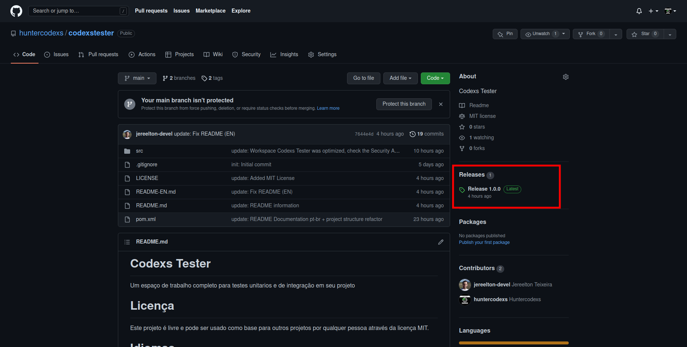
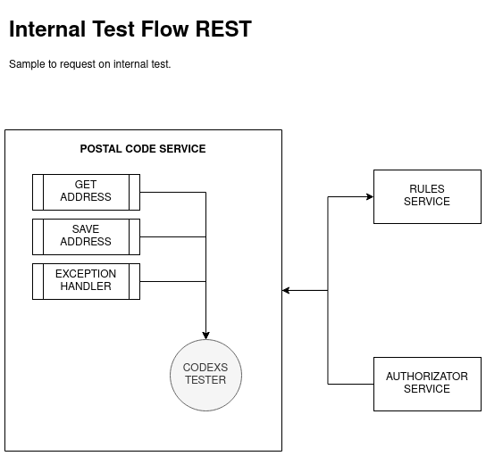
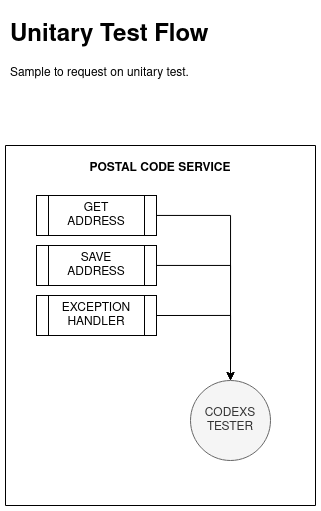

# CODEXS TESTER
Este projeto é um espaço de trabalho completo para escrever testes unitarios e de integração

# Licença

Este projeto é livre e pode ser usado como base para outros projetos por qualquer pessoa através da licença MIT.

# Idiomas

- Language: Portugues Brazil (pt-br)  |  <a href="README-EN.md">Inglês (en)</a>

# Pre Requisitos

- MVC Concept
- Maven Project 4.0.0 
- Spring Boot 2.0.1.RELEASE 
- Java Version 1.8 (jdk1.8.0_212)

> veja mais detalhes no arquivo pom.xml desse projeto

# Código de status HTTP

Esse projeto ofere todos os codigos http para tratamento de requisição REST, para mais detalhes do Status Code em 
requisições. Veja mais detalhes sobre HTTP STATUS CODE emhttps://developer.mozilla.org/pt-BR/docs/Web/HTTP/Status

# Instalação e Configuração

- Depedendencias

Primeiramente import para dentro do arquivo pom.xml de um projeto qualquer as seguintes dependencias:

<pre>
		&lt;dependency&gt;
			&lt;groupId>org.springframework.boot&lt;/groupId&gt;
			&lt;artifactId>spring-boot-starter-test&lt;/artifactId&gt;
			&lt;scope>test&lt;/scope&gt;
		&lt;/dependency&gt;
		&lt;dependency&gt;
			&lt;groupId>io.projectreactor&lt;/groupId&gt;
			&lt;artifactId>reactor-test&lt;/artifactId&gt;
			&lt;scope>test&lt;/scope&gt;
		&lt;/dependency&gt;
		&lt;dependency&gt;
			&lt;groupId>org.springframework.restdocs&lt;/groupId&gt;
			&lt;artifactId>spring-restdocs-mockmvc&lt;/artifactId&gt;
			&lt;scope>test&lt;/scope&gt;
		&lt;/dependency&gt;
		&lt;dependency&gt;
			&lt;groupId>io.rest-assured&lt;/groupId&gt;
			&lt;artifactId>spring-mock-mvc&lt;/artifactId&gt;
			&lt;scope>test&lt;/scope&gt;
		&lt;/dependency&gt;
		&lt;dependency&gt;
			&lt;groupId>junit&lt;/groupId&gt;
			&lt;artifactId>junit&lt;/artifactId&gt;
			&lt;scope>test&lt;/scope&gt;
		&lt;/dependency&gt;
		&lt;dependency&gt;
			&lt;groupId&gt;net.minidev&lt;/groupId&gt;
			&lt;artifactId&gt;json-smart&lt;/artifactId&gt;
			&lt;version&gt;2.3&lt;/version&gt;
			&lt;scope&gt;compile&lt;/scope&gt;
		&lt;/dependency&gt;
</pre>

- Configuração

> O procedimento de configuração pode ser resumido nos seguintes passos:

- usando o comando git clone

<pre>
cd @{PROJECT_ROOT_PATH}/src/test/java
git clone https://github.com/huntercodexs/codexstester.git
cd codexstester
git checkout release-@{RELEASE_VERSION} (exemplo: release-1.0.0) 
rm -rf .git .gitignore
</pre>

Você também pode usar as releases disponiveis no repositorio github desse projeto acessando o link Releases conforme 
ilustrado na imagem abaixo

> NOTA: Escolha sempre a ultima release disponivel no repositorio, pois ela contem todas as atualizações do projeto 
> previamente testadas e que são de grande importância para o desenvolvimento dos testes

Nesse caso o procedimento é, em partes, o mesmo do explicado acima em "git clone", ou seja os arquivos devem estar na 
pasta correta <pre>@{PROJECT_ROOT_PATH}/src/test/java</pre> do projeto consumidor.

***NOTA: Caso os procedimentos acima não funcionem, ou ainda existam dúvidas, siga as instruções abaixo***

Após importar as dependencias em seu projeto, verifique se a pasta (package) "test" existe no projeto, caso ainda não 
exista crie esse package no seguinte path:

<pre>
    @{PROJECT_ROOT_PATH}/src/test
</pre>

Dentro do path "test" criado, certifique-se de que existam as pastas "java" e "resources" conforme imagem abaixo:

Em seguida no projeto onde sera executado os testes copie a pasta (package) "codexstester" para dentro da pasta "java" 
mostrada acima, sendo que a pasta "codexstester" é a mesma que esta dentro do projeto CODEXS TESTER

NOTA

> É recomandável fazer isso com o auxilio de uma IDE como o IntelliJ, pois essa ferramenta é capaz de copiar todos os 
> arquivos e pastas renomeando corretamente os "packages" e referencias dentro do projeto, isso evita que ocorram falhas
> e erros inesperados além de causar muita confusão para um procedimento de refatoramento de codigo. Também é possível 
> apenas arrastar a pasta inteira para dentro do projeto consumidor no path especificado 

<pre>
    @{PROJECT_ROOT_PATH}/src
</pre>

A imagem abaixo mostra como o cenário deve estar

Agora copie os arquivos ".properties" que estão dentro do path src/test/java/codexstester/setup/properties/files 
para dentro do path src/test/resources/@{RESOURCE_NAME} conforme mostrado na imagem abaixo

> IMPORTANTE: Veja que foram criadas duas pastas denrto do path src/test/resources separando os testes para recursos contidos 
> dentro do serviço/aplicação que esta consumindo o CODEXS TESTER, no caso um recurso chamada postalcode e um outro 
> recurso chamado sample. Essa configuração não é obrigatória, mas auxilia na organização do espaço de trabalho de 
> testes e do projeto em geral, mantendo os códigos e arquivos separados por suas finalidades.

Esses arquivos serão utilizados para realizar uma parte das configurações de testes, por exemplo a url para requisições 
e a uri ou endpoint de uma API, assim como HEADERS HTTP e parametros adicionais.

Nesse momento temos o espaço de trabalho pronto para ser configurado devendo estar conforme a imagem abaixo, sendo 
possivel observar os seguintes recursos de setup:

- path: src/test/java/codexstester/setup/advanced
  - file: [AdvancedSetupTests.java](src/test/java/codexstester/setup/advanced/AdvancedSetupTests.java)
- path: src/test/java/codexstester/setup/bridge
  - [ExternalSampleBridgeTests.java](src/test/java/codexstester/setup/bridge/ExternalSampleBridgeTests.java)
  - [InternalSampleBridgeTests.java](src/test/java/codexstester/setup/bridge/InternalSampleBridgeTests.java)
  - [UnitarySampleBridgeTests.java](src/test/java/codexstester/setup/bridge/UnitarySampleBridgeTests.java)
- path: src/test/java/codexstester/setup/datasource
  - file: [DataSourceSampleTests.java](src/test/java/codexstester/setup/datasource/DataSourceSampleTests.java)
- path: src/test/java/codexstester/setup/properties
  - file: [FilePropertiesSourceTests.java](src/test/java/codexstester/setup/properties/FilePropertiesSourceTests.java)
- path: src/test/java/codexstester/setup/properties/file
  - [external.tests.properties](src/test/java/codexstester/setup/properties/files/external.tests.properties)
  - [internal.tests.properties](src/test/java/codexstester/setup/properties/files/internal.tests.properties)
  - [unitary.tests.properties](src/test/java/codexstester/setup/properties/files/unitary.tests.properties)
- path: src/test/java/codexstester/setup/security
  - [SecuritySourceTests.java](src/test/java/codexstester/setup/security/SecuritySourceTests.java)
- path: src/test/resources/sample
  - [external.tests.properties](src/test/resources/sample/external.tests.properties)
  - [internal.tests.properties](src/test/resources/sample/internal.tests.properties)
  - [unitary.tests.properties](src/test/resources/sample/unitary.tests.properties)

- AdvancedSetupTests.java

Iniciando pelo primeiro arquivo de lista, temos o arquivo java AdvancedSetupTests. Esse arquivo tem como finalidade 
servir aos testes de maneira restrita e avançada para comparação de dados, valores e tipos de dados. Sendo assim, caso 
seja necessario uma apuração mais profunda e assertiva nos testes, deve-se usar esse arquivo para programas essas 
informações. Ele ja vem com uma série de dados prontos para exemplificar seu uso, porém seu uso sera explicado com mais 
detalhes na sessão de convenções e padronização dos testes nesse mesmo documento.

- ExternalSampleBridgeTests.java
- InternalSampleBridgeTests.java
- UnitarySampleBridgeTests.java

Continuando com os arquivos da lista acima, temos os arquivo java de BRIDGE, que tem como finalidade criar um link 
entre os arquivos de testes e o CORE do CODEXS TESTER

Coloque o nome da classe principal do seu projeto spring boot, que nesse caso é SampleApplication.java, essa é a 
classe que contem o metodo principal do projeto chamado "main", é possível que o projeto tenha mais de uma classe 
principal (main) e o CODEXS TESTER oferece suporte a isso conforme será mostrado na sessão de convenções de testes.

- DataSourceSampleTests.java

Esse é o arquivo que devera ser usado como base de dados para os testes, nele será definido todo o escopo de testes 
dados esperados, dados para comparações e etc. O formato e os dados a serem escritos nesse arquivo, são livres, e podem 
ser escritos da maneira mais conveninte possível ao desenvolvedor.

- FilePropertiesSourceTests.java

Esse é o arquivo mais simples de todos dentro do espaço de trabalho CODEXS TESTER, sendo necessário apenas uma configuração 
conforme imagem a seguir:

Veja que existe apenas um atributo chamado targetTests o qual deve ser configurado de acordo com a necessidade do projeto, 
porém essa configuração será melhor explicada na sessão de convenções e padrões de testes. 

- external.tests.properties
- internal.tests.properties
- unitary.tests.properties

Esses são os arquivo ".properties" que devem ser usados durante os testes, porém eles precisam ser copiados para dentro 
do path resources/sample, conforme mencionado anteriormente. Esses arquivos de propriedades possuem uma série de campos 
úteis para os testes, como HEADERS HTTP, API-KEY, QUERY-PARAMETERS entre outros, e eles serão procurados no path citado 
durante a execução de um teste qualquer.

- SecuritySourceTests.java

É nesse arquivo que os dados de acesso estão disponiveis, por exemplo, credenciais para uma autenticação via OAuth2, por 
isso tenha muito cuidado ao editar esse arquivo.

NOTA

> Tenha cuidado com as credenciais que serão utilizadas no arquivo SecuritySourceTests para que elas não fiquem
> expostas em locais inapropriados.

- Entendendo os recurso do espaco de trabalho CODEXS TESTER

A seguir temos uma imagem onde podemos ver os principais arquivos para executar os testes, sendo eles separados por:

- external
- internal
- unitary

Para cada um dos testes temos um arquivo de exemplo chamado ExternalSampleTests, InternalSampleTests e
UnitaySampleTests, porém são apenas exemplos para agilizar o processo de aprendizado sobre o funcionamento dos testes 
com o usdo do CODEXS TESTER.

> Sobre testes do tipo "external"

Os testes do tipo "external" são também conhecidos como testes de integração, eles tem a capacidade de executar testes 
em ambientes completamente segregados e "espalhados" por uma infra estrutura qualquer, ou seja, o principal objetivo 
desse teste e também sua principal atratividade esta no fato de ser possível executar um teste completo em uma infra 
estrutura qualquer através de uma chamada feita para uma central ou roteador de requisições como no caso de usos com um 
API GATEAWAY (por exemplo o Zuul da Netflix) o qual faz o redirecionamento das chamadas para um recurso especifico 
dentro de um ambiente seguro e controlado.

Abaixo temos uma demonstração grafica de como isso funciona

> Sobre testes do tipo "internal"

Com relação ao testes do tipo "internal", assim como no tipo "exrternal" eles também podem ser usado e chamados de testes 
de integração, ou seja, é possivel que o serviço alvo de teste possa conter um recurso integrado com algum ambiente externo, 
como no caso do projeto de exemplo POSTAL CODE (contido nesse projeto) que faz uma chamada REST através de um HTTP-CLIENT 
para um recurso externo conhecido como VIA CEP CORREIOS.

Entretanto os testes podem ser meramente internos ao serviço ou projeto consumidor do CODEXS TESTER, ou seja, as chamadas 
REST para os "endpoints" contidos no serviço, o que o torna diferente dos testes unitarios.

A imagem abaixo ilustra o fluxo de processamento para testes do tipo internal:

> Sobre testes do tipo "unitary"

Já no caso dos testes do tipo "unitary" temos a premissa de que os testes serão feitos em cima de uma unidade qualquer 
contida em um serviço ou projeto, ou seja, praticamente estaremos testando se um metodo de uma classe esta funcionando 
corretamente, se uma instância esta correta ou mesmo se a soma de dois numeros esta sendo feita corretamente por um 
calculo qualquer.

Para exemplificar esse cenário temos a imagem a seguir, que mostra de forma simples e resumida como são feitos os testes 
unitarios com o espaço de trabalho CODEXS TESTER.

Essas foram as informações sobre o path de configuração codexstester/setup e o path de testes codexstester/test, sendo 
que eles serão detalhados na sessão de convenções e padrões de testes do CODEXS TESTER.

# Estrutura de código CODEXS TESTER

Como já mencionado, a estrutura dos testes é composta por HEADER, BODY e TESTE, sendo elas detalhadas a seguir

> HEADER

A HEADER da requsições são definidas pelo uso da classe HeadersDto.java que contem todos os campos necessários para
realizar uma requisição REST, sendo esse campos descritos abaixo:

- contentType
- httpMethod
- statusCode
- crossOrigin
- origin
- hostname
- ip
- osname
- authorizationBasic
- authorizationBearer
- apiKeyToken
- apiKeyAppName
- apiKeySecret
- apiKeyValue
- apiKeyGeneric
- addtionalName
- addtionalValue
- bodyParameters

Os campos acima são auto descritos e não precisam de mais detalhes, entretando alguns pontos precisam ser esclarecidos.
Caso seja necessário usar um metodo de autenticação como o OAuth2, o campo authorizationBasic e authorizationBearer
estarão comprometidos não podendo ser utilizados em uma chamada, por exemplo

<pre>
headersDto.setAuthorizationBasic("Basic YXJjaF9kZW1vX2NsaWVudF8xOjExMTExMTExLTIyMjItMzMzMy00NDQ0LTU1NTU1NTU1NTU1NQ==")
</pre>

Se for necessário enviar algum campo personalizado na HEADER use os artibutos **addtionalName** e **addtionalValue**,
que tempo por finalidade criar esse campo especifico, por exemplo:

<pre>
headersDto.setAddtionalName("X-Api-Access-Code");
headersDto.setAddtionalValue("XYZ-123");
</pre>

***IMPORTANTE: Use o arquivo de propriedades para definir as headers adicionais de requisição, sendo permitido até cinco
headers adicionais***

> BODY

O BODY de uma requisição REST contem as informações que devem ser transmitidas até o recurso final para serem processadas
e usadas com um propósito especifico.

Para enviar esse BODY na requisição é preciso usar a classe RequestDto.java disponivel no espaço de trabalho do Codexs
Tester detalhada a seguir:

- uri
- id
- dataRequest
- expectedMessage
- expectedCode

Veja que temos como definir a URI (uri) onde queremos chegar e que também pode ser definida no arquivo de propriedades.

Temos o ID (id) que pode ser usado para definir uma requisição REST enviando na url, ou seja uma API RESTFUL por exemplo
/api/postal-code/{id} => /api/postal-code/1209000.

O campo dataRequest deve ser usado para definir o BODY REQUEST da requisição, ou seja, os dados para enviar no teste
devem estar nesse campo.

Ainda é possível definir uma string para ser comparada no teste no campo expectedMessage, por exemplo: "Data Not Found",
se não for definido uma string no campo expectedMessage nenhuma comparaçã será feita.

O campo expectedCode não deve ser usado, pois ele não será considerado dessa forma, esse campo é usado no backend do
CODEXS TESTER de acordo com a função definida para teste, por exemplo:

codexsTesterInternal_StatusCode200_RetrieveOK = expectedCode = 200 OK

> TESTE

Essa é a parte do código que realmente executa o teste, após a correta parametrização dos dados de HEADER e BODY o TESTE
pode ser chamado sem nenhum problema. Os testes disponiveis no espaço de trabalho CODEXS TESTER podem ser listados
iniciando a digitação codexsTester+[Ctrl+Space], em algumas IDEs como o IntelliJ essa funcionalidade é automatica.

# Convenções e Padrões CODEXS TESTER

<h3>1. Configurando um escopo para os testes</h3>

Para definir um escopo de testes é preciso editar o arquivo FilePropertiesSourceTests.java, mas precisamente o atributo
targetTests, sendo que essa configuração faz referencia a uma aplicação ou recurso separado contida dentro do projeto.

A seguir sera mostrado um exemplo completo dessa configuração:

Conforme imagem abaixo, a configuração acima diz que o escopo de trabalho que o CODEXS TESTER deve considerar estara 
localizado em src/test/resources/sample

Com essa configurações dizemos para os testes "external", "internal" ou "unitary" que os detalhes de "requests" como 
HEADERS-HTTP estarão disponiveis em cada arquivo especifico ao modo de teste.

<h3>2. Configurando uma ponte entre os testes e o CORE do CODEXS TESTER</h3>

Essa configuração é a mais importante e deve ser feita com atenção e entendimento correto do seu funcionamento, uma vez 
que ela diz ao CODEXS TESTER qual será a aplicação a ser testada. Imagine que existam duas aplicações em um mesmo projeto, 
o que dificilmente ocorrerá com um projeto orientado a micro serviço, SampleApplication e PostalCodeApplication, dessa 
forma será necessário informar ao CODEXS TESTER qual será a aplicação a ser testada, conforme mostrado na imagem abaixo:

> Veja que existem dois arquivos diferentes, uma para a aplicação SampleApplication e outro para a aplição 
PostalCodeApplication

Agora veja como esta o projeto alvo de testes

Não é necessário alterar mais nada nesse arquivo, entretanto como um projeto de código aberto e livre para ser alterado, 
é possível acrescentar outros códigos se necessário, porém tenha cautela porque o CODEXS TESTER pode parar de funcionar.

<h3>3. Configurando um datasoruce</h3>

Essa etapa não é mandatória, mas como ja mecionado, ajuda a manter organizado o ambiente de teste e a codificação do 
projeto. Para definir um datasource crie um arquivo no path codexstester/setup/datasource com o nome especifico de sua 
finalidade, por exemplo: DataSourceSampleTests.java ou DataSourcePostalCodeTests.java.

Esse arquivo deve conter dados e informações para os diferentes tipo de testes que deverão ser executados no projeto 
consumidor do CODEXS TESTER. A classe DataSourceSampleTests definida no arquivo DataSourceSampleTests.java devera ser 
extendida no arquivo de tester referente, conforme mostrado abaixo:

Um exemplo de código no datasource pode ser visto no código abaixo

Repare que existem dois metodos que retornam um objeto JSON que serão utilizados nos testes como dados para enviar na 
requisição, conforme será mostrado mais adiante. Também é possível observar atributos definidos para uso nos arquivos de 
testes caso seja util. Esse arquivo é livre em sua preparação e programação, apenas tenha o cuidado com o entendimento 
do mesmo.

<h3>4. Configurações de segurança</h3>

As configurações de segurança devem estar contidas no arquivo SecuritySourceTests.java localizado no path do CODEXS TESTER 
codexstester/setup/security, sendo essas configurações referentes a dados de acesso e autorização OAuth2 .

Conforme ja mencionado nesse documento essas configurações devem ser feitas com muita responsabilidade, pois são dados 
sensiveis de acesso. É altamente recomendado que não se utilize dados de acesso a ambientes de produção ou até mesmo de 
homologação, ainda assim não exponha os dados, mesmo que de ambientes de desenvolvimento ou testes para pessoas não 
autorizados. A seguir temos uma imagem para ilustrar esse assunto:

<h3>5. Configurações avançadas</h3>

> NOTA: Não é necessário importar nenhum arquivo para dentro do arquivo de testes, pois isso já é feito pelo arquivo
> de bridge mencionado mais acima nesse documento.

As configurações avançadas para testes devem ser feitas no arquivo AdvancedSetupTests.java o qual tem a finalidade de 
oferecer um ambiente mais organizado e otimizado para realizar testes em larga escala e com alta precisão. Os testes 
avançados do CODEXS TESTER consistem em verificar se um dado qualer possui as seguintes caracteristicas:

- Nome ou identificação de uma chave ou campo 

Para nome ou identificação de uma chave ou campo em um teste, devem ser usados daodos em formato String, por exemplo: 
"name", "age", "address", "data" e etc.

- Tipo de dados

Para definição de tipo de dados, devem ser informados os formatos para cada campo em um determinado teste, devendo ser 
utilizado o formato @{DATA-TYPED}.java, veja mais detalhes nos exemplos abaixo.

- Valor esperado

O campo valor esperado deve ser usado para também testar o conteudo de um dado, sendo ele em formato fixo e definido no 
CODEXS TESTER como String.

- Modo Rigoroso

O modo rigoroso STRICT-MODE também esta disponivel para aplicação nos testes, ele deve ser utilizado quando existe a 
necessidade em fazer um teste com uma precisão mais alta, pois quando ele esta ativo (true), todos os dados como, nome 
de um campo ou chave de um campo, tipo do campo e valor do campo serão testados e validados.

Os testes avançados CODEXS TESTER estão limitados a oito tipos de dados considerados essenciais em JAVA, sendo eles:

<pre>
- String
- JSON
- DTO
- HashMap
- ArrayList
- LinkedList
- List
- LinkedHashMap
</pre>

Entretando o formato dos campos presentes nas estruturas de dados são livres e independentes, podendo ser utilizadas 
de acordo com a necessidade do programador.

Abaixo segue um exemplo de como implementar um teste avançado CODEXS TESTER utilizando o tipo de dados JSON

- Configuração para uma resposta JSON com varios tipos de dados no seu conteudo

- Configuração do teste responsavel pelo uso das configurações acima

Repare que existe um definição para testar as respostas dentro do arquivo AdvancedSetupTests.java, e uma simulação de 
resposta dentro do teste whenJsonFormatTypedTests(), sendo que o formato esperado para esse teste é o JSON, conforme o 
proprio nome do teste sugere codexsTesterCompareJsonFormat();

Os testes avançados disponiveis no CODEXS TESTER são:

- codexsTesterCompareJsonFormat
- codexsTesterCompareDtoFormat
- codexsTesterCompareHashMapFormat
- codexsTesterCompareArrayListFormat
- codexsTesterCompareLinkedListFormat
- codexsTesterCompareListFormat
- codexsTesterCompareLinkedHashMapFormat

Cada um dos testes acima correspondem a um determinado tipo de teste conforme o próprio nome do teste, isso facilita o 
entendimento e uso de cada estrutura do tipo de dados.

> IMPORTANTE: Não confunda as configurações avançadas contidas no arquivo AdvancedSetupTests.java com as configurações
> contidas no arquivo DataSourcesSampleTests.java, pois esse ultimo apenas serve como base de dados para os testes e
> o primeiro serve para definir os tipos de dados e valores esperados em uma resposta a um teste qualquer, seja ele via
> REST ou seja ele por meio de uma chamada interna.

<h3>6. Detalhes sobre o CODEXS TESTER</h3>

- Fluxo resumido para um teste programado com o CODEXS TESTER

Apenas a titulo de exemplificar com maior detalhes o motor do espaço de trabalho CODEXS TESTER, vemos na figura abaixo
a relação entres os recursos do sistema e do projeto consumidor. Repare o longo caminho que um simples teste pode fazer
para executar as instruções corretamente e completamente, entretanto todo esse ambiente otimiza em quase 90% o trabalho
do programador em desenvolver um teste complexo do zero.

- Fluxo completo para um teste programado com o CODEXS TESTER

# Programando testes com no espaço de trabalho CODEXS TESTER

> DICA: Todos os testes e recursos disponiveis que o CODEXS TESTER oferece começam com a palavra codexsTester, sendo
> assim, quando for digitado codexsTester no editor/IDE poderá ser listado uma imensa lista de recursos disponíveis no
> CODEXS TESTER, por exemplo: codexsTesterAssertionBool().

> LEMBRETE: Não se esqueça que o arquivo DataSourceSampleTests.java é essencial nos testes e pode ser usado em qualquer
> situação e em qualquer um dos trẽs tipos de testes do CODEXS TESTER. Também não podemos esquecer os arquivos de
> propriedades external.tests.properties, internal.tests.properties e unitary.tests.properties, que são recursos muito
> importantes no espaço de trabalho CODEXS TESTER.

Veremos agora situações onde o CODEXS TESTER pode ser usado, sendo em um teste unitario de soma, um teste externo para 
consultar um endereço residencial e um teste interno para também consultar um endereço residencial.

Os testes serão meramente ilustrativos, porém são testes que ja foram feito e verificados seu correto funcionamento, 
e com esses testes já é possível entender a metodologia de trabalho do CODEXS TESTER.

- Teste:  Soma (Unitary Tests)

Se você abrir o arquivo UnitarySampleTests.java poderá ver que o primeiro teste é uma soma simples de dois numeros, 
conforme mostrado abaixo:

<pre>
    @Test
    public void whenSumAnyNumbersTest() {
        int result = DataSourceSampleTests.dataSourceSampleSum(1000, 10);
        codexsTesterAssertInt(result, 1010);
    }
</pre>

Os testes do tipo unitário são bem simples e não necessitam de muita explicação, caso seja necessário analise com calma o 
arquivo de exemplos SampleTestsUnitaryTests.java e veja por si mesmo que é muito facil de utilizar.

- Teste: Consulta Endereço (External Tests)

Para demonstrar um exemplo de teste do tipo "external" sera realizada uma consulta de endereço usando um codigo postal 
valido e que possa ter como retorno o codigo http 200 (Status Code 200 OK).

No arquivo ExternalSampleTests.java existem muitos exemplos, porém será apresentado apenas 2, ambos para o mesmo 
caso de uso, sendo um com autenticação via OAuth2 e outro sem nenhuma autenticação.

Abaixo esta o teste de exemplo mancionado acima:

<pre>
    @Test
    public void whenAnyOkRequest_WithNoAuth_RetrieveOk_StatusCode200_ByHttpMethodPOST() throws Exception {
        JSONObject dataRequest = DataSourcePostalCodeTests.dataSourceOkRequest();

        HeadersDto headersDto = new HeadersDto();
        headersDto.setContentType(MediaType.APPLICATION_JSON_VALUE);
        headersDto.setHttpMethod(HTTP_METHOD_POST);

        RequestDto requestDto = new RequestDto();
        requestDto.setUri(externalProps.getProperty("external.tests.base-uri"));
        requestDto.setId("");
        requestDto.setDataRequest(dataRequest.toString());
        requestDto.setExpectedMessage(null);

        codexsTesterExternal_StatusCode200_RetrieveOK(headersDto, requestDto);
    }
</pre>

Olhando para o teste acima é visivel qual a finalidade desse teste, tendo em vista seu nome que embora seja muito longo 
oferece com precisão o que esta sendo testado. O corpo desse contem a estrutura padrão utilizada pelo CODEXS TESTER para 
monstar os testes, e essa estrutura é definida por:

- Dados da requisição (BODY REQUEST)
- Header da requisição (HEADER REQUEST)
- Metodo CODEXS TESTER para realizar a requisição (CODEXS TESTER)

Também é possivel observar que existe uma linha de código que faz uso do arquivo DataSourcePostalCodeTests.java o qual 
contem todos os dados para os testes, seja para testar requisições, respostas ou valores unitarios. Esse dado para 
requisição é usado mais abaixo no código como BODY REQUEST, sendo que esse dado sera enviado para testes no formato de 
texto (String).

A configuração da HEADER mostram que a requisição usara o metodo http GET (linha 7) e que seu tipo de conteudo é 
application/json.

Finalizando o corpo desse teste temos efetivamente a chamada codexsTesterExternal_StatusCode200_RetrieveOK 
que por sua vez também deixa claro qual a sua finalidade, ou seja: Um teste externo que espera um codigo "200 OK" como 
resultado, e que já foi definido que sera feito com o uso do metodo http POST.

- Teste: Consulta Endereço usando OAuth2 como autenticação (External Tests)

O teste abaixo segue o mesmo principio do teste acima, porém com informações adicionais, tendo um metodo definido para 
autenticação com OAuth2 e que toda a sua configuração de credenciais e url contida no arquivo de dados SecuritySourceTests.java

Note que as instruções que montam o HEADER são mais detalhadas, contendo o metodo de autenticação e headers adicionais, 
assim como o metodo http POST (HTTP_METHOD_POST).

Por fim o restante do código dispensa comentarios, pois tem o mesmo funcionamento dito anteriormente no teste acima.

<pre>
    @Test
    public void whenAnyOkRequest_WithOAuth2_RetrieveOk_StatusCode200_ByHttpMethodPOST() throws Exception {
        Oauth2RequestTokenDto oauth2RequestTokenDto = codexsTesterSecurityOAuth2Token();
        ResponseEntity&lt;Oauth2ResponseTokenDto&gt; response = codexsTesterExternalOAuth2GetToken(oauth2RequestTokenDto);
        JSONObject dataRequest = DataSourcePostalCodeTests.dataSourceOkRequest();

        HeadersDto headersDto = new HeadersDto();
        headersDto.setAuthorizationBearer(response.getBody().getAccess_token());
        headersDto.setContentType(MediaType.APPLICATION_JSON_VALUE);
        headersDto.setAdditionalName("Access-Code");
        headersDto.setAdditionalValue("XYZ-123");
        headersDto.setHttpMethod(HTTP_METHOD_POST);

        RequestDto requestDto = new RequestDto();
        requestDto.setUri(externalProps.getProperty("external.tests.base-uri"));
        requestDto.setId("");
        requestDto.setDataRequest(dataRequest.toString());
        requestDto.setExpectedMessage(null);

        codexsTesterExternal_StatusCode200_RetrieveOK(headersDto, requestDto);
    }
</pre>

- Teste: Consulta Endereço (Intenal Tests)

A diferença que um teste do tipo "internal" possui com relação ao tipo "external" é quase que invisivel, pois a "mágica" 
ocorre no "backend" do CODEXS TESTER e não na escrita do código. Isso permite que um mesmo conceito de código e testes 
seja usado em ambas situações.

<pre>
    @Test
    public void whenAnyOkRequest_WithNoAuth_RetrieveOk_StatusCode200_ByHttpMethodPOST() throws Exception {
        JSONObject dataRequest = DataSourcePostalCodeTests.dataSourceOkRequest();

        HeadersDto headersDto = new HeadersDto();
        headersDto.setContentType(MediaType.APPLICATION_JSON_VALUE);
        headersDto.setHttpMethod(HTTP_METHOD_POST);

        RequestDto requestDto = new RequestDto();
        requestDto.setUri(internalProps.getProperty("internal.tests.base-uri"));
        requestDto.setId("");
        requestDto.setDataRequest(dataRequest.toString());
        requestDto.setExpectedMessage(null);

        codexsTesterInternal_StatusCode200_RetrieveOK(headersDto, requestDto);
    }
</pre>

- Teste: Consulta Endereço usando OAuth2 como autenticação (Intenal Tests)

<pre>
    @Test
    public void whenAnyOkRequest_WithOAuth2_RetrieveOk_StatusCode200_ByHttpMethodPOST() throws Exception {
        Oauth2RequestTokenDto oauth2RequestTokenDto = codexsTesterSecurityOAuth2Token();
        ResponseEntity&lt;Oauth2ResponseTokenDto&gt; response = codexsTesterInternalOAuth2GetToken(oauth2RequestTokenDto);
        JSONObject dataRequest = DataSourcePostalCodeTests.dataSourceOkRequest();

        HeadersDto headersDto = new HeadersDto();
        headersDto.setAuthorizationBasic(response.getBody().getAccess_token());
        headersDto.setContentType(MediaType.APPLICATION_JSON_VALUE);
        headersDto.setHttpMethod(HTTP_METHOD_POST);

        RequestDto requestDto = new RequestDto();
        requestDto.setUri(internalProps.getProperty("internal.tests.base-uri"));
        requestDto.setId("");
        requestDto.setDataRequest(dataRequest.toString());
        requestDto.setExpectedMessage(null);

        codexsTesterInternal_StatusCode200_RetrieveOK(headersDto, requestDto);
    }
</pre>

- Teste: Teste Avançado

Conforme mencionado anteriormente os testes avançados possuem um grau de assertividade mais alto do que os convencionais, 
entretanto ainda não foi mostrado como realizar um teste completo utilizando o CODEXS TESTER com os recursos avançados.

Um teste avançado no espaço de trabalho CODEXS TESTER nada mais é do que asseguran que o resultado de um teste seja 
exatamente o esperado, conforme mostrado a seguir:

