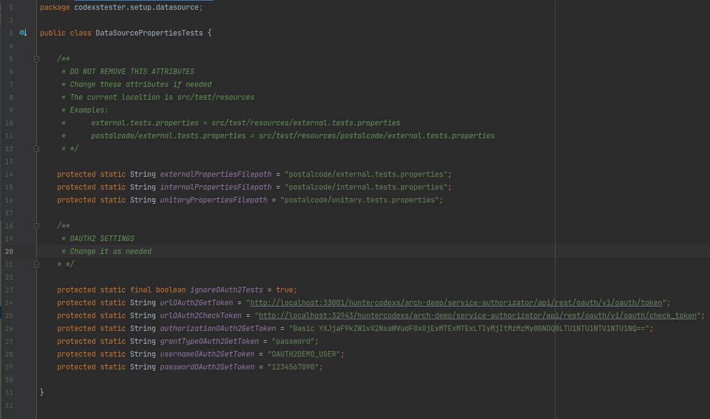

# Codexs Tester
Um espaço de trabalho completo para testes unitarios e de integração em seu projeto

# Licença

Este projeto é livre e pode ser usado como base para outros projetos por qualquer pessoa através da licença MIT.

# Idiomas

- Language: Portugues Brazil (pt-br)  |  <a href="README-EN.md">Inglês (en)</a>

# Pre Requisitos

- MVC Concept
- Maven Project 4.0.0 
- Spring Boot 2.0.1.RELEASE 
- Java Version 1.8 (jdk1.8.0_212)

> veja mais detalhes no arquivo pom.xml desse projeto

# Sobre os codigos de status http

Esse projeto ofere todos os codigos http para tratamento de requisição REST, para mais detalhes do Status Code em 
requisições veja: https://developer.mozilla.org/pt-BR/docs/Web/HTTP/Status

# Como usar

- Depedendencias

Primeiramente import para dentro do arquivo pom.xml do seu projeto as seguintes dependencias:

<pre>
		&lt;dependency&gt;
			&lt;groupId>org.springframework.boot&lt;/groupId&gt;
			&lt;artifactId>spring-boot-starter-test&lt;/artifactId&gt;
			&lt;scope>test&lt;/scope&gt;
		&lt;/dependency&gt;
		&lt;dependency&gt;
			&lt;groupId>io.projectreactor&lt;/groupId&gt;
			&lt;artifactId>reactor-test&lt;/artifactId&gt;
			&lt;scope>test&lt;/scope&gt;
		&lt;/dependency&gt;
		&lt;dependency&gt;
			&lt;groupId>org.springframework.restdocs&lt;/groupId&gt;
			&lt;artifactId>spring-restdocs-mockmvc&lt;/artifactId&gt;
			&lt;scope>test&lt;/scope&gt;
		&lt;/dependency&gt;
		&lt;dependency&gt;
			&lt;groupId>io.rest-assured&lt;/groupId&gt;
			&lt;artifactId>spring-mock-mvc&lt;/artifactId&gt;
			&lt;scope>test&lt;/scope&gt;
		&lt;/dependency&gt;
		&lt;dependency&gt;
			&lt;groupId>junit&lt;/groupId&gt;
			&lt;artifactId>junit&lt;/artifactId&gt;
			&lt;scope>test&lt;/scope&gt;
		&lt;/dependency&gt;
</pre>

- Configuração

> O procedimento de configuração pode ser resumido nos seguintes passos:

<pre>
cd {PROJECT_ROOT_PATH}/src/test/java
git clone https://github.com/huntercodexs/codexstester.git
cd codexstester
git checkout release
rm -rf .git .gitignore
</pre>

Você também pode usar as releases disponiveis nesse projeto no github acessando o link Releases conforme imagem a seguir

Nesse caso o procedimento é o mesmo do "git clone", ou seja os arquivos devem estar na pasta correta src/test/java do 
seu projeto.

NOTA: ***Caso os procedimentos acima não funcionem, ou ainda existam dúvidas, siga as instruções abaixo***

Após importar as dependencias em seu projeto, verifique se a pasta (package) "test" já existe em seu projeto, caso não 
exista crie esse package no seguinte path:

<pre>
    {PROJECT_ROOT_PATH}/src/test
</pre>

Dentro do path "test" criado, certifique-se de que existam as pastas "java" e "resources" conforme imagem abaixo:

Em seguida no projeto onde sera executado os testes copie a pasta(package) "codexstester" para dentro da pasta "java" 
mostrada acima, sendo que a pasta "codexstester" é a mesma que esta dentro desse projeto Codexs Tester

NOTA

> É recomandável fazer isso com o auxilio de uma IDE como o IntelliJ, pois essa ferramenta é capaz de copiar todos os 
> arquivos e pastas renomeando corretamente os "packages" e referencias dentro do projeto, isso evita que ocorram falhas
> e erros inesperados além de causar muita confusão. Você pode simplesmente arrastar a pasta inteira para dentro do seu 
> projeto no path especificado src/test/java

A imagem abaixo mostra como o cenário deve estar

Nesse ponto é preciso copiar os arquivos "properties" que estão dentro do path src/test/java/codexstester/setup/datafileproperty 
para dentro do path src/test/resources conforme mostrado na imagem abaixo

Esses arquivos serão utilizados para realizar uma parte das configurações de testes, por exemplo a url para requisições 
e a uri ou endpoint de uma API.

Agora temos o espaço de trabalho pronto para ser configurado devendo estar conforme imagem abaixo, sendo que nessa 
imagem é possivel observar os seguintes recursos de setup:

- path: dataproperty (aqui ficam as configurações relacioadas ao arquivo properties de testes)
  - file: ExternalPropertyTests
  - file: InternalPropertyTests
  - file: UnitaryPropertyTests
- path: datasource (aqui é onde devem ser inseridos os dados de testes, como respostas esperadas em uma requisição)
  - file: DataSourceTests
  - file: DataSourcePropertiesTests
- file: SetupExternalTests 
- file: SetupInternalTests
- file: SetupUnitaryTests

O arquivo DataSourcePropertiesTests tem uma importancia muito grande, tenha atenção ao edita-lo pois caso seja feito 
algo errado os testes podem não funcionar corretamente. Nesse arquivo temos o informação de "path" dos arquivos de 
propriedades de dados ".properties", porém são os arquivos do espacço de trabalho Codexs Testes e não os arquivos 
que pertencem ao projeto a ser testado. A imagem a seguir mostra como é o corpo desse arquivo ".class"

Nos arquivos SetupExternalTests, SetupInternalTests e SetupUnitaryTests é preciso alterar a seguinte linha de código

Coloque o nome da classe principal do seu projeto spring boot, que nesse caso é PostalCodeApplication.class, essa é a 
classe que contem o metodo principal do projeto chamado "main".

NOTA

> Tenha cuidado ao editar o arquivo DataSourcePropertiesTests pois ele contem uma integração de autenticação via 
> OAuth2 com o  resto do espaço de trabalho Codexs Tester, e caso você precisa realizar uma chamada com esse tipo 
> de autenticação tera de usar esse recurso

NOTA 

> Tenha cuidado com as credenciais que serão utilizadas no arquivo DataSourcePropertiesTests para que elas não fiquem 
> expostas em locais inapropriados.

- Entendendo os recurso do espaco de trabalho Codexs Tester

A seguir temos uma imagem onde podemos ver os principais arquivos para executar os testes, sendo eles separados por:

- External
- Internal
- Unitary

Para cada um dos testes temos um arquivo de exemplo chamado SampleTestsExternalTests, SampleTestsInternalTests e
SampleTestsUnitaryTests, porém são apenas exemplos para agilizar no processo de aprendizado de como funcionam os testes.

> Sobre testes do tipo External

Os testes do tipo "external" são também conhecidos como testes de integração, eles tem a capacidade de executar testes 
em ambientes completamente segregados e espalhados por uma infra estrutura qualquer, ou seja, o principal objetivo 
desse teste e também a principal atratividade dele é poder executar um teste através de uma chamada feita para um 
API GATEAWAY (por exemplo o Zuul da Netflix) o qual faz o redirecionamento das chamadas para um recurso especifico 
dentro de um ambiente seguro.

Abaixo temos uma demonstração grafica de como isso funciona

> Sobre testes do tipo Internal

Com relação ao testes do tipo "internal", eles também podem ser usado e chamados de testes de integração, ou seja, é
possivel que o serviço alvo de teste possa conter um recurso integrado com algum ambiente externo, como no caso do
projeto de exemplo POSTAL CODE que faz uma chamada REST através de um "client" para um recurso externo conhecido como
VIA CEP CORREIOS.

Entretanto os testes podem ser meramente internos ao serviço alvo dos testes, ou seja, chamadas REST para os "endpoints"
contidos no serviço, o que o torna diferente dos testes unitarios.

A imagem abaixo ilustra o fluxo de processamento para testes do tipo internal:

> Sobre testes do tipo Unitary

Já no caso dos testes do tipo "unitary" temos a premissa de que os testes serão feitos em cima de uma unidade qualquer 
contida em um serviço, ou seja, praticamente estaremos testando se um metodo de uma classe esta funcionando corretamente,
se uma instância esta correta ou mesmo se a soma de dois numeros esta sendo feita corretamente por um calculo qualquer.

Para exemplificar esse cenário temos a imagem a seguir, que mostra de forma simples e resumida como são feitos os testes 
unitarios com o espaço de trabalho do Codexs Tester.

# Programando um teste com o espaço de trabalho Codexs Tester

> DICA: Todos os testes e recursos disponiveis que o Codexs Tester oferece começam com a palavra codexsTester, sendo 
> assim, quando você iniciar a digitação em sua IDE será listado uma lista imensa de recursos disponiveis.

> LEMBRETE: Não se esqueça que o arquivo DataSourceTests.class é essencial nos testes e pode ser usado em qualquer 
> situação e em qualquer um dos trẽs tipos de testes do Codexs Tester. Também não podemos esquecer os arquivos de 
> propriedades external.tests.properties, internal.tests.properties e unitary.tests.properties, que são recursos muito 
> importantes no espaço de trabalho Codexs Tester.

Veremos agora situações onde o Codexs Tester pode ser usado, sendo em um teste unitario de soma, um teste externo para 
consultar um endereço e um teste interno para também consultar um endereço.

Os testes serão meramente ilustrativos, porém são testes que ja foram feito e verificados seu correto funcionamento, 
e com esses testes já é possível entender a metodologia de trabalho do Codexs Tester.

- Soma (Unitary Tests)

Se você abrir o arquivo SampleTestsUnitaryTests.class poderá ver que o primeiro teste é uma soma simples de dois numeros, 
conforme mostrado abaixo:

<pre>
1    @Test
2    public void whenSumAnyNumbersTest() {
3        int result = postalCodeService.sum(1000, 10);
4        codexsTesterAssertInt(result, 1010);
5    }
</pre>

Os testes do tipo unitário são bem simples e não necessitam de muita explicação, caso seja necessário analise com calma o 
arquivo de exemplos SampleTestsUnitaryTests.class e veja por si mesmo que é muito facil de utilizar.

> Consulta Endereço (External Tests)

Para demonstrar um exemplo de teste do tipo "external" sera realizada uma consulta de endereço usando um codigo postal 
valido e que possa ter como retorno o codigo http 200 (Status Code 200 OK).

No arquivo SampleTestsExternalTests.class existem muitos exemplos, porém será apresentado apenas 2, ambos para o mesmo 
caso de uso, sendo um com autenticação via OAuth2 e outro sem nenhuma autenticação.

Abaixo esta o teste de exemplo mancionado acima:

<pre>
 1    @Test
 2    public void whenAnyOkRequest_WithNoAuth_RetrieveOk_StatusCode200_ByHttpMethodGET() throws Exception {
 3        JSONObject dataRequest = DataSourceTests.dataSourceOkRequest();
 4
 5        HeadersDto headersDto = new HeadersDto();
 6        headersDto.setContentType("application/json;charset=UTF-8");
 7        headersDto.setHttpMethod(HTTP_METHOD_GET);
 8
 9        RequestDto requestDto = new RequestDto();
10        requestDto.setUri(externalProp.getProperty("external.tests.base-uri"));
11        requestDto.setId("");
12        requestDto.setDataRequest(dataRequest.toString());
13        requestDto.setExpectedMessage(null);
14
15        codexsTesterExternal_StatusCode200_RetrieveOK(headersDto, requestDto);
16    }
</pre>

Olhando para o teste acima é visivel qual a finalidade desse teste, tendo em vista seu nome que embora seja muito longo 
oferece com precisão o que esta sendo testado. O corpo desse contem a estrutura padrão utilizada pelo Codexs Tester para 
monstar os testes, e essa estrutura é definida por:

- Dados da requisição (BODY REQUEST)
- Header da requisição (HEADER REQUEST)
- Metodo Codexs Tester para realizar a requisição (CODEXS TESTER)

Também é possivel observar que existe uma linha de código (linha 3) que faz uso do arquivo DataSourceTests.class o qual 
contem todos os dados para os testes, seja para testar requisições, respostas ou valores unitarios. Esse dado para 
requisição é usado mais abaixo no código (linha 12) como BODY REQUEST, sendo que esse dado sera enviado para testes 
no formato de texto (String).

A configuração da HEADER, linhas 5, 6 e 7 mostram que a requisição usara o metodo http GET (linha 7) e que seu tipo de 
conteudo é application/json (linha 6).

Finalizando o corpo desse teste na linha 15 temos efetivamente a chamada codexsTesterExternal_StatusCode200_RetrieveOK 
que por sua vez também deixa claro qual a sua finalidade, ou seja: Um teste externo que espera um codigo "200 OK" como 
resultado, e que já foi definido que sera feito com o uso do metodo http GET.

> Consulta Endereço usando OAuth2 como autenticação (External Tests)

O teste abaixo segue o mesmo principio do teste acima, porém com informações adicionais, tendo um metodo definido para 
autenticação com OAuth2 (linha 4) e quem toda a sua configuração de credenciais e url mais uma vez no arquivo de dados 
DataSourceTest.class

Note que as instruções que montam o HEADER são mais detalhadas, contendo o metodo de autenticação e headers adicionais, 
assim como o metodo http POST (HTTP_METHOD_POST: linha 12).

Por fim o restante do código dispensa comentarios, pois tem o mesmo funcionamento dito anteriormente no teste acima.

<pre>
 1    @Test
 2    public void whenAnyOkRequest_WithOAuth2_RetrieveOk_StatusCode200_ByHttpMethodPOST() throws Exception {
 3        Oauth2RequestTokenDto oauth2RequestTokenDto = DataSourceTests.dataSourceOAuth2Token();
 4        ResponseEntity&lt;Oauth2ResponseTokenDto&gt; response = codexsTesterExternalOAuth2GetToken(oauth2RequestTokenDto);
 5        JSONObject dataRequest = DataSourceTests.dataSourceOkRequest();
 6
 7        HeadersDto headersDto = new HeadersDto();
 8        headersDto.setAuthorizationBearer(response.getBody().getAccess_token());
 9        headersDto.setContentType("application/json;charset=UTF-8");
10        headersDto.setAddtionalName("Access-Code");
11        headersDto.setAddtionalValue("XYZ-123");
12        headersDto.setHttpMethod(HTTP_METHOD_POST);
13
14        RequestDto requestDto = new RequestDto();
15        requestDto.setUri(externalProp.getProperty("external.tests.base-uri"));
16        requestDto.setId("");
17        requestDto.setDataRequest(dataRequest.toString());
18        requestDto.setExpectedMessage(null);
19
20        codexsTesterExternal_StatusCode200_RetrieveOK(headersDto, requestDto);
21    }
</pre>

> Consulta Endereço (Intenal Tests)

A diferença que um teste do tipo "internal" possui com relação ao tipo "external" é quase que invisivel, pois a "mágica" 
ocorre no "backend" do Codexs Tester e não na escrita do código. Isso permite que um mesmo conceito de código e testes 
seja usado em ambas situações.

<pre>
 1    @Test
 2    public void whenAnyOkRequest_WithNoAuth_RetrieveOk_StatusCode200_ByHttpMethodPOST() throws Exception {
 3        JSONObject dataRequest = DataSourceTests.dataSourceOkRequest();
 4
 5        HeadersDto headersDto = new HeadersDto();
 6        headersDto.setContentType("application/json;charset=UTF-8");
 7        headersDto.setHttpMethod(HTTP_METHOD_POST);
 8
 9        RequestDto requestDto = new RequestDto();
10        requestDto.setUri(internalProp.getProperty("internal.tests.base-uri"));
11        requestDto.setId("");
12        requestDto.setDataRequest(dataRequest.toString());
13        requestDto.setExpectedMessage(null);
14
15        codexsTesterInternal_StatusCode200_RetrieveOK(headersDto, requestDto);
16    }
</pre>

> Consulta Endereço usando OAuth2 como autenticação (Intenal Tests)

<pre>
 1    @Test
 2    public void whenAnyOkRequest_WithOAuth2_RetrieveOk_StatusCode200_ByHttpMethodPOST() throws Exception {
 3        Oauth2RequestTokenDto oauth2RequestTokenDto = DataSourceTests.dataSourceOAuth2Token();
 4        ResponseEntity&lt;Oauth2ResponseTokenDto&gt; response = codexsTesterInternalOAuth2GetToken(oauth2RequestTokenDto);
 5        JSONObject dataRequest = DataSourceTests.dataSourceOkRequest();
 6
 7        HeadersDto headersDto = new HeadersDto();
 8        headersDto.setAuthorizationBasic(response.getBody().getAccess_token());
 9        headersDto.setContentType("application/json;charset=UTF-8");
10        headersDto.setHttpMethod(HTTP_METHOD_POST);
11
12        RequestDto requestDto = new RequestDto();
13        requestDto.setUri(internalProp.getProperty("internal.tests.base-uri"));
14        requestDto.setId("");
15        requestDto.setDataRequest(dataRequest.toString());
16        requestDto.setExpectedMessage(null);
17
18        codexsTesterInternal_StatusCode200_RetrieveOK(headersDto, requestDto);
19    }
</pre>

# Estrutura de código Codexs Tester

Como já mencionado, a estrutura dos testes é composta por HEADER, BODY e TESTE, sendo elas detalhadas a seguir

> HEADER

A HEADER da requsições são definidas pelo uso da classe HeadersDto.class que contem todos os campos necessários para 
realizar uma requisição REST, sendo esse campos descritos abaixo:

- contentType
- httpMethod
- statusCode
- crossOrigin
- origin
- hostname
- ip
- osname
- authorizationBasic
- authorizationBearer
- apiKeyToken
- apiKeyAppName
- apiKeySecret
- apiKeyValue
- apiKeyGeneric
- addtionalName
- addtionalValue

Os campos acima são auto descritos e não precisam de mais detalhes, entretando alguns pontos precisam ser esclarecidos. 
Caso seja necessário usar um metodo de autenticação como o OAuth2, o campo authorizationBasic e authorizationBearer 
estarão comprometidos não podendo ser utilizados em uma chamada, por exemplo 

<pre>
headersDto.setAuthorizationBasic("Basic YXJjaF9kZW1vX2NsaWVudF8xOjExMTExMTExLTIyMjItMzMzMy00NDQ0LTU1NTU1NTU1NTU1NQ==")
</pre>

Se for necessário enviar algum campo personalizado na HEADER use os artibutos **addtionalName** e **addtionalValue**, 
que tempo por finalidade criar esse campo especifico, por exemplo:

<pre>
headersDto.setAddtionalName("X-Api-Access-Code");
headersDto.setAddtionalValue("XYZ-123");
</pre>

> BODY

O BODY de uma requisição REST contem as informações que devem ser transmitidas até o recurso final para serem processadas 
e usadas com um propósito especifico. 

Para enviar esse BODY na requisição é preciso usar a classe RequestDto.class disponivel no espaço de trabalho do Codexs 
Tester detalhada a seguir:

- uri
- id
- dataRequest
- expectedMessage
- expectedCode

Veja que temos como definir a URI (uri) onde queremos chegar e que também pode ser definida no arquivo de propriedades. 

Temos o ID (id) que pode ser usado para definir uma requisição REST enviando na url, ou seja uma API RESTFUL por exemplo
/api/postal-code/{id} => /api/postal-code/1209000.

O campo dataRequest deve ser usado para definir o BODY REQUEST da requisição, ou seja, os dados para enviar no teste 
devem estar nesse campo.

Ainda é possível definir uma string para ser comparada no teste no campo expectedMessage, por exemplo: "Data Not Found", 
se não for definido uma string no campo expectedMessage nenhuma comparaçã será feita.

O campo expectedCode não deve ser usado, pois ele não será considerado dessa forma, esse campo é usado no backend do 
Codexs Tester de acordo com a função definida para teste, por exemplo:

codexsTesterInternal_StatusCode200_RetrieveOK = expectedCode = 200 OK

> TESTE

Essa é a parte do código que realmente executa o teste, após a correta parametrização dos dados de HEADER e BODY o TESTE 
pode ser chamado sem nenhum problema.

