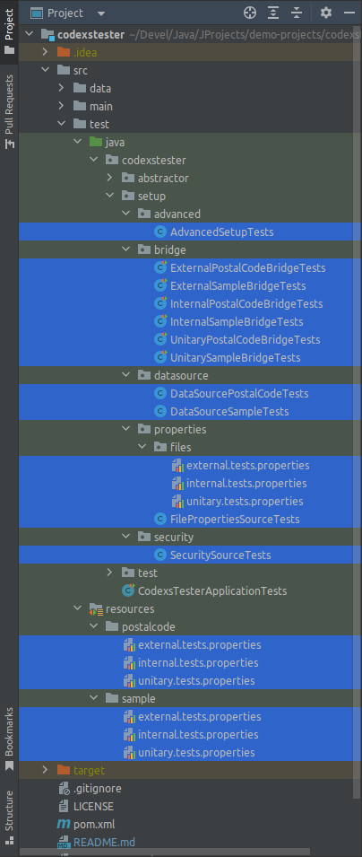
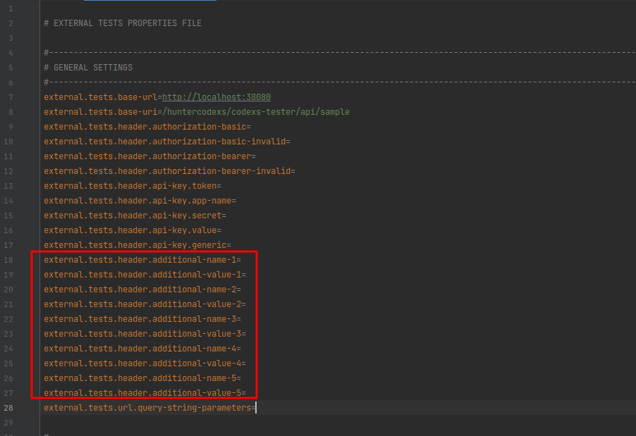
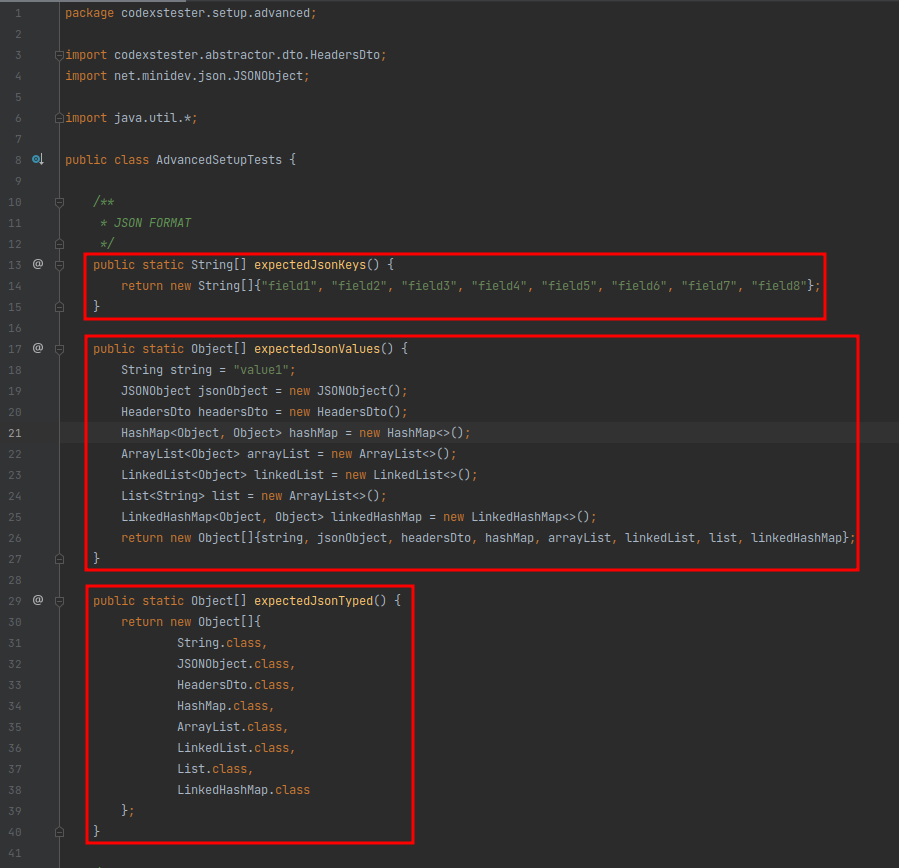
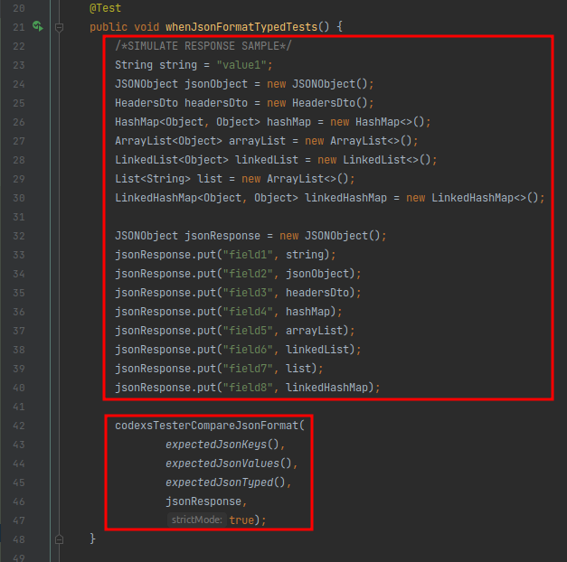
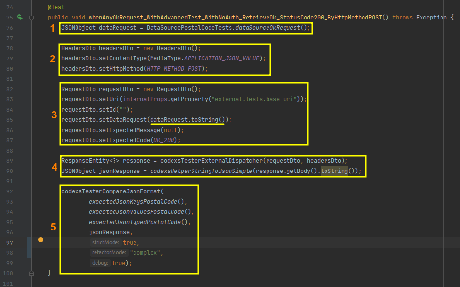

# CODEXSTESTER - BASIC
The simple library to write tests in java

>  DEPRECATED: see the 
> <a href="https://github.com/huntercodexs/codexstester/blob/main/data/CODEXSTESTER-PLUS.md">CODEXSTESTER PLUS</a> 
> documentation instead.

# Overview

## About

<pre>
WELCOME TO

|||||||||||||||||||||||||||||||||||||||||||||||||||||||||||||||||||||||||||||||||||||||||||||||||||| 
 
//||||  //|||\\  ||||\\   ||||||  \\  //  //||||     ||||||  ||||||  //||||  ||||||  ||||||  ||||\\ 
||      ||   ||  ||   ||  ||||      ||    \\||\\  -    ||    ||||    \\||\\    ||    ||||    ||  // 
\\||||  \\|||//  ||||//   ||||||  //  \\  ||||//       ||    ||||||  ||||//    ||    ||||||  ||  \\ 

Release: 1.0.8 
Powered by Huntercodexs (c) 2022 
https://github.com/huntercodexs 
|||||||||||||||||||||||||||||||||||||||||||||||||||||||||||||||||||||||||||||||||||||||||||||||||||| 
</pre>

The Codexstester is a simple library tool to make some kind of tests in java, with it, you can test your code, 
infrastructure, containers, databases, brokers and more. Just give a careful read in this documentation to get 
how easy is implement and use this great library.

## License

This project is free and can be used as a basis for other projects by anyone under the MIT license.

## Pre Requisites

- JDK/JRE 
  - Version 8
  - Version 11
  - Version 17
  - Version 21
- Spring Boot
  - 2.0.1.RELEASE
  - 2.6.4
- Concepts
  - MVC
  - Mock
  - Junit
  - Integration

## HTTP status code

This project offers all http codes for REST request handling, for more details of the Status Code at
requests. See more details about HTTP STATUS CODE at https://developer.mozilla.org/en-US/docs/Web/HTTP/Status

## Project Structure

<pre>
src
└── test
    ├── java
    │   └── codexstester
    │       ├── engine
    │       │   ├── bridge
    │       │   │   └── CodexsTesterCoreBridgeTests.java
    │       │   ├── core
    │       │   │   ├── CodexsTesterIgnitionTests.java
    │       │   │   └── CodexTesterPropertiesLoaderTests.java
    │       │   ├── dto
    │       │   │   ├── HeadersDto.java
    │       │   │   ├── Oauth2RequestCheckTokenDto.java
    │       │   │   ├── Oauth2RequestTokenDto.java
    │       │   │   ├── Oauth2ResponseTokenDto.java
    │       │   │   └── RequestDto.java
    │       │   ├── external
    │       │   │   ├── AbstractExternalRequestTests.java
    │       │   │   ├── AbstractExternalRestTemplateTests.java
    │       │   │   ├── ExternalHttpHeadersFactoryTests.java
    │       │   │   ├── ExternalRequest1xxTests.java
    │       │   │   ├── ExternalRequest2xxTests.java
    │       │   │   ├── ExternalRequest3xxTests.java
    │       │   │   ├── ExternalRequest4xxTests.java
    │       │   │   └── ExternalRequest5xxTests.java
    │       │   ├── http
    │       │   │   ├── AvailableHttpMethodTests.java
    │       │   │   └── AvailableHttpStatusTests.java
    │       │   ├── internal
    │       │   │   ├── AbstractInternalMockMvcTests.java
    │       │   │   ├── AbstractInternalRequestTests.java
    │       │   │   ├── InternalHttpHeadersFactoryTests.java
    │       │   │   ├── InternalRequest1xxTests.java
    │       │   │   ├── InternalRequest2xxTests.java
    │       │   │   ├── InternalRequest3xxTests.java
    │       │   │   ├── InternalRequest4xxTests.java
    │       │   │   └── InternalRequest5xxTests.java
    │       │   ├── properties
    │       │   │   ├── ExternalPropertyTests.java
    │       │   │   ├── InternalPropertyTests.java
    │       │   │   └── UnitaryPropertyTests.java
    │       │   ├── security
    │       │   │   └── SecurityTests.java
    │       │   ├── unitary
    │       │   │   └── AbstractUnitaryTests.java
    │       │   └── util
    │       │       ├── AdvancedTests.java
    │       │       ├── AssertionTests.java
    │       │       ├── CodexsHelperTests.java
    │       │       └── CodexsParserJsonTests.java
    │       ├── setup
    │       │   ├── advanced
    │       │   │   └── AdvancedSetupTests.java
    │       │   ├── bridge
    │       │   │   └── SamplesBridgeTests.java
    │       │   ├── datasource
    │       │   │   └── SamplesDataSourceTests.java
    │       │   ├── properties
    │       │   │   ├── external.tests.properties
    │       │   │   ├── internal.tests.properties
    │       │   │   └── unitary.tests.properties
    │       │   └── security
    │       │       └── SecuritySourceTests.java
    │       └── test
    │           ├── external
    │           │   └── SamplesExternalTests.java
    │           ├── internal
    │           │   └── SamplesInternalTests.java
    │           └── unitary
    │           │   └── SamplesInternalTests.java
    └── resources
        ├── samples
        │   ├── external.tests.properties
        │   ├── internal.tests.properties
        │   └── unitary.tests.properties
</pre>

## Use cases

Below are some situations where we can use CODEXS TESTER

- Integrated tests
    - External requests using a client
- Unitary tests
    - Sum of two numbers
    - Data processing
    - Data persistence
    - Private methods
- Complete flow of a REST request
    - Consistency test
- Authentication
    - MFA/2FA
    - OAuth2

# Configuration

- Dependency

First import into the pom.xml file of any project the following dependency:

<code>

		<dependency>
			<groupId>org.springframework.boot</groupId>
			<artifactId>spring-boot-starter-test</artifactId>
			<scope>test</scope>
		</dependency>
		<dependency>
			<groupId>io.projectreactor</groupId>
			<artifactId>reactor-test</artifactId>
			<scope>test</scope>
		</dependency>
		<dependency>
			<groupId>org.springframework.restdocs</groupId>
			<artifactId>spring-restdocs-mockmvc</artifactId>
			<scope>test</scope>
		</dependency>
		<dependency>
			<groupId>io.rest-assured</groupId>
			<artifactId>spring-mock-mvc</artifactId>
			<scope>test</scope>
		</dependency>
		<dependency>
			<groupId>junit</groupId>
			<artifactId>junit</artifactId>
			<scope>test</scope>
		</dependency>
		<dependency>
			<groupId>net.minidev</groupId>
			<artifactId>json-smart</artifactId>
			<version>2.3</version>
			<scope>compile</scope>
		</dependency>

</code>

- Settings

> The configuration procedure can be summarized in the following steps:

- using git clone command

<pre>
jereelton@jereelton-acer-nitro:~$ cd @{PROJECT_ROOT_PATH}/src/test/java
jereelton@jereelton-acer-nitro:~$ git clone https://github.com/huntercodexs/codexstester.git
jereelton@jereelton-acer-nitro:~$ cd codexstester
jereelton@jereelton-acer-nitro:~$ git checkout release-@{RELEASE_VERSION} (example: release-1.0.X) 
jereelton@jereelton-acer-nitro:~$ rm -rf .git .gitignore
</pre>

You can also use the releases available in the GitHub repository of this project by accessing the Releases link as
illustrated in the image below

> NOTE: Always choose the latest release available in the repository, as it contains all project updates
> previously tested and which are of great importance for the development of the tests. Check if the release
> has any updates for test development tweaks written in previous releases to verify
> compatibility.

In this case, the procedure is, in parts, the same as explained above in "git clone", that is, the files must be in the
correct folder <pre>@{PROJECT_ROOT_PATH}/src/test/java</pre> of the consuming project.

***NOTE: If the above procedures do not work, or if you still have doubts, follow the instructions below***

After importing the dependencies in your project, check if the folder (package) "test" exists in the project, if not already
exist create this package in the following path:

<pre>
    @{PROJECT_ROOT_PATH}/src/test
</pre>

Inside the "test" path created, make sure that the "java" and "resources" folders exist as shown in the image below:

Then in the project where the tests will be executed, copy the folder (package) "codexstester" into the folder "java"
shown above, and the "codexstester" folder is the same as the one inside the CODEXS TESTER project

NOTE

> It is recommended to do this with the help of an IDE such as IntelliJ, as this tool is capable of copying all
> files and folders correctly renaming the "packages" and references within the project, this prevents failures from occurring
> and unexpected errors besides causing a lot of confusion for a code refactoring procedure. it is also possible
> just drag the entire codexstester folder into the consuming project at the specified path

<pre>
    @{PROJECT_ROOT_PATH}/src
</pre>

The image below shows how the scenario should look (the README and LICENSE files are missing)

Now copy the ".properties" files that are inside the path src/test/java/codexstester/setup/properties
into the path src/test/resources/@{RESOURCE_NAME} as shown in the image below

> IMPORTANT: See that two folders were created inside the path src/test/resources separating the tests by resources
> contained within the service/application that is consuming the CODEXS TESTER, in this case a resource called postalcode and a
> another feature called sample. This setting is not mandatory, but it helps to organize the workspace of
> tests and the project in general, keeping the codes and files separated by their purposes. another important point
> is that it doesn't matter where these files should be, as long as it can be found with the classpath, and it should
> be informed in the constructor of all tests as will be shown below

These files will be used to carry out part of the test settings, for example the url for requests
and the uri or endpoint of an API, as well as request HTTP HEADERS and additional parameters.

At this moment we have the workspace ready to be configured and it should be as shown in the image below, being
You can observe the following setup features:

- path: src/test/java/codexstester/setup/advanced
    - file: [AdvancedSetupTests.java](../../src/test/java/codexstester/setup/advanced/AdvancedSetupTests.java)
- path: src/test/java/codexstester/setup/bridge
    - [SampleBridgeTests.java](../../src/test/java/codexstester/setup/bridge/SampleBridgeTests.java)
- path: src/test/java/codexstester/setup/datasource
    - file: [SampleDataSourceTests.java](../../src/test/java/codexstester/setup/datasource/SampleDataSourceTests.java)
- path: src/test/java/codexstester/setup/properties
    - [external.tests.properties](../../src/test/java/codexstester/setup/properties/external.tests.properties)
    - [internal.tests.properties](../../src/test/java/codexstester/setup/properties/internal.tests.properties)
    - [unitary.tests.properties](../../src/test/java/codexstester/setup/properties/unitary.tests.properties)
- path: src/test/java/codexstester/setup/security
    - [SecuritySourceTests.java](../../src/test/java/codexstester/setup/security/SecuritySourceTests.java)
- path: src/test/resources/sample
    - [external.tests.properties](../../src/test/resources/sample/external.tests.properties)
    - [internal.tests.properties](../../src/test/resources/sample/internal.tests.properties)
    - [unitary.tests.properties](../../src/test/resources/sample/unitary.tests.properties)

- AdvancedSetupTests.java

Starting with the first file in the previous list, we have the AdvancedSetupTests java file. This file is intended
serve tests in a narrow and advanced way for comparing data, values and data types. Therefore, in case
If a deeper and more assertive verification is needed in the tests, this file must be used to program these
information. It already comes with a series of data ready to exemplify its use, but its use will be explained in more detail.
details in the test conventions and standardization section of that same document.

- SampleBridgeTests.java

Continuing with the files from the list above, we have the BRIDGE file, which has the purpose of creating a link
between the test files of the consumer project and the CORE of CODEXS TESTER.

Put the name of the main class of your java spring boot project, which in this case is SampleApplication.java, this is the
class that contains the main method of the consumer project, that is, the "main" class. However, it is possible that the project
have more than one main class (main), that is, several projects in the same repository, this happens a lot with
monolithic structures, in these cases CODEXS TESTER also supports, as will be shown later in the
test convention session.

- SampleDataSourceTests.java

This is the file that should be used as a database for the tests, it will define the entire "database" of
tests, that is, data for comparisons. The format and data to be written in this file are free choice of the
developer, and can be written as simply and conveniently as possible.

- external.tests.properties
- internal.tests.properties
- unitary.tests.properties

These are the ".properties" files that should be used during the tests, however they need to be copied inside
from path resources/sample or sample/ as mentioned earlier. These properties files have a series of
useful fields for the tests, such as URL, URI, HTTP HEADERS, API-KEY, QUERY-PARAMETERS among others, and they will be searched in the
path quoted during the execution of any test.

- SecuritySourceTests.java

It is in this file that access data is available, for example, credentials for authentication via OAuth2,
so be very careful when editing this file.

NOTE

> Be careful with the credentials that will be used in the SecuritySourceTests file so that they are not
> exposed in vulnerable places.

- OAuht2 Example

<code>

    public String oauth2Token() {
        Oauth2RequestTokenDto oauth2RequestTokenDto = codexsTesterSecurityOAuth2Token();
        ResponseEntity<Oauth2ResponseTokenDto> response = codexsTesterExternalOAuth2GetToken(oauth2RequestTokenDto);
        if (response.getBody() != null) return response.getBody().getAccess_token();
        return null;
    }

</code>

- Understanding the features of the CODEXS TESTER workspace

Below we have an image where we can see the main files to run the tests, they are separated by:

- external
- internal
- unitary

For each of the tests we have a sample file called ExternalSampleTests, InternalSampleTests and
UnitaySampleTests, but they are just examples to speed up the learning process about how the tests work
with the use of CODEXS TESTER.

> About "external" type tests

Tests of the "external" type are also known as integration tests, they have the ability to run tests
in completely segregated environments and "spread" across any infrastructure, that is, the main objective
of this test and also its main feature is the fact that it is possible to run a complete test on an infrastructure
any structure through a call made to a central or request router as in the case of uses with a
API GATEAWAY (for example Zuul from Netflix), or an NGINX with PROXY REVERSE, which redirects the
calls to a specific resource within a secure and controlled environment.

Below is a graphical demonstration of how this works.

> About "internal" type tests

Regarding tests of the "internal" type, as well as the "external" type, they can also be used and called tests
of integration, that is, it is possible that the test target service may contain a resource integrated with some external environment,
as in the case of the POSTAL CODE example project (contained in this project) that makes a REST call through an HTTP-CLIENT
to an external resource known as VIA CEP CORREIOS.

However, the tests can be merely internal to the CODEXS TESTER consumer service or project, that is, the calls
REST for the "endpoints" contained in the service, which makes it different from unit tests.

The image below illustrates the processing flow for tests of the internal type:

> About "unitary" type tests

In the case of tests of the "unitary" type, we have the premise that the tests will be done on top of any unit
contained in a service, project, function, method or any unit of code, that is, we will practically be
testing if a part of a class is working correctly, if an instance is being done correctly
or even if the sum of two numbers is being done correctly by any calculation.

To exemplify this scenario, we have the following image, which shows in a simple and summarized way how the tests are carried out
units with the CODEXS TESTER workspace.

This was the information about the codexstester/setup configuration path and the codexstester/test tests path, being
that they will be detailed in the conventions and testing standards section of CODEXS TESTER.

# CODEXS TESTER code structure

As already mentioned, the structure of the tests is composed of HEADER, BODY and TEST, which are detailed below

> HEADER

The HEADER of requests are defined by using the HeadersDto.java class which contains all the fields needed to
perform a standard REST request, these fields being described below:

- contentType
- httpMethod
- statusCode
- crossOrigin
- origin
- hostname
- ip
- osname
- authorizationBasic
- authorizationBearer
- apiKeyToken
- apiKeyAppName
- apiKeySecret
- apiKeyValue
- apiKeyGeneric
- addtionalName
- addtionalValue
- bodyParameters

The fields above are self-described and do not need further details, however some points need to be clarified.
If it is necessary to use an authentication method such as OAuth2, the field authorizationBasic and authorizationBearer
will be compromised and cannot be used in a call, for example

<pre>
headersDto.setAuthorizationBasic("Basic YXJjaF9kZW1vX2NsaWVudF8xOjExMTExMTExLTIyMjItMzMzMy00NDQ0LTU1NTU1NTU1NTU1NQ==")
</pre>

If you need to send a custom field in the HEADER, use the **addtionalName** and **addtionalValue** attributes,
which aims to create this specific field, for example:

<pre>
headersDto.setAddtionalName("X-Api-Access-Code");
headersDto.setAddtionalValue("XYZ-123");
</pre>

***IMPORTANT: Use the properties file to define additional request headers, up to five are allowed
Additional headers, as shown in the image below***

Example (internal/external):

<pre>
internal.tests.header.additional-name-1=Api-Key-Token
internal.tests.header.additional-value-1=312876786d7s6f87f6876d78f6df78
internal.tests.header.additional-name-2=Api-key-Username
internal.tests.header.additional-value-2=codexstester
internal.tests.header.additional-name-3=Api-Key-Specific-Header
internal.tests.header.additional-value-3=5e363142-5ef4-4cf7-8ca8-87e1401be1f3
internal.tests.header.additional-name-4=Customer-Config
internal.tests.header.additional-value-4=secret-config-server
internal.tests.header.additional-name-5=App-Name
internal.tests.header.additional-value-5=CODEXS-TESTER-APP
</pre>

> BODY

The BODY of a REST request contains the information that must be transmitted to the final resource to be processed
and used for a specific purpose.

To send this BODY in the request it is necessary to use the RequestDto.java class available in the Codexs workspace
Tester detailed below:

- uri
- id
- dataRequest
- expectedMessage
- expectedCode

See that we can define the URI (uri) where we want to go, although this property can also be defined in
properties file.

We have the ID (id) that can be used to define a REST request by sending id in the url, that is a RESTFUL API by
example

<pre>/api/postal-code/{id} => /api/postal-code/1209000</pre>

The dataRequest field must be used to define the BODY REQUEST of the request, that is, the data to be sent in the tests
must be in this field.

It is still possible to define a string to be compared in the test in the expectedMessage field, for example: "Data Not Found",
if a string is not defined in the expectedMessage field, no comparison will be made.

> NOTE: The subject "Data Comparison" will be covered later in this documentation

The expectedCode field should not be used, as it will not be considered that way, this field is used in the backend of
CODEXS TESTER according to the function defined for testing, for example:

If the functionality "codexsTesterInternal_StatusCode200_RetrieveOK" is called, it will automatically have as value
for the expectedCode field the value "200 OK".

> TEST

This is the part of the code that actually executes the test, after the correct parameterization of the HEADER and BODY data of the TEST
can be called without any problem. The tests available in the CODEXS TESTER workspace can be listed
starting typing codexsTester+[Ctrl+Space], in some IDEs like IntelliJ this functionality is performed in
automatically. At the end of the documentation there is a huge list with the features available in CODEXS TESTER.

# Conventions and Standards CODEXS TESTER

<h3>1. Configuring the communication (bridge) between the tests and the CODEXS TESTER CORE</h3>

This configuration is the most important and must be done carefully and with a correct understanding of how it works, since
that it tells CODEXS TESTER which application will be tested. Imagine that there are two applications in the same project,
SampleApplication and PostalCodeApplication, which is unlikely to happen with a microservice-oriented project, this way
In this way, it will be necessary to inform CODEXS TESTER which application will be tested, as shown in the image below:

> See that there are two different files, one for the SampleApplication application and another for the PostalCodeApplication application

Now see how the test target project is (also called CONSUMER CODEXS TESTER)

It is not necessary to change anything else in this file, however like every open source project free to be changed,
it is possible to add other codes if necessary, but be careful in the changes so as not to compromise the correct
operation of CODEXS TESTER.

<h3>2. Configuring a scope for tests</h3>

To create a test scope just extend/inherit the correct bridge to your test file as shown below:

<h3>3. Configuring a DataSource</h3>

This step is not mandatory, but as already mentioned, it helps to keep the test environment and the coding of the project more
organized and easy to organize. To define a datasource create a file in the path codexstester/setup/datasource
with the specific name of its purpose, for example: DataSourceSampleTests.java or DataSourcePostalCodeTests.java or
still SampleDataSourceTests.java, PostalCodeDataSourceTests and etc...

This file must contain data and information for the different types of tests that must be performed in the project.
CODEXS TESTER consumer. The DataSourceSampleTests class defined in the DataSourceSampleTests.java file must be
extended in the related test file, as shown below:

A code example in the datasource can be seen in the code below

Note that there are two methods that return a JSON object that will be used in the tests as data to send in the
request, as will be shown later. It is also possible to observe attributes defined for use in the
tests if it's useful. This file is free in its preparation and programming, just be careful with understanding and
usability of it.

<h3>4. Security settings</h3>

Security settings must be contained in the SecuritySourceTests.java file located in the CODEXS TESTER path
codexstester/setup/security, with these settings referring to access data and OAuth2 authorization. Until the moment
CODEXS TESTER only supports OAuth2 in SecuritySourceTests file, but more security options coming soon
will be added.

As already mentioned in this document, these configurations must be done with great responsibility, as they are data
access sensitive. It is highly recommended that you do not use access data to production environments or even
homologation, still do not expose the data, even if from development or test environments to people not
authorized. Below is an image to illustrate this configuration:

<h3>5. Advanced Settings</h3>

> NOTE: First of all, it is important to make it clear that it is not necessary to import any files into the archive
> of tests, as this is already done by the bridge file mentioned above in this document.

The advanced settings for tests must be done in the AdvancedSetupTests.java file, which has the purpose of
offer a more organized and optimized environment to perform large-scale and high-precision tests. The tests
The advanced features of CODEXS TESTER consist of checking whether a piece of data has the following characteristics:

- Name or identification of a key or field

To name or identify a key or field in a test, data in String format must be used, for example:
<pre>"name", "age", "address", "data"</pre>

- Expected value

The expected value field should be used to also test the content of a response, in a fixed and defined format
in CODEXS TESTER as a String, making it possible to serialize any object such as JSONObject, LinkedHashMap or
HasMap for comparison, for example:

<code>

    public static Object[] expectedJsonValues() {
        String string = "value1";
        JSONObject jsonObject = new JSONObject();
        HeadersDto headersDto = new HeadersDto();
        return new Object[]{string, jsonObject, headersDto};
    }

</code>

- Data type

To define the type of data, the formats for each field in a given test must be informed, and must be
@{CLASS-NAME}.java format is used, see more details in the examples below.

- Strict Mode

The strict mode STRICT-MODE is available for application in tests, it should be used when there is a need
in doing a test with high precision, because when it is active (true), all data such as, name of a field or key
of a field, field type and field value will be tested and validated.

CODEXS TESTER advanced tests are limited to eight types of data considered essential in JAVA, namely:

<pre>
- String
- JSON
- DTO
- HashMap
- ArrayList
- LinkedList
- List (interface)
- LinkedHashMap
</pre>

However, the format of the fields present in the data structures are free and independent, and can be used
according to the need of the programmer.

Below is an example of how to implement an advanced CODEXS TESTER test using the JSON data type

- Configuration for a JSON response with various types of data in its content

- Test setup responsible for using the above settings

Notice that there is a definition for testing the responses inside the AdvancedSetupTests.java file, and a simulation of
response within the whenJsonFormatTypedTests() test, and the expected format for this test is JSON, as per the
test name itself suggests codexsTesterCompareJsonFormat();

The advanced tests available in CODEXS TESTER are:

<pre>
codexsTesterCompareJsonFormat (This one with 5 possibilities of use, see more in Functionalities Details)
codexsTesterCompareDtoFormat
codexsTesterCompareHashMapFormat
codexsTesterCompareArrayListFormat
codexsTesterCompareLinkedListFormat
codexsTesterCompareListFormat
codexsTesterCompareLinkedHashMapFormat
</pre>

Each of the tests above correspond to a certain type of test according to the name of the test, this facilitates the
understanding and use of each data type structure.

> IMPORTANT: Do not confuse the advanced settings contained in the AdvancedSetupTests.java file with the settings
> contained in the DataSourcesSampleTests.java file, as the latter only serves as a database for the tests and
> the first serves to define the types of data and expected values in a response to any test, be it via
> REST that is through an internal call.

- Advanced DataTree Features

> Available from release-1.0.3

Advanced tests have been optimized so that the programmer can be more agile in coding tests. That
improvement is present in advanced tests through method overload, that is, methods that can be used
in more than one way, or with more than one possibility of parameterization/argumentation.

The resources in question are the same as described and illustrated earlier in this document, but will be presented
here a brief demonstration of what can be done in advanced and optimized tests.

> NOTE: These codes can be obtained in this same project in the tests path, more precisely in the UnitarySampleTests.java file

In the figure below we have the use, see how much simpler and more direct the writing of an advanced test, which will test
the entire "mapped tree" in your target named jsonResponse.

The expectedJsonDataTree() method code was created in the AdvancedSetupTests.java file, which in turn is located
in the path src/test/java/codexstester/setup/advanced, according to the image below the understanding of this data format for
tests need more details.

See that a data matrix called Data Tree was created with all the necessary data for a complete test and
satisfactory.

Still talking about advanced tests using a DataTree, it is possible to assemble an extremely complex test using
of all the features available in CODEXS TESTER, for example:

1) In frame (1) of the image above we have the origin of the data (DataSource)
2) In frame (2) of the image above we have the settings for the current test related to the Header, notice that we have a
   Content-Type and an HTTP-METHOD, where the latter defines the type of verb that will be used to perform the test call.
3) In frame (3) of the image, the body of the RequestDto request, which in turn contains the dataRequest and the expected HTTP code
   in the test return (HTTP-STATUS-CODE).
4) In frame (4) there are two very important and specific features of CODEXS TESTER, codexsTesterExternalDispatcher and
   codexsHelperStringToJsonSimple, where one complements the other. In the case of the codexsTesterExternalDispatcher functionality it
   is nothing more than a RestTemplate that executes the external call via REST and returns any ResponseEntity, in this case
   from the codexsHelperStringToJsonSimple functionality, we have one of the many CodexsHelpers, which in this case performs the conversion
   needs and complex any string (as long as it's compatible) into a JSON object. This makes life a lot easier for the Tester,
   which in turn doesn't have to worry about additional imports or data conversions.
5) Finally, in frame (5) we have the advanced test itself codexsTesterCompareJsonFormat. This test waits seven
   parameters, self-explanatory, but it is worth mentioning the importance of strictMode = true, so that the data comparison
   be done assertively and in all fields.

> NOTE: The refactorMode parameter will be explained in the feature description section of this documentation.

<h3>6. Details about CODEXS TESTER</h3>

- Summary flow for a test programmed with CODEXS TESTER

Just for the sake of exemplifying in greater detail the engine of the CODEXS TESTER workspace, we see in the figure below
the relationship between the resources of the system and the consumer project. Notice the long way a simple test can go
to execute the instructions correctly and completely, however this whole environment optimizes the work by almost 90%
of the programmer in developing a complex test from scratch.

- Complete workflow for a programmed test with CODEXS TESTER

- Complete flow for a test written with CODEXS TESTER

# Programming tests with the CODEXS TESTER workspace

> TIP: All available tests and resources that CODEXS TESTER offers start with the word codexsTester, being
> thus, when codexsTester is typed in the editor/IDE, a huge list of resources available in the
> CODEXS TESTER, for example: codexsTesterAssertionBool().

> REMINDER: Don't forget that the DataSourceSampleTests.java file is essential for testing and can be used in any
> situation and in any of the three types of CODEXS TESTER tests. Nor can we forget the files of
> external.tests.properties, internal.tests.properties and unitary.tests.properties properties, which are very
> important in the CODEXS TESTER workspace.

We will now see situations where the CODEXS TESTER can be used, being in a summation unit test, an external test for
query a home address and an internal test to also query a home address.

The tests will be merely illustrative, but they are tests that have already been carried out and their correct functioning 
has been verified, and with these tests it is already possible to understand the work methodology of CODEXS TESTER.

Before starting, remember to create the constructor in the class that will be used to run the tests as shown in the 
example below:

<code>

    public class SampleUnitaryTests extends SampleBridgeTests {
    
        /**
         * DO NOT REMOVE THIS CONSTRUCTOR
         * */
        public SampleUnitaryTests() {
            super("sample/"); /*Inform here the current targetTests*/
        }
    
        @Test
        public void anyTest() {
            /*Code Here*/
        }
    
    }

</code>

- Test: Sum (Unitary Tests)

If you open the UnitarySampleTests.java file you can see that the first test is a simple sum of two numbers,
as shown below:

<code>

    @Test
    public void whenSumAnyNumbersTest() {
        int result = DataSourceSampleTests.dataSourceSampleSum(1000, 10);
        codexsTesterAssertInt(result, 1010);
    }

</code>

The unit tests are very simple and do not need much explanation, if necessary, calmly analyze the
example file SampleTestsUnitaryTests.java and see for yourself that it is very easy to use.

- Test: Address Query (External Tests)

To demonstrate a test example of the "external" type, an address query will be performed using a postal code
valid and that may return the http code 200 (Status Code 200 OK).

In the ExternalSampleTests.java file there are many examples, but only 2 will be presented, both for the same
use case, one with authentication via OAuth2 and another without any authentication.

Below is the sample test mentioned above:

<code>

    @Test
    public void whenAnyOkRequest_WithNoAuth_RetrieveOk_StatusCode200_ByHttpMethodPOST() throws Exception {
        JSONObject dataRequest = DataSourcePostalCodeTests.dataSourceOkRequest();

        HeadersDto headersDto = new HeadersDto();
        headersDto.setContentType(MediaType.APPLICATION_JSON_VALUE);
        headersDto.setHttpMethod(HTTP_METHOD_POST);

        RequestDto requestDto = new RequestDto();
        requestDto.setUri(externalProps.getProperty("external.tests.base-uri"));
        requestDto.setId("");
        requestDto.setDataRequest(dataRequest.toString());
        requestDto.setExpectedMessage(null);

        codexsTesterExternal_StatusCode200_RetrieveOK(headersDto, requestDto);
    }

</code>

Looking at the test above, it is visible what the purpose of this test is, considering its name, which, although it is very long
accurately delivers what is being tested. The body of this contains the standard structure used by CODEXS TESTER to
run the tests, and this structure is defined by:

- Request data (BODY REQUEST)
- Header of the request (HEADER REQUEST)
- CODEXS TESTER method to perform the request (CODEXS TESTER)

It is also possible to observe that there is a line of code that makes use of the DataSourcePostalCodeTests.java file which
contains all the data for the tests, whether to test requests, responses or unitary values. This data for
request is used further down the code as BODY REQUEST, and this data will be sent to tests in the form of
text(String).

The HEADER configuration shows that the request will use the http GET method (line 7) and that its content type is
application/json.

Finishing the body of this test we effectively have the call codexsTesterExternal_StatusCode200_RetrieveOK
which in turn also makes clear what its purpose is, that is: An external test that expects a "200 OK" code like
result, and that it has already been defined that it will be done using the http POST method.

- Test: Query Address using OAuth2 as authentication (External Tests)

The test below follows the same principle as the test above, but with additional information, having a defined method for
authentication with OAuth2 and that all your credentials and url configuration contained in the SecuritySourceTests.java data file

Note that the instructions that assemble the HEADER are more detailed, containing the authentication method and additional headers,
as well as the http POST method (HTTP_METHOD_POST).

Finally, the rest of the code needs no comments, as it has the same operation as previously stated in the test above.

<code>

    @Test
    public void whenAnyOkRequest_WithOAuth2_RetrieveOk_StatusCode200_ByHttpMethodPOST() throws Exception {
        Oauth2RequestTokenDto oauth2RequestTokenDto = codexsTesterSecurityOAuth2Token();
        ResponseEntity&lt;Oauth2ResponseTokenDto&gt; response = codexsTesterExternalOAuth2GetToken(oauth2RequestTokenDto);
        JSONObject dataRequest = DataSourcePostalCodeTests.dataSourceOkRequest();

        HeadersDto headersDto = new HeadersDto();
        headersDto.setAuthorizationBearer(response.getBody().getAccess_token());
        headersDto.setContentType(MediaType.APPLICATION_JSON_VALUE);
        headersDto.setAdditionalName("Access-Code");
        headersDto.setAdditionalValue("XYZ-123");
        headersDto.setHttpMethod(HTTP_METHOD_POST);

        RequestDto requestDto = new RequestDto();
        requestDto.setUri(externalProps.getProperty("external.tests.base-uri"));
        requestDto.setId("");
        requestDto.setDataRequest(dataRequest.toString());
        requestDto.setExpectedMessage(null);

        codexsTesterExternal_StatusCode200_RetrieveOK(headersDto, requestDto);
    }

</code>

- Test: Address Query (Intentional Tests)

The difference that an "internal" type test has in relation to the "external" type is almost invisible, because the "magic"
occurs in the "backend" of CODEXS TESTER and not in writing the code. This allows the same concept of code and tests
be used in both situations.

<code>

    @Test
    public void whenAnyOkRequest_WithNoAuth_RetrieveOk_StatusCode200_ByHttpMethodPOST() throws Exception {
        JSONObject dataRequest = DataSourcePostalCodeTests.dataSourceOkRequest();

        HeadersDto headersDto = new HeadersDto();
        headersDto.setContentType(MediaType.APPLICATION_JSON_VALUE);
        headersDto.setHttpMethod(HTTP_METHOD_POST);

        RequestDto requestDto = new RequestDto();
        requestDto.setUri(internalProps.getProperty("internal.tests.base-uri"));
        requestDto.setId("");
        requestDto.setDataRequest(dataRequest.toString());
        requestDto.setExpectedMessage(null);

        codexsTesterInternal_StatusCode200_RetrieveOK(headersDto, requestDto);
    }

</code>

- Test: Query Address using OAuth2 as authentication (Intentional Tests)

<code>

    @Test
    public void whenAnyOkRequest_WithOAuth2_RetrieveOk_StatusCode200_ByHttpMethodPOST() throws Exception {
        Oauth2RequestTokenDto oauth2RequestTokenDto = codexsTesterSecurityOAuth2Token();
        ResponseEntity&lt;Oauth2ResponseTokenDto&gt; response = codexsTesterInternalOAuth2GetToken(oauth2RequestTokenDto);
        JSONObject dataRequest = DataSourcePostalCodeTests.dataSourceOkRequest();

        HeadersDto headersDto = new HeadersDto();
        headersDto.setAuthorizationBasic(response.getBody().getAccess_token());
        headersDto.setContentType(MediaType.APPLICATION_JSON_VALUE);
        headersDto.setHttpMethod(HTTP_METHOD_POST);

        RequestDto requestDto = new RequestDto();
        requestDto.setUri(internalProps.getProperty("internal.tests.base-uri"));
        requestDto.setId("");
        requestDto.setDataRequest(dataRequest.toString());
        requestDto.setExpectedMessage(null);

        codexsTesterInternal_StatusCode200_RetrieveOK(headersDto, requestDto);
    }

</code>

- Test: Address Query with Advanced Test

As mentioned earlier, advanced tests have a higher degree of assertiveness than conventional ones,
however, it has not yet been shown how to perform a complete test using CODEXS TESTER with the advanced features.

An advanced test in the CODEXS TESTER workspace is nothing more than ensuring that the result of a test is
exactly as expected, as shown below:

Next, the programming of an advanced CODEXS TESTER type test will be shown in detail, which performs the query
from any address through a postal code, validates the HTTP response code, the response format and the type
data contained in the response. It is worth noting that advanced type tests can also be of the "external" type,
"internal" and "unitary", as mentioned earlier, these are the types of tests available in the workspace
TESTER CODEXS.

In short, an "internal" type tester looks like this:

> NOTE: Tests of type "internal" use MockMvc to trigger requests

<pre>
[REQUEST]
HTTP-REQUEST-HEADERS Content-Type: application/json
POST /huntercodexs/postalcode/api/address/12090000

[RESPONSE]
HTTP-STATUS-CODE 200 OK
RESPONSE-BODY JSON {"cep":"12090002","logradouro":"Rua São Caetano","complemento":"","bairro":"Campos Elíseos","localidade":"Taubaté","uf":"SP","ibge":"3554102","gia":"6889","ddd":"12","siafi":"7183"}
</pre>

In the case of tests of the "external" type

> NOTE: Tests of type "external" use RestTempalte to trigger requests

<pre>
[REQUEST]
HTTP-REQUEST-HEADERS Content-Type: application/json
POST http://localhost:38080/huntercodexs/postalcode/api/address/12090000

[RESPONSE]
HTTP-STATUS-CODE 200 OK
RESPONSE-BODY JSON {"cep":"12090002","logradouro":"Rua São Caetano","complemento":"","bairro":"Campos Elíseos","localidade":"Taubaté","uf":"SP","ibge":"3554102","gia":"6889","ddd":"12","siafi":"7183"}
</pre>

See that the only difference between the "internal" and "external" tests is how the REQUEST is done, that is, through MockMvc
or through RestTemplate, where you can see the difference between URL and URI.

The next step consists of defining the data types, field names, field values and data types of the
fields, and this configuration must be done in the AdvancedSetupTests.java file contained in the setup/advanced path of
CODEXS TESTER src/test/java/codexstester/setup/advanced/AdvancedSetupTests.java. See below for the expected configuration
for the test in question

<code>

    /**
     * POSTAL CODE ADVANCED TESTS - JSON TYPED
     */
    public static String[] expectedJsonKeysPostalCode() {
        return new String[]{
                "cep",
                "logradouro",
                "complemento",
                "bairro",
                "localidade",
                "uf",
                "ibge",
                "gia",
                "ddd",
                "siafi"
        };
    }

    public static Object[] expectedJsonValuesPostalCode() {
        return new Object[]{
                "12090002",
                "Rua São Caetano",
                "",
                "Campos Elíseos",
                "Taubaté",
                "SP",
                "3554102",
                "6889",
                "12",
                "7183"
        };
    }

    public static Object[] expectedJsonTypedPostalCode() {
        return new Object[]{
                String.class,
                String.class,
                String.class,
                String.class,
                String.class,
                String.class,
                String.class,
                String.class,
                String.class,
                String.class
        };
    }

</code>

Notice the following aspects of the configuration, see that we have three methods that have Arrays inside, which
must have the same size, for example Array(10), also see that the method names are self-explanatory about their
goal. Still at this point, it is configured that the fields to be tested will all be of type String.class and that
the expected values are defined in the expectedJsonValuesPostalCode() method.

> STRICT MODE: When a strict test mode is defined (strictMode=true), CODEXS TESTER will also test the values
> contained in the information to be tested, that is, they must have the same name, type and value. If it is not feasible to use
> this functionality, use the non-strict mode (strictMode-false), in which case only name and data type will be validated.

The next step consists of configuring the src/test/resources/postalcode/internal.tests.properties file and also the
src/test/resources/postalcode/external.tests.properties file, informing the data as (in this case) shown below

- internal.tests.properties

<pre>
internal.tests.base-url=/huntercodexs/codexs-tester/api
internal.tests.base-uri=/address
</pre>

- external.tests.properties

<pre>
external.tests.base-url=http://localhost:38080
external.tests.base-uri=/huntercodexs/codexs-tester/api/address
</pre>

Continuing, the next step is to program the data for the REQUEST (datasource), for which a method will be created
inside the src/test/java/codexstester/setup/datasource/DataSourcePostalCodeTests.java file, ***note that the name in
file has a self-explanation about its purpose***.

> NOTE: This procedure is intended to keep the code and structure of the project organized and clean, however
> it is not mandatory that it be done like this, it is possible to enter this data directly in the tests, or else create the
> method inside the test file itself

<code>

    public static JSONObject dataSourceOkRequest() {
        JSONObject jsonObject = new JSONObject();
        jsonObject.appendField("rulesCode", "XYZ12345");
        jsonObject.appendField("postalCode", "12090002");
        jsonObject.appendField("webhook", "");
        return jsonObject;
    }

</code>

With that, or rather, with the settings shown above, it is possible to start programming the tests as shown below.

- Test type "external"

The image above shows an advanced test CODES TESTER, where it is possible to notice the important points of this test and that
deserve attention, see below:

- (1) Extension of the BRIDGE already mentioned in this document and which links @Test with the CORE of CODEXS TESTER
- (2) Use of the file (datasource) to start the request data
- (3) Definition of the HTTP-METHOD method for the request, in this case POST
- (4) The expected HTTP-STATUS-CODE for this request
- (5) In the first line the codexsTesterExternalDispatcher literally triggers the request, in the second line the response
  of the request is converted into the expected JSON format.
- (6) The main method of this test, the codexsTesterCompareJsonFormat, which uses all the configuration done previously
  in the scope of the advanced test, note that it has strictMode=false, that is, the values will not be evaluated, because of
  according to the programmer, they are not relevant to the test.

- "Internal" type test

The image above shows an advanced test of the "internal" type of CODEXS TESTER, with very similar characteristics to the test
to the "external" type shown above, thus dispensing with further details. However, note that in item (6) of
image, in the first line the method used is codexsTesterInternalDispatcher() and not codexsTesterExternalDispatcher(), that is,
the scope of the test is postalcode/internal.tests.properties contained in the path src/test/resources/postalcode/internal.tests.properties,
and the type of test is "internal", as noted in item (4).

- Advanced test example

<code>

    @Test
    public void whenRequestToSummarySync_WithDispatcher_Compare_WithAdvancedTest_RetrieveCreated_201_POST() throws Exception {
        String tcn = codexsHelperGuideGenerator(null);
        JSONObject dataRequest = restRequestFakeToSummaryNetJSON(tcn, null);

        HeadersDto headersDto = new HeadersDto();
        headersDto.setAuthorizationBearer(oauth2Token());
        headersDto.setContentType(MediaType.APPLICATION_JSON_VALUE);
        headersDto.setHttpMethod(HTTP_METHOD_POST);

        RequestDto requestDto = new RequestDto();
        requestDto.setExpectedCode(CREATED_201);
        requestDto.setUri(externalProps.getProperty("external.tests.base-uri"));
        requestDto.setId("");
        requestDto.setDataRequest(dataRequest.toString());
        requestDto.setExpectedMessage(null);

        ResponseEntity<?> dispatcherResult = codexsTesterExternalDispatcher(requestDto, headersDto);

        Object[] fields = new Object[]{
                "summary",
                "searchRequest",
                "searchRequestEnrichment",
                "dataSources",
                "riskFactors",
                "records",
                "warnings"};

        org.json.JSONObject jsonResponse = codexsTesterOrgJsonFromLinkedHashMap(
                (LinkedHashMap<?, ?>) dispatcherResult.getBody(),
                fields,
                false);

        codexsTesterCompareJsonFormat(
                expectedSyncResponseFromQuantifindDataTree(tcn),
                jsonResponse,
                true,
                "complex",
                true);
    }

</code>

# private methods

To test private methods use codexsHelperToPrivateMethods, which easily handles method execution by returning a
response previously defined by the programmer, for example:

<code>

     @Test
     public void validResultFromPrivateMethod_AssertBoolTest() throws IOException {
         boolean result = (boolean) codexsHelperToPrivateMethods(new PostalCodeService(), "valid", Collections.singletonList(1));
         codexsTesterAssertBool(result, true);
     }

     @Test
     public void validResultFromPrivateMethod_AssertExactTest() throws IOException {
         List<String> args = new ArrayList<>();
         args.add("Jereelton");
         args.add("Teixeira");
         Object fullname = codexsHelperToPrivateMethods(new PostalCodeService(), "fullname", args);
         codexsTesterAssertExact(fullname.toString(), "Jereelton Teixeira");
     }

</code>

Basically it is necessary to inform codexsHelperToPrivateMethods three parameters, namely:

- instance of the target class
- method to be tested of the instantiated class
- arguments the method expects
    - Still at this point, keep in mind that codexsHelperToPrivateMethods supports up to 5 arguments as parameters, and these
      arguments must be informed in the correct sequence inside a List<>, as shown in the example above.
    - 

# Details of features available in CODE TESTER

- Helpers

<pre>
public static String codexsHelperMd5(String data);
public static String codexsHelperGuideGenerator(String tcn);
public static String codexsHelperToday();
public static String codexsHelperOneYearAgo();
public static String codexsHelperFiveYearAgo();
public static void codexsHelperLogTerm(String title, Object data, boolean line);
public static void codexsHelperLogTermTests(String title, Object data, boolean line);
public static JSONObject codexsHelperQueryStringToJson(String queryString);
public static String codexsHelperJsonToString(JSONObject json);
public static JSONObject codexsHelperStringToJson(String string);
public static Object codexsHelperToPrivateMethods(Object instance, String method, List<?> args);
public static String codexsHelperReadFile(String filepath);
</pre>

- Refactors e Parser

<pre>
public static String codexsTesterParseJsonString(String jsonString, boolean debug) throws Exception
public static org.json.JSONObject codexsTesterParseOrgJsonObject(Object jsonCandidate, boolean debug) throws Exception
public static net.minidev.json.JSONObject codexsTesterParseNetJsonObject(Object jsonCandidate, boolean debug) throws Exception

public static String codexsTesterJsonRefactorUrl(Object jsonString, boolean debug) throws Exception
public static String codexsTesterJsonRefactorEscapeChars(Object jsonString, boolean debug) throws Exception
public static String codexsTesterJsonRefactorSpaces(Object jsonString, boolean debug) throws Exception
public static String codexsTesterJsonRefactorArrayFix(Object jsonString, boolean debug) throws Exception
public static String codexsTesterJsonRefactorComplexArray(Object jsonString, boolean debug) throws Exception
public static String codexsTesterJsonRefactorArrayFromString(Object jsonString, boolean debug) throws Exception
public static String codexsTesterJsonRefactorArrayNumber(Object jsonString, boolean debug) throws Exception
public static String codexsTesterJsonRefactorObjects(Object jsonString, boolean debug) throws Exception
public static String codexsTesterJsonRefactorDatetime(Object jsonString, boolean debug) throws Exception
public static String codexsTesterJsonRefactorSanitize(Object jsonString, boolean debug) throws Exception
public static String codexsTesterJsonRefactor(String refactorMode, Object jsonString, boolean debug) throws Exception

public static org.json.JSONObject codexsTesterObjectToOrgJson(Object object, boolean debug) throws Exception
public static net.minidev.json.JSONObject codexsTesterObjectToNetJson(Object object, boolean debug) throws Exception
public static boolean codexsTesterCheckJsonCompatibility(Object jsonString, boolean debug) throws Exception
public static net.minidev.json.JSONObject codexsTesterOrgJsonToNetJson(org.json.JSONObject jsonOrg, boolean debug) throws Exception
public static org.json.JSONObject codexsTesterNetJsonToOrgJson(net.minidev.json.JSONObject jsonNet, boolean debug) throws Exception
public static org.json.JSONObject codexsTesterOrgJsonFromLinkedHashMap(LinkedHashMap<?, ?> linkedHashMap, Object[] expectedFields, boolean debug) throws Exception
public static net.minidev.json.JSONObject codexsTesterNetJsonFromLinkedHashMap(LinkedHashMap<?, ?> linkedHashMap, Object[] expectedFields, boolean debug) throws Exception
</pre>

- Asserts

<pre>
protected void codexsTesterAssertExact(String ref, String text);
protected void codexsTesterAssertObject(Object obj1, Object obj2);
protected void codexsTesterAssertText(String ref, String text);
protected void codexsTesterAssertRegExp(String regExp, String text);
protected void codexsTesterAssertInt(int num1, int num2);
protected void codexsTesterAssertBool(boolean val, boolean flag);
protected void codexsTesterAssertNotNull(Object obj);
protected void codexsTesterAssertNull(Object obj);
protected void codexsTesterAssertNumber(String number);
protected void codexsTesterAssertCpf(String cpf);
protected void codexsTesterAssertEmail(String email);
protected void codexsTesterAssertPhone(String phoneNumber);
protected void codexsTesterAssertSum(int a, int b, int c);
</pre>

- Dispatchers

<pre>
protected ResponseEntity&lt;?&lt; codexsTesterExternalDispatcher(RequestDto requestDto, HeadersDto headersDto);
protected String codexsTesterInternalDispatcher(RequestDto requestDto, HeadersDto headersDto) throws Exception

protected static ResponseEntity&lt;Oauth2ResponseTokenDto&gt; codexsTesterExternalOAuth2GetToken(Oauth2RequestTokenDto oauth2RequestTokenDto);
protected static ResponseEntity&lt;Object&gt; codexsTesterExternalOAuth2CheckToken(Oauth2RequestCheckTokenDto oauth2RequestCheckTokenDto);
protected static ResponseEntity&lt;Oauth2ResponseTokenDto&lt; codexsTesterInternalOAuth2GetToken(Oauth2RequestTokenDto oauth2RequestTokenDto);
protected static ResponseEntity&lt;Object&lt; codexsTesterInternalOAuth2CheckToken(Oauth2RequestCheckTokenDto oauth2RequestCheckTokenDto);
</pre>

- Advanceds

<code>
    
    public void codexsTesterCompareJsonFormat(
                Object[][] expectedJsonDataTree,
                org.json.JSONObject jsonCompare,
                boolean strictMode,
                String refactorMode, /*none,easy,middle,regular,complex*/
                boolean debug
        ) throws Exception
    
    public void codexsTesterCompareJsonFormat(
                Object[][] expectedJsonDataTree,
                net.minidev.json.JSONObject jsonCompare,
                boolean strictMode,
                String refactorMode, /*none,easy,middle,regular,complex*/
                boolean debug
        ) throws Exception
    
    public void codexsTesterCompareJsonFormat(
                String[] jsonKeys,
                Object[] jsonValues,
                Object[] jsonTyped,
                net.minidev.json.JSONObject jsonCompare,
                boolean strictMode,
                String refactorMode, /*none,easy,middle,regular,complex*/
                boolean debug
        ) throws Exception
    
    public void codexsTesterCompareJsonFormat(
                String[] jsonKeys,
                Object[] jsonValues,
                Object[] jsonTyped,
                org.json.JSONObject jsonCompare,
                boolean strictMode,
                String refactorMode, /*none,easy,middle,regular,complex*/
                boolean debug
        ) throws Exception
    
    public void codexsTesterCompareJsonFormat(
                Object[][] expectedJsonDataTree,
                Object[] dataCompare,
                boolean strictMode
        ) throws Exception
    
    public void codexsTesterCompareDtoFormat(
                Object[][] expectedDtoDataTree,
                Object[] dtoCompare,
                Class<?> dtoClass,
                boolean strictMode
        )
    
    public void codexsTesterCompareDtoFormat(
                Object[][] expectedDtoDataTree,
                Object dtoCompare,
                Class<?> dtoClass,
                boolean strictMode
        )
    
    public void codexsTesterCompareDtoFormat(
                String[] dtoValues,
                Object dtoCompare,
                Class<?> dtoClass,
                boolean strictMode
        )
    
     public void codexsTesterCompareHashMapFormat(
                Object[][] expectedHashMapDataTree,
                HashMap<Object, Object> hashMapCompare,
                boolean strictMode
        )
    
    public void codexsTesterCompareHashMapFormat(
                String[] hashMapKeys,
                Object[] hashMapValues,
                Object[] hashMapTyped,
                HashMap<Object, Object> hashMapCompare,
                boolean strictMode
        )
    
    public void codexsTesterCompareArrayListFormat(
                Object[][] expectedArrayListDataTree,
                ArrayList<Object> arrayListCompare,
                boolean strictMode
        )
    
    public void codexsTesterCompareArrayListFormat(
                Object[] arrayListValues,
                Object[] arrayListTyped,
                ArrayList<Object> arrayListCompare,
                boolean strictMode
        )
    
    public void codexsTesterCompareLinkedListFormat(
                Object[][] expectedLinkedListDataTree,
                LinkedList<Object> linkedListCompare,
                boolean strictMode
        )
    
    public void codexsTesterCompareLinkedListFormat(
                Object[] linkedListValues,
                Object[] linkedListTyped,
                LinkedList<Object> linkedListCompare,
                boolean strictMode
        )
    
    public void codexsTesterCompareListFormat(
                Object[][] expectedListDataTree,
                List<String> listCompare,
                boolean strictMode
        )
    
    public void codexsTesterCompareListFormat(
                Object[] listValues,
                Object[] listTyped,
                List<String> listCompare,
                boolean strictMode
        )
    
    public void codexsTesterCompareLinkedHashMapFormat(
                Object[][] expectedLinkedHashMapDataTree,
                LinkedHashMap<Object, Object> linkedHashMapCompare,
                boolean strictMode
        )
    
    public void codexsTesterCompareLinkedHashMapFormat(
                String[] linkedHashMapKeys,
                Object[] linkedHashMapValues,
                Object[] linkedHashMapTyped,
                LinkedHashMap<Object, Object> linkedHashMapCompare,
                boolean strictMode
        )

</code>

- Requesters

<pre>
protected void codexsTesterExternal_StatusCode100_RetrieveContinue(HeadersDto headersDto, RequestDto requestDto) throws Exception
protected void codexsTesterExternal_StatusCode101_RetrieveSwitchingProtocol(HeadersDto headersDto, RequestDto requestDto) throws Exception
protected void codexsTesterExternal_StatusCode102_RetrieveProcessing(HeadersDto headersDto, RequestDto requestDto) throws Exception
protected void codexsTesterExternal_StatusCode103_RetrieveEarlyHints(HeadersDto headersDto, RequestDto requestDto) throws Exception

protected void codexsTesterExternal_StatusCode200_RetrieveOK(HeadersDto headersDto, RequestDto requestDto) throws Exception
protected void codexsTesterExternal_StatusCode201_RetrieveCreated(HeadersDto headersDto, RequestDto requestDto) throws Exception
protected void codexsTesterExternal_StatusCode202_RetrieveAccepted(HeadersDto headersDto, RequestDto requestDto) throws Exception
protected void codexsTesterExternal_StatusCode203_RetrieveNonAuthoritativeInformation(HeadersDto headersDto, RequestDto requestDto) throws Exception
protected void codexsTesterExternal_StatusCode204_RetrieveNoContent(HeadersDto headersDto, RequestDto requestDto) throws Exception
protected void codexsTesterExternal_StatusCode205_RetrieveResetContent(HeadersDto headersDto, RequestDto requestDto) throws Exception
protected void codexsTesterExternal_StatusCode206_RetrievePartialContent(HeadersDto headersDto, RequestDto requestDto) throws Exception
protected void codexsTesterExternal_StatusCode207_RetrieveMultStatusWebdav(HeadersDto headersDto, RequestDto requestDto) throws Exception
protected void codexsTesterExternal_StatusCode208_RetrieveMultiStatus(HeadersDto headersDto, RequestDto requestDto) throws Exception
protected void codexsTesterExternal_StatusCode226_RetrieveImUsedHttpDeltaEncoding(HeadersDto headersDto, RequestDto requestDto) throws Exception

protected void codexsTesterExternal_StatusCode300_RetrieveMultipleChoice(HeadersDto headersDto, RequestDto requestDto) throws Exception
protected void codexsTesterExternal_StatusCode301_RetrieveMovedPermanently(HeadersDto headersDto, RequestDto requestDto) throws Exception
protected void codexsTesterExternal_StatusCode302_RetrieveFound(HeadersDto headersDto, RequestDto requestDto) throws Exception
protected void codexsTesterExternal_StatusCode303_RetrieveSeeOther(HeadersDto headersDto, RequestDto requestDto) throws Exception
protected void codexsTesterExternal_StatusCode304_RetrieveNotModified(HeadersDto headersDto, RequestDto requestDto) throws Exception
protected void codexsTesterExternal_StatusCode305_RetrieveUseProxyDeprecated(HeadersDto headersDto, RequestDto requestDto) throws Exception
protected void codexsTesterExternal_StatusCode306_RetrieveUnusedDeprecated(HeadersDto headersDto, RequestDto requestDto) throws Exception
protected void codexsTesterExternal_StatusCode307_RetrieveTemporaryRedirect(HeadersDto headersDto, RequestDto requestDto) throws Exception
protected void codexsTesterExternal_StatusCode308_RetrievePermanentRedirect(HeadersDto headersDto, RequestDto requestDto) throws Exception

protected void codexsTesterExternal_StatusCode400_RetrieveBadRequest(HeadersDto headersDto, RequestDto requestDto) throws Exception
protected void codexsTesterExternal_StatusCode401_RetrieveUnauthorized(HeadersDto headersDto, RequestDto requestDto) throws Exception
protected void codexsTesterExternal_StatusCode402_RetrievePaymentRequired(HeadersDto headersDto, RequestDto requestDto) throws Exception
protected void codexsTesterExternal_StatusCode403_RetrieveForbidden(HeadersDto headersDto, RequestDto requestDto) throws Exception
protected void codexsTesterExternal_StatusCode404_RetrieveNotFound(HeadersDto headersDto, RequestDto requestDto) throws Exception
protected void codexsTesterExternal_StatusCode405_RetrieveMethodNotAllowed(HeadersDto headersDto, RequestDto requestDto) throws Exception
protected void codexsTesterExternal_StatusCode406_RetrieveNotAcceptable(HeadersDto headersDto, RequestDto requestDto) throws Exception
protected void codexsTesterExternal_StatusCode407_RetrieveProxyAuthenticationRequired(HeadersDto headersDto, RequestDto requestDto) throws Exception
protected void codexsTesterExternal_StatusCode408_RetrieveRequestTimeout(HeadersDto headersDto, RequestDto requestDto) throws Exception
protected void codexsTesterExternal_StatusCode409_RetrieveConflict(HeadersDto headersDto, RequestDto requestDto) throws Exception
protected void codexsTesterExternal_StatusCode410_RetrieveGone(HeadersDto headersDto, RequestDto requestDto) throws Exception
protected void codexsTesterExternal_StatusCode411_RetrieveLengthRequired(HeadersDto headersDto, RequestDto requestDto) throws Exception
protected void codexsTesterExternal_StatusCode412_RetrievePreconditionFailed(HeadersDto headersDto, RequestDto requestDto) throws Exception
protected void codexsTesterExternal_StatusCode413_RetrievePayloadTooLarge(HeadersDto headersDto, RequestDto requestDto) throws Exception
protected void codexsTesterExternal_StatusCode414_RetrieveUriTooLong(HeadersDto headersDto, RequestDto requestDto) throws Exception
protected void codexsTesterExternal_StatusCode415_RetrieveUnsupportedMediaType(HeadersDto headersDto, RequestDto requestDto) throws Exception
protected void codexsTesterExternal_StatusCode416_RetrieveRequestedRangeNotSatisfiable(HeadersDto headersDto, RequestDto requestDto) throws Exception
protected void codexsTesterExternal_StatusCode417_RetrieveExpectationFailed(HeadersDto headersDto, RequestDto requestDto) throws Exception
protected void codexsTesterExternal_StatusCode418_RetrieveImATeapotLengthRequired(HeadersDto headersDto, RequestDto requestDto) throws Exception
protected void codexsTesterExternal_StatusCode421_RetrieveMisDirectedRequest(HeadersDto headersDto, RequestDto requestDto) throws Exception
protected void codexsTesterExternal_StatusCode422_RetrieveUnprocessableEntity(HeadersDto headersDto, RequestDto requestDto) throws Exception
protected void codexsTesterExternal_StatusCode423_RetrieveLocked(HeadersDto headersDto, RequestDto requestDto) throws Exception
protected void codexsTesterExternal_StatusCode424_RetrieveFailedDependency(HeadersDto headersDto, RequestDto requestDto) throws Exception
protected void codexsTesterExternal_StatusCode425_RetrieveTooEarly(HeadersDto headersDto, RequestDto requestDto) throws Exception
protected void codexsTesterExternal_StatusCode426_RetrieveUpgradeRequired(HeadersDto headersDto, RequestDto requestDto) throws Exception
protected void codexsTesterExternal_StatusCode428_RetrievePreConditionRequired(HeadersDto headersDto, RequestDto requestDto) throws Exception
protected void codexsTesterExternal_StatusCode429_RetrieveTooManyRequest(HeadersDto headersDto, RequestDto requestDto) throws Exception
protected void codexsTesterExternal_StatusCode431_RetrieveRequestHeaderFieldsTooLarge(HeadersDto headersDto, RequestDto requestDto) throws Exception
protected void codexsTesterExternal_StatusCode451_RetrieveUnavailableForLegalReasons(HeadersDto headersDto, RequestDto requestDto) throws Exception

protected void codexsTesterExternal_StatusCode500_RetrieveInternalServerError(HeadersDto headersDto, RequestDto requestDto) throws Exception
protected void codexsTesterExternal_StatusCode501_RetrieveNotImplemented(HeadersDto headersDto, RequestDto requestDto) throws Exception
protected void codexsTesterExternal_StatusCode502_RetrieveBadGateway(HeadersDto headersDto, RequestDto requestDto) throws Exception
protected void codexsTesterExternal_StatusCode503_RetrieveServiceUnavailable(HeadersDto headersDto, RequestDto requestDto) throws Exception
protected void codexsTesterExternal_StatusCode504_RetrieveGatewayTimeout(HeadersDto headersDto, RequestDto requestDto) throws Exception
protected void codexsTesterExternal_StatusCode505_RetrieveHttpVersionNotSupported(HeadersDto headersDto, RequestDto requestDto) throws Exception
protected void codexsTesterExternal_StatusCode506_RetrieveVariantAlsoNegotiates(HeadersDto headersDto, RequestDto requestDto) throws Exception
protected void codexsTesterExternal_StatusCode507_RetrieveInsuficientStorage(HeadersDto headersDto, RequestDto requestDto) throws Exception
protected void codexsTesterExternal_StatusCode508_RetrieveLoopDetected(HeadersDto headersDto, RequestDto requestDto) throws Exception
protected void codexsTesterExternal_StatusCode510_RetrieveNotExtended(HeadersDto headersDto, RequestDto requestDto) throws Exception
protected void codexsTesterExternal_StatusCode511_RetrieveNetworkAuthenticationRequired(HeadersDto headersDto, RequestDto requestDto) throws Exception

protected void codexsTesterInternal_StatusCode100_RetrieveContinue(HeadersDto headersDto, RequestDto requestDto) throws Exception
protected void codexsTesterInternal_StatusCode101_RetrieveSwitchingProtocol(HeadersDto headersDto, RequestDto requestDto) throws Exception
protected void codexsTesterInternal_StatusCode102_RetrieveProcessing(HeadersDto headersDto, RequestDto requestDto) throws Exception
protected void codexsTesterInternal_StatusCode103_RetrieveEarlyHints(HeadersDto headersDto, RequestDto requestDto) throws Exception

protected void codexsTesterInternal_StatusCode200_RetrieveOK(HeadersDto headersDto, RequestDto requestDto) throws Exception
protected void codexsTesterInternal_StatusCode201_RetrieveCreated(HeadersDto headersDto, RequestDto requestDto) throws Exception
protected void codexsTesterInternal_StatusCode202_RetrieveAccepted(HeadersDto headersDto, RequestDto requestDto) throws Exception
protected void codexsTesterInternal_StatusCode203_RetrieveNonAuthoritativeInformation(HeadersDto headersDto, RequestDto requestDto) throws Exception
protected void codexsTesterInternal_StatusCode204_RetrieveNoContent(HeadersDto headersDto, RequestDto requestDto) throws Exception
protected void codexsTesterInternal_StatusCode205_RetrieveResetContent(HeadersDto headersDto, RequestDto requestDto) throws Exception
protected void codexsTesterInternal_StatusCode206_RetrievePartialContent(HeadersDto headersDto, RequestDto requestDto) throws Exception
protected void codexsTesterInternal_StatusCode207_RetrieveMultStatusWebdav(HeadersDto headersDto, RequestDto requestDto) throws Exception
protected void codexsTesterInternal_StatusCode208_RetrieveMultiStatus(HeadersDto headersDto, RequestDto requestDto) throws Exception
protected void codexsTesterInternal_StatusCode226_RetrieveImUsedHttpDeltaEncoding(HeadersDto headersDto, RequestDto requestDto) throws Exception

protected void codexsTesterInternal_StatusCode300_RetrieveMultipleChoice(HeadersDto headersDto, RequestDto requestDto) throws Exception
protected void codexsTesterInternal_StatusCode301_RetrieveMovedPermanently(HeadersDto headersDto, RequestDto requestDto) throws Exception
protected void codexsTesterInternal_StatusCode302_RetrieveFound(HeadersDto headersDto, RequestDto requestDto) throws Exception
protected void codexsTesterInternal_StatusCode303_RetrieveSeeOther(HeadersDto headersDto, RequestDto requestDto) throws Exception
protected void codexsTesterInternal_StatusCode304_RetrieveNotModified(HeadersDto headersDto, RequestDto requestDto) throws Exception
protected void codexsTesterInternal_StatusCode305_RetrieveUseProxyDeprecated(HeadersDto headersDto, RequestDto requestDto) throws Exception
protected void codexsTesterInternal_StatusCode306_RetrieveUnusedDeprecated(HeadersDto headersDto, RequestDto requestDto) throws Exception
protected void codexsTesterInternal_StatusCode307_RetrieveTemporaryRedirect(HeadersDto headersDto, RequestDto requestDto) throws Exception
protected void codexsTesterInternal_StatusCode308_RetrievePermanentRedirect(HeadersDto headersDto, RequestDto requestDto) throws Exception

protected void codexsTesterInternal_StatusCode400_RetrieveBadRequest(HeadersDto headersDto, RequestDto requestDto) throws Exception
protected void codexsTesterInternal_StatusCode401_RetrieveUnauthorized(HeadersDto headersDto, RequestDto requestDto) throws Exception
protected void codexsTesterInternal_StatusCode402_RetrievePaymentRequired(HeadersDto headersDto, RequestDto requestDto) throws Exception
protected void codexsTesterInternal_StatusCode403_RetrieveForbidden(HeadersDto headersDto, RequestDto requestDto) throws Exception
protected void codexsTesterInternal_StatusCode404_RetrieveNotFound(HeadersDto headersDto, RequestDto requestDto) throws Exception
protected void codexsTesterInternal_StatusCode405_RetrieveMethodNotAllowed(HeadersDto headersDto, RequestDto requestDto) throws Exception
protected void codexsTesterInternal_StatusCode406_RetrieveNotAcceptable(HeadersDto headersDto, RequestDto requestDto) throws Exception
protected void codexsTesterInternal_StatusCode407_RetrieveProxyAuthenticationRequired(HeadersDto headersDto, RequestDto requestDto) throws Exception
protected void codexsTesterInternal_StatusCode408_RetrieveRequestTimeout(HeadersDto headersDto, RequestDto requestDto) throws Exception
protected void codexsTesterInternal_StatusCode409_RetrieveConflict(HeadersDto headersDto, RequestDto requestDto) throws Exception
protected void codexsTesterInternal_StatusCode410_RetrieveGone(HeadersDto headersDto, RequestDto requestDto) throws Exception
protected void codexsTesterInternal_StatusCode411_RetrieveLengthRequired(HeadersDto headersDto, RequestDto requestDto) throws Exception
protected void codexsTesterInternal_StatusCode412_RetrievePreconditionFailed(HeadersDto headersDto, RequestDto requestDto) throws Exception
protected void codexsTesterInternal_StatusCode413_RetrievePayloadTooLarge(HeadersDto headersDto, RequestDto requestDto) throws Exception
protected void codexsTesterInternal_StatusCode414_RetrieveUriTooLong(HeadersDto headersDto, RequestDto requestDto) throws Exception
protected void codexsTesterInternal_StatusCode415_RetrieveUnsupportedMediaType(HeadersDto headersDto, RequestDto requestDto) throws Exception
protected void codexsTesterInternal_StatusCode416_RetrieveRequestedRangeNotSatisfiable(HeadersDto headersDto, RequestDto requestDto) throws Exception
protected void codexsTesterInternal_StatusCode417_RetrieveExpectationFailed(HeadersDto headersDto, RequestDto requestDto) throws Exception
protected void codexsTesterInternal_StatusCode418_RetrieveImATeapotLengthRequired(HeadersDto headersDto, RequestDto requestDto) throws Exception
protected void codexsTesterInternal_StatusCode421_RetrieveMisDirectedRequest(HeadersDto headersDto, RequestDto requestDto) throws Exception
protected void codexsTesterInternal_StatusCode422_RetrieveUnprocessableEntity(HeadersDto headersDto, RequestDto requestDto) throws Exception
protected void codexsTesterInternal_StatusCode423_RetrieveLocked(HeadersDto headersDto, RequestDto requestDto) throws Exception
protected void codexsTesterInternal_StatusCode424_RetrieveFailedDependency(HeadersDto headersDto, RequestDto requestDto) throws Exception
protected void codexsTesterInternal_StatusCode425_RetrieveTooEarly(HeadersDto headersDto, RequestDto requestDto) throws Exception
protected void codexsTesterInternal_StatusCode426_RetrieveUpgradeRequired(HeadersDto headersDto, RequestDto requestDto) throws Exception
protected void codexsTesterInternal_StatusCode428_RetrievePreConditionRequired(HeadersDto headersDto, RequestDto requestDto) throws Exception
protected void codexsTesterInternal_StatusCode429_RetrieveTooManyRequest(HeadersDto headersDto, RequestDto requestDto) throws Exception
protected void codexsTesterInternal_StatusCode431_RetrieveRequestHeaderFieldsTooLarge(HeadersDto headersDto, RequestDto requestDto) throws Exception
protected void codexsTesterInternal_StatusCode451_RetrieveUnavailableForLegalReasons(HeadersDto headersDto, RequestDto requestDto) throws Exception

protected void codexsTesterInternal_StatusCode500_RetrieveInternalServerError(HeadersDto headersDto, RequestDto requestDto) throws Exception
protected void codexsTesterInternal_StatusCode501_RetrieveNotImplemented(HeadersDto headersDto, RequestDto requestDto) throws Exception
protected void codexsTesterInternal_StatusCode502_RetrieveBadGateway(HeadersDto headersDto, RequestDto requestDto) throws Exception
protected void codexsTesterInternal_StatusCode503_RetrieveServiceUnavailable(HeadersDto headersDto, RequestDto requestDto) throws Exception
protected void codexsTesterInternal_StatusCode504_RetrieveGatewayTimeout(HeadersDto headersDto, RequestDto requestDto) throws Exception
protected void codexsTesterInternal_StatusCode505_RetrieveHttpVersionNotSupported(HeadersDto headersDto, RequestDto requestDto) throws Exception
protected void codexsTesterInternal_StatusCode506_RetrieveVariantAlsoNegotiates(HeadersDto headersDto, RequestDto requestDto) throws Exception
protected void codexsTesterInternal_StatusCode507_RetrieveInsuficientStorage(HeadersDto headersDto, RequestDto requestDto) throws Exception
protected void codexsTesterInternal_StatusCode508_RetrieveLoopDetected(HeadersDto headersDto, RequestDto requestDto) throws Exception
protected void codexsTesterInternal_StatusCode510_RetrieveNotExtended(HeadersDto headersDto, RequestDto requestDto) throws Exception
protected void codexsTesterInternal_StatusCode511_RetrieveNetworkAuthenticationRequired(HeadersDto headersDto, RequestDto requestDto) throws Exception
</pre>

************************************************************************************************************************

# Releases

- <a href="https://github.com/huntercodexs/codexstester/releases/tag/r.1.0.8">Release 1.0.8</a>
- <a href="https://github.com/huntercodexs/codexstester/releases/tag/r.1.0.7">Release 1.0.7</a>
- <a href="https://github.com/huntercodexs/codexstester/releases/tag/r.1.0.6">Release 1.0.6</a>
- <a href="https://github.com/huntercodexs/codexstester/releases/tag/r.1.0.5">Release 1.0.5</a>
- <a href="https://github.com/huntercodexs/codexstester/releases/tag/r.1.0.4">Release 1.0.4</a>
- <a href="https://github.com/huntercodexs/codexstester/releases/tag/r.1.0.3">Release 1.0.3</a>
- <a href="https://github.com/huntercodexs/codexstester/releases/tag/r.1.0.2">Release 1.0.2</a>
- <a href="https://github.com/huntercodexs/codexstester/releases/tag/r.1.0.1">Release 1.0.1</a>
- <a href="https://github.com/huntercodexs/codexstester/releases/tag/r.1.0.0">Release 1.0.0</a>

************************************************************************************************************************
Enjoy this job as you prefer.

------------------------------------------------------------------------------------------------------------------------
* All rights reserved to Huntercodexs &copy; 2021 - Software Development
* Maintained by Jereelton Teixeira (jereelton-devel)
************************************************************************************************************************
