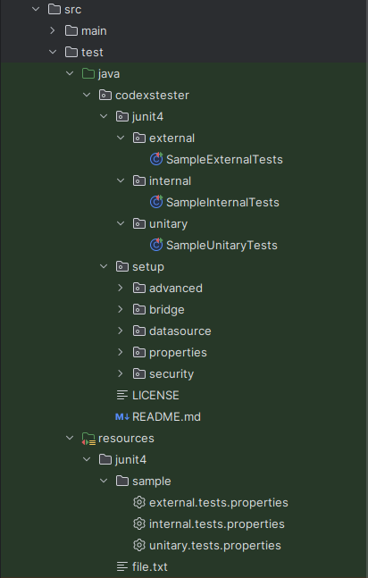

# CODEXSTESTER - GENERATOR

## Overview

To help and optimize the time of tests development the Codexstester offer a simple resource manager to generate files 
and configurations. This resource is called CODEXSTESTER-GENERATOR and can be resumed in the following parts:

- Install
- Uninstall
- Create
- Delete

### Install

The parameter install is used to install a CODEXSTESTER-GENERATOR that make everything prepared for tests creation and 
can be executed once. For exemplify this resource we are going to see the samples codes below to get a little bit more 
knowledge about this process.

> Installing

As mentioned previously the CODEXSTESTER-GENERATOR makes install of the Codexstester Project to get all thing 
working fine, just execute the following command

<pre>
codexstester-generator --install
</pre>

However, there is one important point to clarify, it is very important to get the CODEXSTESTER-GENERATOR from 
Huntercodexs GitHub account and put it in the correctly place, that is the root path from the target project, 
for example:

<pre>
PROJECT_PATH=/home/${USER}/path-to-project/
</pre>

<pre>
${PROJECT_PATH}
    └── src
        ├── main
        │   └── java
        │       └── com
        ├── test
        │   └── java
        │       └── com
</pre>

The CODEXSTESTER-GENERATOR should be placed in the PROJECT_PATH according to example above. Whe the installation command 
will be executed --install, the CODEXSTESTER-GENERATOR will be checking if the path contains a valid java project and 
if there is some older installation. Whether everything is ok the installation will be making the necessary changes in 
the PROJECT test sources, creating a structure like something below:

> For JUnit + Selenium

<pre>
src
└── test
    ├── java
    │   └── codexstester
    │       ├── junit4
    │       │   ├── external
    │       │   ├── internal
    │       │   └── unitary
    │       └── setup
    │           ├── advanced
    │           ├── bridge
    │           ├── datasource
    │           ├── properties
    │           └── security
    └── resources
        ├── junit4
        │   └── sample
</pre>

> For JUnit + Selenium + Cucumber

<pre>
src
└── test
    ├── java
    │   └── codexstester
    │       ├── bdd
    │       │   ├── runner
    │       │   │   └── samples
    │       │   └── stepsdef
    │       │       └── samples
    │       │           ├── integration
    │       ├── junit4
    │       │   ├── external
    │       │   ├── internal
    │       │   └── unitary
    │       └── setup
    │           ├── advanced
    │           ├── bridge
    │           ├── datasource
    │           ├── properties
    │           └── security
    └── resources
        ├── features
        │   ├── app
        │   └── samples
        │       ├── background
        │       ├── counter
        │       ├── datatable
        │       ├── lambda
        │       ├── list
        │       └── login
        ├── junit4
        │   └── sample
        └── reporting
</pre>

In the both cases above, the structure is based on the type of tests workspace that you are applying the installation. 
Sample tests files and configurations are been affordable to consult and get how to do in some use cases, be for junit, 
cucumber or selenium, each workspace has a complete samples and can be running without impact others tests that you 
are making in any occasion.

### Uninstall

If you need to remove completely the CODEXSTESTER-GENERATOR just execute the command below:

<pre>
codexstester-generator --uninstall
</pre>

> WARNING: There is no backup in this process, so make yourself a backup of the tests before 

### Create

> IMPORTANT: For more details check the documentation
> <a href="https://github.com/huntercodexs/codexstester/blob/main/data/CODEXSTESTER-PLUS.md">CODEXSTESTER PLUS</a>

- Syntax

<pre>
codexstester-generator --create [test-type] --name=[test-name]
</pre>

where

test-type = [--junit, --selenium, --cucumber, --all]
test-name = [any string name]

Using these parameters you can create the following resources:

#### Tests for Junit

- Command

<pre>
codexstester-generator --create --junit --name=Sample
</pre>

The result of this command is a complete Workspace to write tests very fast and controlled by one specific standard. 
Look the example below:

<pre>
src
└── test
    ├── java
    │   └── codexstester
    │       ├── junit4
    │       │   ├── external
    │       │   │   └── SampleExternalTests.java
    │       │   ├── internal
    │       │   │   └── SampleInternalTests.java
    │       │   └── unitary
    │       │       └── SampleUnitaryTests.java
    │       └── setup
    │           ├── bridge
    │           │   └── SampleBridgeTest.java
    │           ├── datasource
    │           │   └── SampleDataSource.java
    └── resources
        ├── junit4
        │   ├── file.txt
        │   └── sample
        │       ├── external.tests.properties
        │       ├── internal.tests.properties
        │       └── unitary.tests.properties
</pre>

#### Tests for Selenium

> NOTE: Selenium is integrated with Junit over the External tests because sometimes it is needed to make requests 
> to the web pages or web systems supported by web browser. The selenium tests offer one short way to write tests 
> on websites, webpages and web systems, for example: Login, MFA, Onboarding etc...

- Command

<pre>
codexstester-generator --create --selenium --name=Sample
</pre>

The result of this command is a complete Workspace to write tests very fast and controlled by one specific standard.
Look the example below:

<pre>
src
└── test
    ├── java
    │   └── codexstester
    │       ├── junit4
    │       │   ├── external
    │       │   │   └── SampleSeleniumTests.java
    │       └── setup
    │           ├── bridge
    │           │   └── SampleBridgeTest.java
    │           ├── datasource
    │           │   └── SampleDataSource.java
    └── resources
        ├── junit4
        │   ├── file.txt
        │   └── sample
        │       ├── external.tests.properties
</pre>

#### Tests for Cucumber

- Command

<pre>
codexstester-generator --create --cucumber --name=Sample
</pre>

The result of this command is a complete Workspace to write tests very fast and controlled by one specific standard.
Look the example below:

<pre>
src
└── test
    ├── java
    │   └── codexstester
    │       ├── bdd
    │       │   ├── runner
    │       │   │   ├── SampleReportRunnerTest.java
    │       │   │   ├── SampleRunnerTest.java
    │       │   └── stepsdef
    │       │       ├── SampleSteps.java
    └── resources
        ├── features
        │   ├── sample
        │   │   └── Sample.feature
</pre>

> IMPORTANT: Don't remove the path **integration/CucumberSpringIntegration.java**

#### Tests for All

- Command

<pre>
codexstester-generator --create --all --name=Sample
</pre>

The result of this command is a complete Workspace to write tests very fast and controlled by one specific standard.
Look the example below:

<pre>
src
└── test
    ├── java
    │   └── codexstester
    │       ├── bdd
    │       │   ├── runner
    │       │   │   ├── SampleReportRunnerTest.java
    │       │   │   ├── SampleRunnerTest.java
    │       │   └── stepsdef
    │       │       ├── SampleSteps.java
    │       │       └── samples
    │       │           ├── integration
    │       │           │   └── CucumberSpringIntegration.java
    │       ├── junit4
    │       │   ├── external
    │       │   │   └── SampleExternalTests.java
    │       │   │   └── SampleSeleniumTests.java
    │       │   ├── internal
    │       │   │   └── SampleInternalTests.java
    │       │   └── unitary
    │       │       └── SampleUnitaryTests.java
    │       └── setup
    │           ├── bridge
    │           │   └── SampleBridgeTest.java
    │           ├── datasource
    │           │   └── SampleDataSource.java
    └── resources
        ├── features
        │   ├── sample
        │   │   └── Sample.feature
        ├── junit4
        │   ├── file.txt
        │   └── sample
        │       ├── external.tests.properties
        │       ├── internal.tests.properties
        │       └── unitary.tests.properties
</pre>

### Delete

- Syntax

<pre>
codexstester-generator --delete [test-type] --name=[test-name]
</pre>

where

test-type = [--junit, --selenium, --cucumber]
test-name = [any string name]

Ths test-type and test-name should be informed correctly to avoid problems with target identification, because it is 
possible to have different test-type with the same name, for example:

<pre>
Sample.feature for cucumber
SampleUnitaryTests for Junit
</pre>

In the case above the name Sample is shared in the between the test-types and it is needed to inform what kind of them 
you need to delete.

- Examples

<pre>
codexstester-generator --delete --junit --name=Sample
codexstester-generator --delete --selenium --name=Sample
codexstester-generator --delete --cucumber --name=Sample
</pre>

## Download

#### Codexstester Generator

> NOTE: The Codexstester has CODEXSTESTER-GENERATOR that generate the Codexstester Project that belong each 
> one to the Codexstester Ecosystem, so it is very important to understand that before go ahead in the implementation.

- Runnable

The first way to get the CODEXSTESTER-GENERATOR is downloading the executable version available in each release. The 
link https://github.com/huntercodexs/codexstester/releases contains all releases already deployed and in each one has 
a file named codexstester-generator-{VERSION}-run.zip. 

- Portable

The second way to get the CODEXSTESTER-GENERATOR is using the Codexstester Project resource available in each release 
placed in the Releases page link https://github.com/huntercodexs/codexstester/releases. The name for this one file is 
codexstester-generator-{VERSION}-project.zip.

In both cases, Executable or Portable, you need to follow the rules below:

After choose the specific Codexstester Generator resource, check if it is in according to the target version of your 
project, for example: If you choose the CODEXSTESTER-GENERATOR Release r.2.0.0 (that indicates you are developing over 
Spring Boot 2.6.4 and Java 8 Version), in this case you need to choose the codexstester-generator-2.0.0-run.zip or 
codexstester-generator-2.0.0-project.zip, to avoid incompatibility problems. So the project target or consumer is 
running on Java 8 version using Spring Boot 2.6.4 and the Release related for CODEXSTESTER-GENERATOR is 2.0.0.

After download the correct codexstester project, unzip it in the correct place and check if everything is ok. Below it 
is possible to see a sample Codexstester Project that should be look like something so

In the case of Runnable version you need to execute the steps discussed in this documentation before.

************************************************************************************************************************
Enjoy this job as you prefer.

------------------------------------------------------------------------------------------------------------------------
* All rights reserved to Huntercodexs &copy; 2021 - Software Development
* Maintained by Jereelton Teixeira (jereelton-devel)
************************************************************************************************************************
