# CODEXS TESTER
Este projeto é um espaço de trabalho completo para escrever testes unitarios e de integração

<pre>
||||||||||||||||||||||||||||||||||||||||||||||||||||||||||||||||||||||||||||||||||||||||||||||||||||

//||||  //|||\\  ||||\\   ||||||  \\  //  //||||     ||||||  ||||||  //||||  ||||||  ||||||  ||||\\
||      ||   ||  ||   ||  ||||      ||    \\||\\  -    ||    ||||    \\||\\    ||    ||||    ||  //
\\||||  \\|||//  ||||//   ||||||  //  \\  ||||//       ||    ||||||  ||||//    ||    ||||||  ||  \\

Release: 1.0.4
Powered by Huntercodexs (c) 2022
https://github.com/huntercodexs
||||||||||||||||||||||||||||||||||||||||||||||||||||||||||||||||||||||||||||||||||||||||||||||||||||
</pre>

# Licença

Este projeto é livre e pode ser usado como base para outros projetos por qualquer pessoa através da licença MIT.

# Idiomas

- Portugues Brazil (pt-br)
- <a href="README-EN.md">Inglês (en)</a>

# Pre Requisitos

- MVC Concept
- Maven Project 4.0.0 
- Spring Boot 2.0.1.RELEASE 
- Java Version 1.8 (jdk1.8.0_212)

> veja mais detalhes no arquivo pom.xml desse projeto

# Código de status HTTP

Esse projeto oferece todos os codigos http para tratamento de requisição REST, para mais detalhes do Status Code em 
requisições. Veja mais detalhes sobre HTTP STATUS CODE em https://developer.mozilla.org/pt-BR/docs/Web/HTTP/Status

# Instalação e Configuração

- Depedendencias

Primeiramente import para dentro do arquivo pom.xml de um projeto qualquer as seguintes dependencias:

<pre>
		&lt;dependency&gt;
			&lt;groupId>org.springframework.boot&lt;/groupId&gt;
			&lt;artifactId>spring-boot-starter-test&lt;/artifactId&gt;
			&lt;scope>test&lt;/scope&gt;
		&lt;/dependency&gt;
		&lt;dependency&gt;
			&lt;groupId>io.projectreactor&lt;/groupId&gt;
			&lt;artifactId>reactor-test&lt;/artifactId&gt;
			&lt;scope>test&lt;/scope&gt;
		&lt;/dependency&gt;
		&lt;dependency&gt;
			&lt;groupId>org.springframework.restdocs&lt;/groupId&gt;
			&lt;artifactId>spring-restdocs-mockmvc&lt;/artifactId&gt;
			&lt;scope>test&lt;/scope&gt;
		&lt;/dependency&gt;
		&lt;dependency&gt;
			&lt;groupId>io.rest-assured&lt;/groupId&gt;
			&lt;artifactId>spring-mock-mvc&lt;/artifactId&gt;
			&lt;scope>test&lt;/scope&gt;
		&lt;/dependency&gt;
		&lt;dependency&gt;
			&lt;groupId>junit&lt;/groupId&gt;
			&lt;artifactId>junit&lt;/artifactId&gt;
			&lt;scope>test&lt;/scope&gt;
		&lt;/dependency&gt;
		&lt;dependency&gt;
			&lt;groupId&gt;net.minidev&lt;/groupId&gt;
			&lt;artifactId&gt;json-smart&lt;/artifactId&gt;
			&lt;version&gt;2.3&lt;/version&gt;
			&lt;scope&gt;compile&lt;/scope&gt;
		&lt;/dependency&gt;
</pre>

- Configuração

> O procedimento de configuração pode ser resumido nos seguintes passos:

- usando o comando git clone

<pre>
cd @{PROJECT_ROOT_PATH}/src/test/java
git clone https://github.com/huntercodexs/codexstester.git
cd codexstester
git checkout release-@{RELEASE_VERSION} (exemplo: release-1.0.0) 
rm -rf .git .gitignore
</pre>

Você também pode usar as releases disponiveis no repositorio github desse projeto acessando o link Releases conforme 
ilustrado na imagem abaixo

> NOTA: Escolha sempre a ultima release disponivel no repositorio, pois ela contem todas as atualizações do projeto 
> previamente testadas e que são de grande importância para o desenvolvimento dos testes. Verifique se a release 
> possui alguma atualização para ajustes no desenvolvimento de testes escritos em releases anteriores para verificar 
> a compatibilidade.

Nesse caso o procedimento é, em partes, o mesmo do explicado acima em "git clone", ou seja os arquivos devem estar na 
pasta correta <pre>@{PROJECT_ROOT_PATH}/src/test/java</pre> do projeto consumidor.

***NOTA: Caso os procedimentos acima não funcionem, ou ainda existam dúvidas, siga as instruções abaixo***

Após importar as dependencias em seu projeto, verifique se a pasta (package) "test" existe no projeto, caso ainda não 
exista crie esse package no seguinte path:

<pre>
    @{PROJECT_ROOT_PATH}/src/test
</pre>

Dentro do path "test" criado, certifique-se de que existam as pastas "java" e "resources" conforme imagem abaixo:

Em seguida no projeto onde sera executado os testes copie a pasta (package) "codexstester" para dentro da pasta "java" 
mostrada acima, sendo que a pasta "codexstester" é a mesma que esta dentro do projeto CODEXS TESTER

NOTA

> É recomandável fazer isso com o auxilio de uma IDE como o IntelliJ, pois essa ferramenta é capaz de copiar todos os 
> arquivos e pastas renomeando corretamente os "packages" e referencias dentro do projeto, isso evita que ocorram falhas
> e erros inesperados além de causar muita confusão para um procedimento de refatoramento de codigo. Também é possível 
> apenas arrastar a pasta codexstester inteira para dentro do projeto consumidor no path especificado 

<pre>
    @{PROJECT_ROOT_PATH}/src
</pre>

A imagem abaixo mostra como o cenário deve estar (faltam os arquivo README e LICENSE)

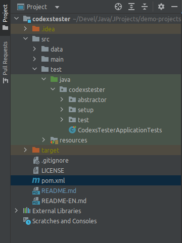

Agora copie os arquivos ".properties" que estão dentro do path src/test/java/codexstester/setup/properties/files 
para dentro do path src/test/resources/@{RESOURCE_NAME} conforme mostrado na imagem abaixo

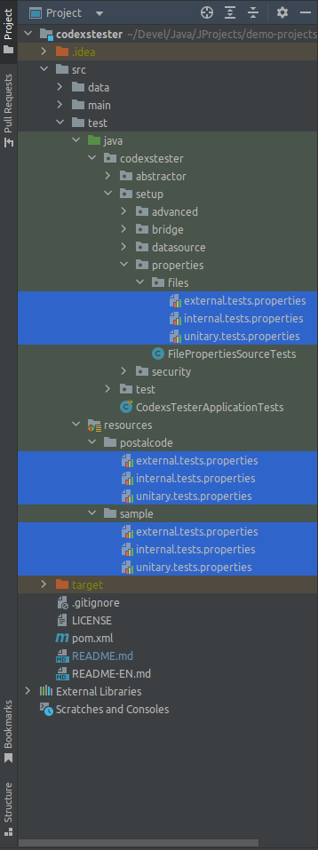

> IMPORTANTE: Veja que foram criadas duas pastas dentro do path src/test/resources separando os testes para recursos 
> contidos dentro do serviço/aplicação que esta consumindo o CODEXS TESTER, no caso um recurso chamada postalcode e um 
> outro recurso chamado sample. Essa configuração não é obrigatória, mas auxilia na organização do espaço de trabalho de 
> testes e do projeto em geral, mantendo os códigos e arquivos separados por suas finalidades. Outro ponto importante 
> é que não importa onde esses arquivos devem estar, mas será necessario informar onde eles estão na configuração de 
> propriedades de testes

Esses arquivos serão utilizados para realizar uma parte das configurações de testes, por exemplo a url para requisições 
e a uri ou endpoint de uma API, assim como HEADERS HTTP de request e parametros adicionais.

Nesse momento temos o espaço de trabalho pronto para ser configurado devendo estar conforme a imagem abaixo, sendo 
possivel observar os seguintes recursos de setup:

- path: src/test/java/codexstester/setup/advanced
  - file: [AdvancedSetupTests.java](src/test/java/codexstester/setup/advanced/AdvancedSetupTests.java)
- path: src/test/java/codexstester/setup/bridge
  - [ExternalSampleBridgeTests.java](src/test/java/codexstester/setup/bridge/ExternalSampleBridgeTests.java)
  - [InternalSampleBridgeTests.java](src/test/java/codexstester/setup/bridge/InternalSampleBridgeTests.java)
  - [UnitarySampleBridgeTests.java](src/test/java/codexstester/setup/bridge/UnitarySampleBridgeTests.java)
- path: src/test/java/codexstester/setup/datasource
  - file: [DataSourceSampleTests.java](src/test/java/codexstester/setup/datasource/DataSourceSampleTests.java)
- path: src/test/java/codexstester/setup/properties
  - file: [FilePropertiesSourceTests.java](src/test/java/codexstester/setup/properties/FilePropertiesSourceTests.java)
- path: src/test/java/codexstester/setup/properties/file
  - [external.tests.properties](src/test/java/codexstester/setup/properties/files/external.tests.properties)
  - [internal.tests.properties](src/test/java/codexstester/setup/properties/files/internal.tests.properties)
  - [unitary.tests.properties](src/test/java/codexstester/setup/properties/files/unitary.tests.properties)
- path: src/test/java/codexstester/setup/security
  - [SecuritySourceTests.java](src/test/java/codexstester/setup/security/SecuritySourceTests.java)
- path: src/test/resources/sample
  - [external.tests.properties](src/test/resources/sample/external.tests.properties)
  - [internal.tests.properties](src/test/resources/sample/internal.tests.properties)
  - [unitary.tests.properties](src/test/resources/sample/unitary.tests.properties)

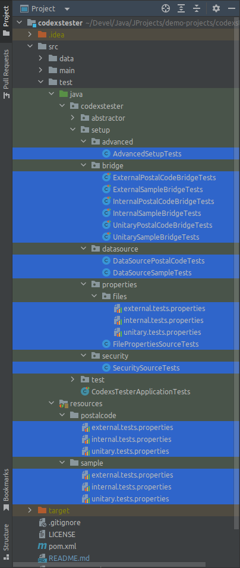

- AdvancedSetupTests.java

Iniciando pelo primeiro arquivo da lista anterior, temos o arquivo java AdvancedSetupTests. Esse arquivo tem como finalidade 
servir aos testes de maneira restrita e avançada para comparação de dados, valores e tipos de dados. Sendo assim, caso 
seja necessario uma apuração mais profunda e assertiva nos testes, deve-se usar esse arquivo para programar essas 
informações. Ele ja vem com uma série de dados prontos para exemplificar seu uso, porém seu uso sera explicado com mais 
detalhes na sessão de convenções e padronização dos testes nesse mesmo documento.

- ExternalSampleBridgeTests.java
- InternalSampleBridgeTests.java
- UnitarySampleBridgeTests.java

Continuando com os arquivos da lista acima, temos os arquivo de BRIDGE, que tem como finalidade criar um link 
entre os arquivos de testes do projeto consumidor e o CORE do CODEXS TESTER.

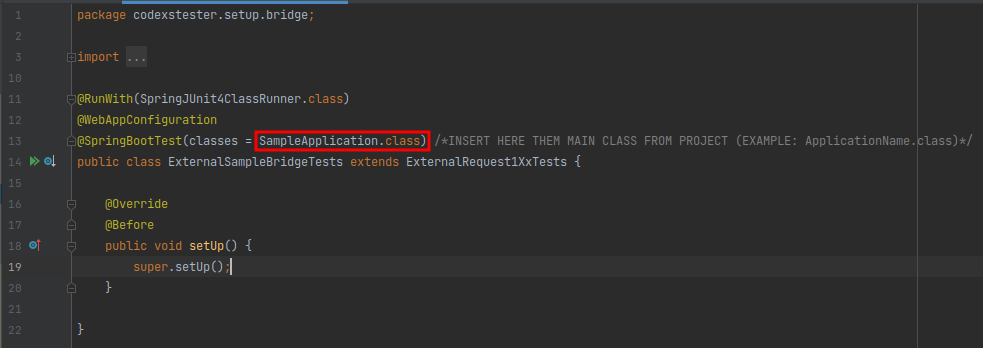

Coloque o nome da classe principal do seu projeto java spring boot, que nesse caso é SampleApplication.java, essa é a 
classe que contem o metodo principal do projeto consumidor, ou seja a classe "main". Entretanto é possível que o projeto 
tenha mais de uma classe principal (main), ou seja, varios projetos em um mesmo repositorio, isso ocorre muito com 
estruturas monoliticas, nesses casos o CODEXS TESTER também oferece suporte, conforme será mostrado mais adiante na 
sessão de convenções de testes.

- DataSourceSampleTests.java

Esse é o arquivo que devera ser usado como base de dados para os testes, nele será definido todo a "base de dados" de 
testes, ou seja, dados para comparações. O formato e os dados a serem escritos nesse arquivo, são de livre escolha do 
desenvolvedor, e podem ser escritos da maneira mais simples e conveniente que for possível.

- FilePropertiesSourceTests.java

Esse é o arquivo mais simples de todos dentro do espaço de trabalho CODEXS TESTER, sendo necessário apenas uma configuração 
conforme imagem a seguir:

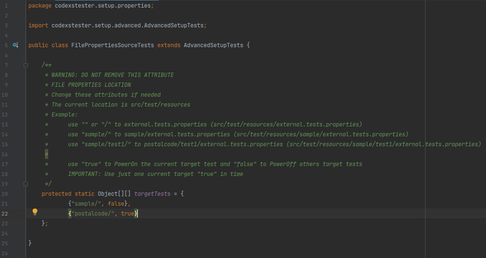

Veja que existe apenas um atributo chamado targetTests o qual deve ser configurado de acordo com a necessidade do projeto, 
porém essa configuração será melhor explicada na sessão de convenções e padrões de testes. 

- external.tests.properties
- internal.tests.properties
- unitary.tests.properties

Esses são os arquivo ".properties" que devem ser usados durante os testes, porém eles precisam ser copiados para dentro 
do path resources/sample ou sample/, conforme mencionado anteriormente. Esses arquivos de propriedades possuem uma série 
de campos úteis para os testes, como URL, URI, HEADERS HTTP, API-KEY, QUERY-PARAMETERS entre outros, e eles serão procurados no 
path citado durante a execução de um teste qualquer.

- SecuritySourceTests.java

É nesse arquivo que os dados de acesso estão disponiveis, por exemplo, credenciais para uma autenticação via OAuth2, 
sendo assim tenha muito cuidado ao editar esse arquivo.

NOTA

> Tenha cuidado com as credenciais que serão utilizadas no arquivo SecuritySourceTests para que elas não fiquem
> expostas em locais vulneráveis.

- Entendendo os recurso do espaco de trabalho CODEXS TESTER

A seguir temos uma imagem onde podemos ver os principais arquivos para executar os testes, sendo eles separados por:

- external
- internal
- unitary

Para cada um dos testes temos um arquivo de exemplo chamado ExternalSampleTests, InternalSampleTests e
UnitaySampleTests, porém são apenas exemplos para agilizar o processo de aprendizado sobre o funcionamento dos testes 
com o usdo do CODEXS TESTER.

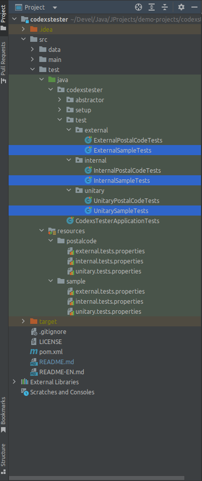

> Sobre testes do tipo "external"

Os testes do tipo "external" são também conhecidos como testes de integração, eles tem a capacidade de executar testes 
em ambientes completamente segregados e "espalhados" por uma infra estrutura qualquer, ou seja, o principal objetivo 
desse teste e também sua principal caracteristica esta no fato de ser possível executar um teste completo em uma infra 
estrutura qualquer através de uma chamada feita para uma central ou roteador de requisições como no caso de usos com um 
API GATEAWAY (por exemplo o Zuul da Netflix), ou então um NGINX com PROXY REVERSE, o qual faz o redirecionamento das 
chamadas para um recurso especifico dentro de um ambiente seguro e controlado.

Abaixo temos uma demonstração grafica de como isso funciona

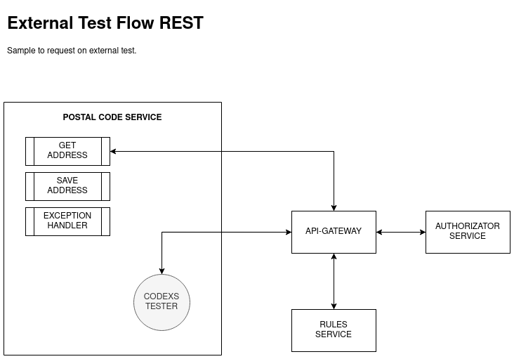

> Sobre testes do tipo "internal"

Com relação ao testes do tipo "internal", assim como no tipo "external" eles também podem ser usado e chamados de testes 
de integração, ou seja, é possivel que o serviço alvo de teste possa conter um recurso integrado com algum ambiente externo, 
como no caso do projeto de exemplo POSTAL CODE (contido nesse projeto) que faz uma chamada REST através de um HTTP-CLIENT 
para um recurso externo conhecido como VIA CEP CORREIOS.

Entretanto os testes podem ser meramente internos ao serviço ou projeto consumidor do CODEXS TESTER, ou seja, as chamadas 
REST para os "endpoints" contidos no serviço, o que o torna diferente dos testes unitarios.

A imagem abaixo ilustra o fluxo de processamento para testes do tipo internal:

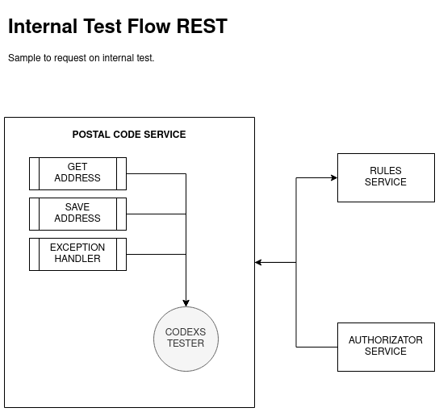

> Sobre testes do tipo "unitary"

Já no caso dos testes do tipo "unitary" temos a premissa de que os testes serão feitos em cima de uma unidade qualquer 
contida em um serviço, projeto, função, metodo ou uma unidade de código qualquer, ou seja, praticamente estaremos 
testando se uma parte de uma classe esta funcionando corretamente, se uma instância esta sendo feita de forma correta 
ou mesmo se a soma de dois numeros esta sendo feita corretamente por um calculo qualquer.

Para exemplificar esse cenário temos a imagem a seguir, que mostra de forma simples e resumida como são feitos os testes 
unitarios com o espaço de trabalho CODEXS TESTER.

Essas foram as informações sobre o path de configuração codexstester/setup e o path de testes codexstester/test, sendo 
que eles serão detalhados na sessão de convenções e padrões de testes do CODEXS TESTER.

# Estrutura de código CODEXS TESTER

Como já mencionado, a estrutura dos testes é composta por CABEÇALHO, CORPO e TESTE, sendo elas detalhadas a seguir

> CABEÇALHO

A HEADER da requsições são definidas pelo uso da classe HeadersDto.java que contem todos os campos necessários para
realizar uma requisição REST padrão, sendo esses campos descritos abaixo:

- contentType
- httpMethod
- statusCode
- crossOrigin
- origin
- hostname
- ip
- osname
- authorizationBasic
- authorizationBearer
- apiKeyToken
- apiKeyAppName
- apiKeySecret
- apiKeyValue
- apiKeyGeneric
- addtionalName
- addtionalValue
- bodyParameters

Os campos acima são auto descritos e não precisam de mais detalhes, entretando alguns pontos precisam ser esclarecidos.
Caso seja necessário usar um metodo de autenticação como o OAuth2, o campo authorizationBasic e authorizationBearer
estarão comprometidos não podendo ser utilizados em uma chamada, por exemplo

<pre>
headersDto.setAuthorizationBasic("Basic YXJjaF9kZW1vX2NsaWVudF8xOjExMTExMTExLTIyMjItMzMzMy00NDQ0LTU1NTU1NTU1NTU1NQ==")
</pre>

Se for necessário enviar algum campo personalizado na HEADER use os artibutos **addtionalName** e **addtionalValue**,
que tem por finalidade criar esse campo especifico, por exemplo:

<pre>
headersDto.setAddtionalName("X-Api-Access-Code");
headersDto.setAddtionalValue("XYZ-123");
</pre>

***IMPORTANTE: Use o arquivo de propriedades para definir as headers adicionais de requisição, sendo permitido até cinco
headers adicionais, conforme imagem abaixo***

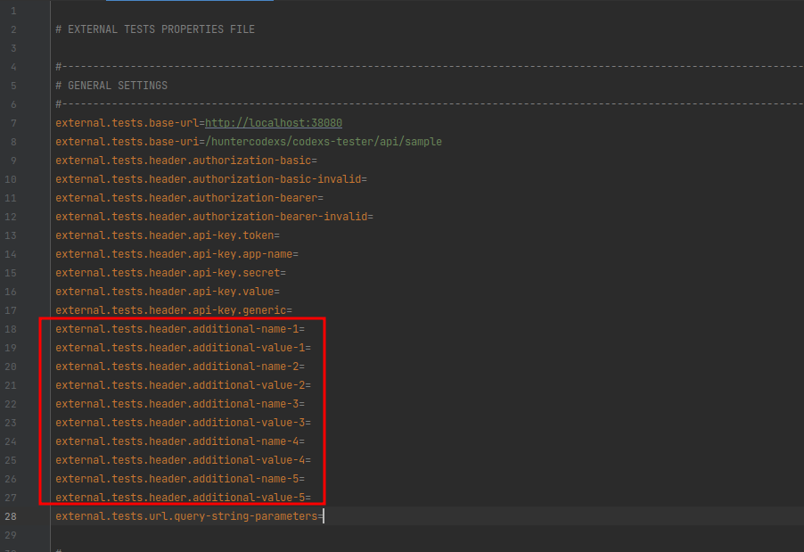

Exemplo (internal/external):

<pre>
internal.tests.header.additional-name-1=Api-Key-Token
internal.tests.header.additional-value-1=312876786d7s6f87f6876d78f6df78
internal.tests.header.additional-name-2=Api-key-Username
internal.tests.header.additional-value-2=codexstester
internal.tests.header.additional-name-3=Api-Key-Specific-Header
internal.tests.header.additional-value-3=5e363142-5ef4-4cf7-8ca8-87e1401be1f3
internal.tests.header.additional-name-4=Customer-Config
internal.tests.header.additional-value-4=secret-config-server
internal.tests.header.additional-name-5=App-Name
internal.tests.header.additional-value-5=CODEXS-TESTER-APP
</pre>

> CORPO

O BODY de uma requisição REST contem as informações que devem ser transmitidas até o recurso final para serem processadas
e usadas com um propósito especifico.

Para enviar esse BODY na requisição é preciso usar a classe RequestDto.java disponivel no espaço de trabalho do Codexs
Tester detalhada a seguir:

- uri
- id
- dataRequest
- expectedMessage
- expectedCode

Veja que temos como definir a URI (uri) onde queremos chegar embora essa propriedade também pode ser definida no 
arquivo de propriedades.

Temos o ID (id) que pode ser usado para definir uma requisição REST enviando id na url, ou seja uma API RESTFUL por 
exemplo

<pre>/api/postal-code/{id} => /api/postal-code/1209000</pre>

O campo dataRequest deve ser usado para definir o BODY REQUEST da requisição, ou seja, os dados para enviar nos testes
devem estar nesse campo.

Ainda é possível definir uma string para ser comparada no teste no campo expectedMessage, por exemplo: "Data Not Found",
se não for definido uma string no campo expectedMessage nenhuma comparaçã será feita.

> NOTA: O assunto "Comparação de Dados" será abordado mais adiante nessa documentação

O campo expectedCode não deve ser usado, pois ele não será considerado dessa forma, esse campo é usado no backend do
CODEXS TESTER de acordo com a função definida para teste, por exemplo:

Se a funcionalidade "codexsTesterInternal_StatusCode200_RetrieveOK" for chamada, ela automaticamente tera como valor 
para o campo expectedCode o valor "200 OK".

> TESTE

Essa é a parte do código que realmente executa o teste, após a correta parametrização dos dados de HEADER e BODY o TESTE
poderá ser chamado sem nenhum problema. Os testes disponiveis no espaço de trabalho CODEXS TESTER podem ser listados
iniciando a digitação codexsTester+[Ctrl+Space], em algumas IDEs como o IntelliJ essa funcionalidade é executada de 
forma automatica. No final da documentação existe uma imensa lista com as funcionalidades disponiveis no CODEXS TESTER.

# Convenções e Padrões CODEXS TESTER

<h3>1. Configurando um escopo para os testes</h3>

Para definir um escopo de testes é preciso editar o arquivo FilePropertiesSourceTests.java, mas precisamente o atributo
targetTests, sendo que essa configuração faz referencia a uma aplicação ou recurso separado contida dentro do projeto.

A seguir é mostrado um exemplo completo dessa configuração:

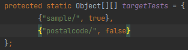

Repare que existem dois escopos para testes, um chamado sample e outro chamado postalcode, porém existe um segundo valor 
em cada indice do array, true ou false, o que indica qual escopo o CODEXS TESTER deve levar em consideração. Sendo assim 
quando um teste for executado, o CODEXS TESTER ira procurar as configurações necessárias (arquivos properties de teste) 
no classpath indica no atributo targetTests e que tem o segundo valor igual a true. Ainda nesse ponto é importante dizer 
que apenas um escopo é aceito por vez, e que o CODEXS TESTER ira considerar o primeiro escopo de teste com o valor true. 
Dessa forma tenha cuidado para não cometer enganos nessa configuração, pois caso seja feita incorretamente, certamente 
ira causar muitos problemas durante os testes, por exemplo:

<pre>
    protected static Object[][] targetTests = {
            {"sample/", false},
            {"postalcode/", false},
            {"salesservice/", true}, <<< Esse será considerado
            {"stockservice/", false},
            {"dispatcherservice/", true} <<< Esse não sera considerado
    };
</pre>

Conforme imagem abaixo, a configuração (da imagem) acima diz que o escopo de trabalho que o CODEXS TESTER deve considerar 
esta localizado em src/test/resources/sample

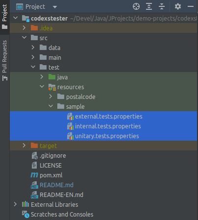

Com essa configurações dizemos para os testes do tipo "external", "internal" ou "unitary" que os detalhes de "requests" 
como HEADERS-HTTP estarão disponiveis em cada arquivo referente ao tipo de teste.

<h3>2. Configurando a comunicação (bridge) entre os testes e o CORE do CODEXS TESTER</h3>

Essa configuração é a mais importante e deve ser feita com atenção e entendimento correto do seu funcionamento, uma vez 
que ela diz ao CODEXS TESTER qual será a aplicação a ser testada. Imagine que existam duas aplicações em um mesmo projeto, 
SampleApplication e PostalCodeApplication, que dificilmente ocorrerá com um projeto orientado a micro serviço, dessa 
forma será necessário informar ao CODEXS TESTER qual será a aplicação a ser testada, conforme mostrado na imagem abaixo:

> Veja que existem dois arquivos diferentes, um para a aplicação SampleApplication e outro para a aplicação PostalCodeApplication

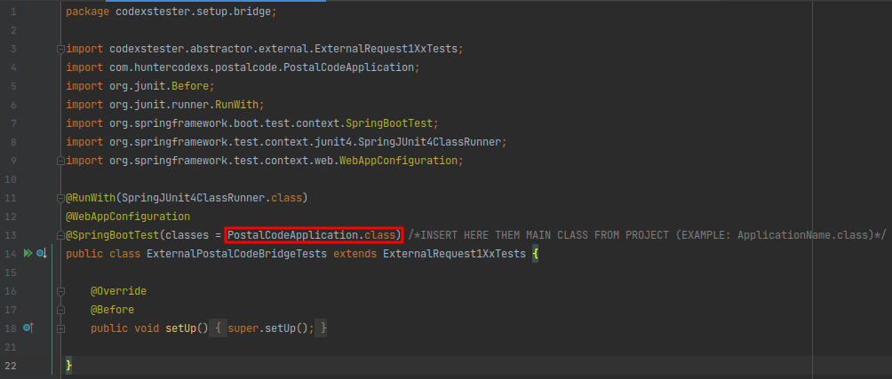

Agora veja como esta o projeto alvo de testes

Não é necessário alterar mais nada nesse arquivo, entretanto como todo projeto de código aberto livre para ser alterado, 
é possível acrescentar outros códigos se necessário, porém tenha cautela nas alterações para não comprometer o correto 
funcionamento do CODEXS TESTER.

<h3>3. Configurando um datasoruce</h3>

Essa etapa não é mandatória, mas como ja mecionado, ajuda a manter o ambiente de teste e a codificação do projeto mais 
organizada e de facil escolonamento. Para definir um datasource crie um arquivo no path codexstester/setup/datasource 
com o nome especifico de sua finalidade, por exemplo: DataSourceSampleTests.java ou DataSourcePostalCodeTests.java ou 
ainda SampleDataSourceTests.java, PostalCodeDataSourceTests e etc...

Esse arquivo deve conter dados e informações para os diferentes tipo de testes que deverão ser executados no projeto 
consumidor do CODEXS TESTER. A classe DataSourceSampleTests definida no arquivo DataSourceSampleTests.java devera ser 
extendida no arquivo de testes referente, conforme mostrado abaixo:

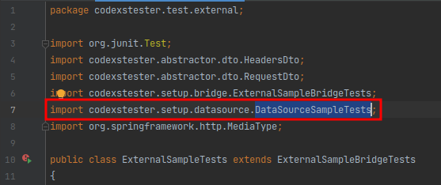

Um exemplo de código no datasource pode ser visto no código abaixo

Repare que existem dois metodos que retornam um objeto JSON que serão utilizados nos testes como dados para enviar na 
requisição, conforme será mostrado mais adiante. Também é possível observar atributos definidos para uso nos arquivos de 
testes caso seja util. Esse arquivo é livre em sua preparação e programação, apenas tenha o cuidado com o entendimento e
usabilidade do mesmo.

<h3>4. Configurações de segurança</h3>

As configurações de segurança devem estar contidas no arquivo SecuritySourceTests.java localizado no path do CODEXS TESTER 
codexstester/setup/security, sendo essas configurações referentes a dados de acesso e autorização OAuth2. Até o momento 
o CODEXS TESTER oferece suporte apenas para OAuth2 no arquivo SecuritySourceTests, mas em breve mais opções de segurança 
serão adicionadas.

Conforme ja mencionado nesse documento essas configurações devem ser feitas com muita responsabilidade, pois são dados 
sensiveis de acesso. É altamente recomendado que não se utilize dados de acesso a ambientes de produção ou até mesmo de 
homologação, ainda assim não exponha os dados, mesmo que de ambientes de desenvolvimento ou testes para pessoas não 
autorizados. A seguir temos uma imagem para ilustrar essa configuração:

<h3>5. Configurações avançadas</h3>

> NOTA: Antes de mais nada, é importante deixar claro que não é necessário importar nenhum arquivo para dentro do arquivo 
> de testes, pois isso já é feito pelo arquivo de bridge mencionado mais acima nesse documento.

As configurações avançadas para testes devem ser feitas no arquivo AdvancedSetupTests.java o qual tem a finalidade de 
oferecer um ambiente mais organizado e otimizado para realizar testes em larga escala e com alta precisão. Os testes 
avançados do CODEXS TESTER consistem em verificar se um dado qualer possui as seguintes caracteristicas:

- Nome ou identificação de uma chave ou campo 

Para nome ou identificação de uma chave ou campo em um teste, devem ser usados dados em formato String, por exemplo:
<pre>"name", "age", "address", "data"</pre>

- Valor esperado

O campo valor esperado deve ser usado para também testar o conteudo de uma resposta, sendo ele em formato fixo e definido 
no CODEXS TESTER como String, sendo possível serializar um objeto qualquer como por exemplo JSONObject, LinkedHashMap ou 
HasMap para comparação, por exemplo:

<pre>
    public static Object[] expectedJsonValues() {
        String string = "value1";
        JSONObject jsonObject = new JSONObject();
        HeadersDto headersDto = new HeadersDto();
        return new Object[]{string, jsonObject, headersDto};
    }
</pre>

- Tipo de dados

Para definição de tipo de dados, devem ser informados os formatos para cada campo em um determinado teste, devendo ser 
utilizado o formato @{CLASS-NAME}.java, veja mais detalhes nos exemplos abaixo.

- Modo Rigoroso

O modo rigoroso STRICT-MODE esta disponivel para aplicação nos testes, ele deve ser utilizado quando existe a necessidade 
em fazer um teste com alta precisão, pois quando ele esta ativo (true), todos os dados como, nome de um campo ou chave 
de um campo, tipo do campo e valor do campo serão testados e validados.

Os testes avançados CODEXS TESTER estão limitados a oito tipos de dados considerados essenciais em JAVA, sendo eles:

<pre>
- String
- JSON
- DTO
- HashMap
- ArrayList
- LinkedList
- List (interface)
- LinkedHashMap
</pre>

Entretando o formato dos campos presentes nas estruturas de dados são livres e independentes, podendo ser utilizadas 
de acordo com a necessidade do programador.

Abaixo segue um exemplo de como implementar um teste avançado CODEXS TESTER utilizando o tipo de dados JSON

- Configuração para uma resposta JSON com varios tipos de dados no seu conteudo

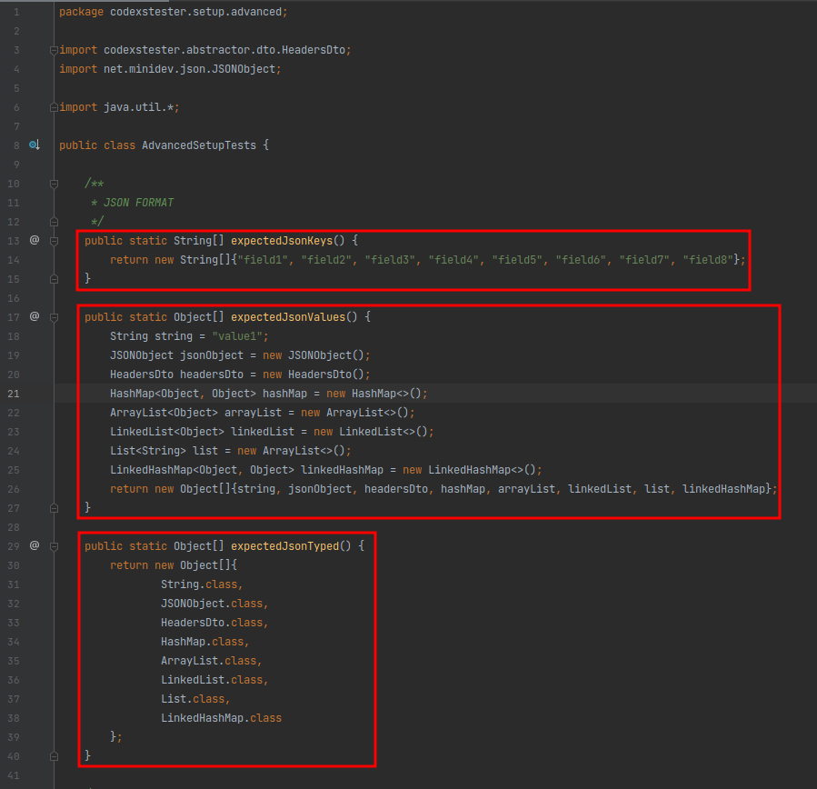

- Configuração do teste responsavel pelo uso das configurações acima

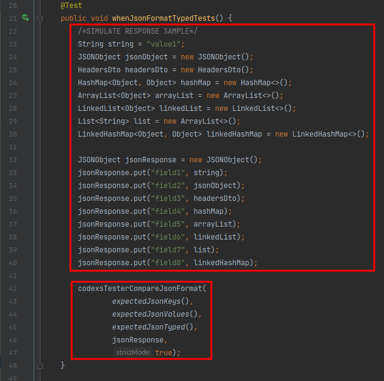

Repare que existe uma definição para testar as respostas dentro do arquivo AdvancedSetupTests.java, e uma simulação de 
resposta dentro do teste whenJsonFormatTypedTests(), sendo que o formato esperado para esse teste é o JSON, conforme o 
proprio nome do teste sugere codexsTesterCompareJsonFormat();

Os testes avançados disponiveis no CODEXS TESTER são:

<pre>
codexsTesterCompareJsonFormat (Esse com 5 possibilidades de uso, veja mais em Detalhes de Funcionalidades)
codexsTesterCompareDtoFormat
codexsTesterCompareHashMapFormat
codexsTesterCompareArrayListFormat
codexsTesterCompareLinkedListFormat
codexsTesterCompareListFormat
codexsTesterCompareLinkedHashMapFormat
</pre>

Cada um dos testes acima correspondem a um determinado tipo de teste conforme o próprio nome do teste, isso facilita o 
entendimento e uso de cada estrutura do tipo de dados.

> IMPORTANTE: Não confunda as configurações avançadas contidas no arquivo AdvancedSetupTests.java com as configurações
> contidas no arquivo DataSourcesSampleTests.java, pois esse ultimo apenas serve como base de dados para os testes e
> o primeiro serve para definir os tipos de dados e valores esperados em uma resposta a um teste qualquer, seja ele via
> REST ou seja ele por meio de uma chamada interna.

- Recursos Avançados DataTree

> Disponivel a partir da release-1.0.3

Os testes avançados foram otimizados para que o programador possa ter mais agilididade na codificação de testes. Essa
melhoria esta presente nos testes avançados por meio de sobrecarga de metodos, ou seja, metodos que podem ser usados
de mais de uma forma, ou com mais de uma possibilidade de parametrização/argumentação.

Os recursos em questão são os mesmos ja descritos e ilustrados anteriormente nesse documento, porém sera apresentado
aqui uma breve demonstração do que pode ser feito nos testes avançados e otimizados.

> NOTA: Esses códigos podem ser obtidos nesse mesmo projeto no path de testes, mais precisamente no arquivo UnitarySampleTests.java

Na figura abaixo temos o uso, veja como ficou muito mais simple e direto a escrita de um teste avançado, o qual ira testar
toda a "arvore mapeada" no seu alvo chamado jsonResponse.

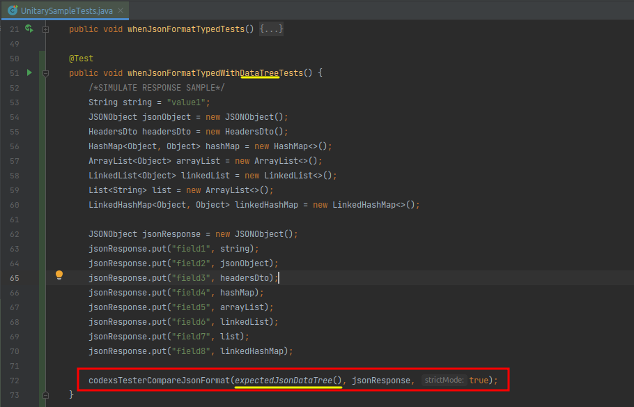

O código do metodo expectedJsonDataTree() foi criado no arquivo AdvancedSetupTests.java que por sua vez esta localidado
no path src/test/java/codexstester/setup/advanced, conforme imagem abaixo o entendimento desse formato de dados para
testes dispensa maiores detalhes.

Veja que foi criado uma matriz de dados chamada Data Tree com todos os dados necessários para um testes completo e 
satisfatório.

Ainda falando de testes avançados com o uso de uma DataTree, é possível montar um teste extremamente complexo com o uso 
de todos os recursos disponiveis no CODEXS TESTER, por exemplo: 

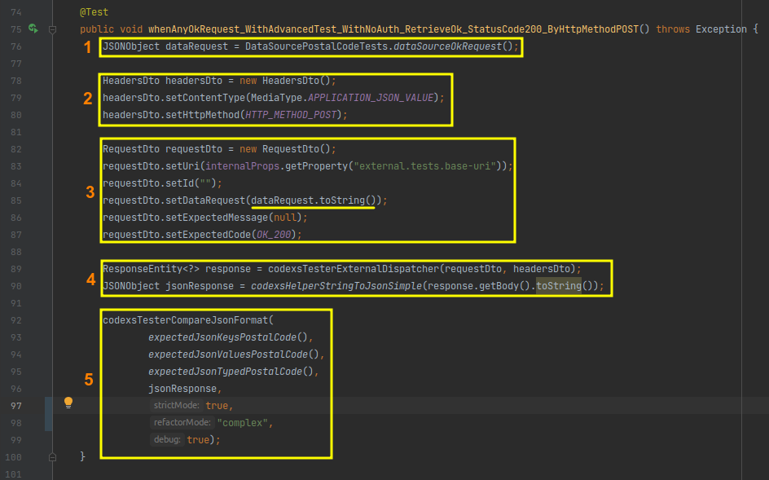

1) No quadro (1) da imagem acima temos a origem dos dados (DataSource)
2) No quadro (2) da imagem acima temos as configurações para o teste atual relacionados a Header, repare que temos um 
Content-Type e um HTTP-METHOD, onde esse ultimo define qual o tipo de verbo que será utilizado para realizar a chamada de teste.
3) No quadro (3) da imagem o corpo da requisição RequestDto, que por sua vez contem o dataRequest e o codigo HTTP esperado
no retorno do teste (HTTP-STATUS-CODE).
4) Ja no quadro (4) existem dus funcionalidade muito importantes e especificas do CODEXS TESTER, codexsTesterExternalDispatcher e 
codexsHelperStringToJsonSimple, onde uma complementa a outra. No caso da funcionalidade codexsTesterExternalDispatcher ela 
nada mais é do que um RestTemplate que executa a chamada externa via REST e retorna um ResponseEntity qualquer, ja no caso 
da funcionalidade codexsHelperStringToJsonSimple, temos um dos muitos CodexsHelpers, que nesse caso realiza a conversão 
precisa e complexa de uma string qualquer (desde que compativel) em um objeto JSON. Isso facilita muita a vida do Tester, 
que por sua vez não precisa se preocupar com importações adicionais ou conversões de dados.
5) Finalmente no quadro (5) temos o teste avançado propriamente dito codexsTesterCompareJsonFormat. Esse teste espera sete 
parametros, auto explicativos, porém vale ressaltar a importanção do strictMode = true, para que a comparação de dados 
seja feita de forma assertiva e em todos os campos.

> NOTA: O parametro refatorMode sera explicado na sessão descritiva de funcionalidades dessa documentação.

<h3>6. Detalhes sobre o CODEXS TESTER</h3>

- Fluxo resumido para um teste programado com o CODEXS TESTER

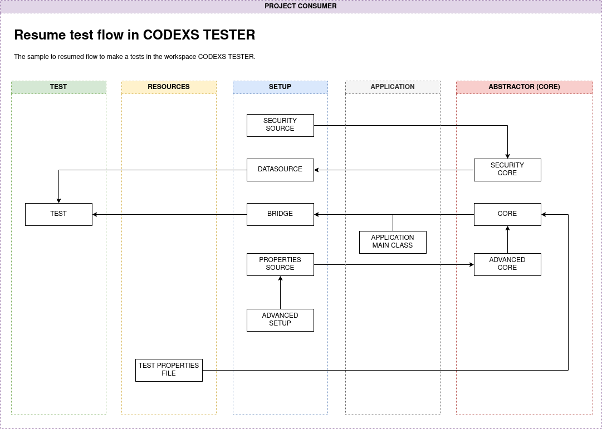

Apenas a titulo de exemplificar com maior detalhes o motor do espaço de trabalho CODEXS TESTER, vemos na figura abaixo
a relação entres os recursos do sistema e do projeto consumidor. Repare o longo caminho que um simples teste pode fazer
para executar as instruções corretamente e completamente, entretanto todo esse ambiente otimiza em quase 90% o trabalho
do programador em desenvolver um teste complexo do zero.

- Fluxo de trabalho completo para um teste programado com o CODEXS TESTER

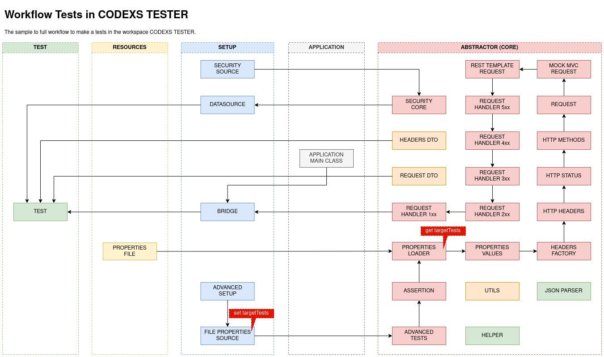

# Programando testes com o espaço de trabalho CODEXS TESTER

> DICA: Todos os testes e recursos disponiveis que o CODEXS TESTER oferece começam com a palavra codexsTester, sendo
> assim, quando for digitado codexsTester no editor/IDE poderá ser listado uma imensa lista de recursos disponíveis no
> CODEXS TESTER, por exemplo: codexsTesterAssertionBool().

> LEMBRETE: Não se esqueça que o arquivo DataSourceSampleTests.java é essencial nos testes e pode ser usado em qualquer
> situação e em qualquer um dos trẽs tipos de testes do CODEXS TESTER. Também não podemos esquecer os arquivos de
> propriedades external.tests.properties, internal.tests.properties e unitary.tests.properties, que são recursos muito
> importantes no espaço de trabalho CODEXS TESTER.

Veremos agora situações onde o CODEXS TESTER pode ser usado, sendo em um teste unitario de soma, um teste externo para 
consultar um endereço residencial e um teste interno para também consultar um endereço residencial.

Os testes serão meramente ilustrativos, porém são testes que ja foram feito e verificados seu correto funcionamento, 
e com esses testes já é possível entender a metodologia de trabalho do CODEXS TESTER.

- Teste:  Soma (Unitary Tests)

Se você abrir o arquivo UnitarySampleTests.java poderá ver que o primeiro teste é uma soma simples de dois numeros, 
conforme mostrado abaixo:

<pre>
    @Test
    public void whenSumAnyNumbersTest() {
        int result = DataSourceSampleTests.dataSourceSampleSum(1000, 10);
        codexsTesterAssertInt(result, 1010);
    }
</pre>

Os testes do tipo unitário são bem simples e não necessitam de muita explicação, caso seja necessário analise com calma o 
arquivo de exemplos SampleTestsUnitaryTests.java e veja por si mesmo que é muito facil de utilizar.

- Teste: Consulta Endereço (External Tests)

Para demonstrar um exemplo de teste do tipo "external" sera realizada uma consulta de endereço usando um codigo postal 
valido e que possa ter como retorno o codigo http 200 (Status Code 200 OK).

No arquivo ExternalSampleTests.java existem muitos exemplos, porém será apresentado apenas 2, ambos para o mesmo 
caso de uso, sendo um com autenticação via OAuth2 e outro sem nenhuma autenticação.

Abaixo esta o teste de exemplo mancionado acima:

<pre>
    @Test
    public void whenAnyOkRequest_WithNoAuth_RetrieveOk_StatusCode200_ByHttpMethodPOST() throws Exception {
        JSONObject dataRequest = DataSourcePostalCodeTests.dataSourceOkRequest();

        HeadersDto headersDto = new HeadersDto();
        headersDto.setContentType(MediaType.APPLICATION_JSON_VALUE);
        headersDto.setHttpMethod(HTTP_METHOD_POST);

        RequestDto requestDto = new RequestDto();
        requestDto.setUri(externalProps.getProperty("external.tests.base-uri"));
        requestDto.setId("");
        requestDto.setDataRequest(dataRequest.toString());
        requestDto.setExpectedMessage(null);

        codexsTesterExternal_StatusCode200_RetrieveOK(headersDto, requestDto);
    }
</pre>

Olhando para o teste acima é visivel qual a finalidade desse teste, tendo em vista seu nome que embora seja muito longo 
oferece com precisão o que esta sendo testado. O corpo desse contem a estrutura padrão utilizada pelo CODEXS TESTER para 
monstar os testes, e essa estrutura é definida por:

- Dados da requisição (BODY REQUEST)
- Header da requisição (HEADER REQUEST)
- Metodo CODEXS TESTER para realizar a requisição (CODEXS TESTER)

Também é possivel observar que existe uma linha de código que faz uso do arquivo DataSourcePostalCodeTests.java o qual 
contem todos os dados para os testes, seja para testar requisições, respostas ou valores unitarios. Esse dado para 
requisição é usado mais abaixo no código como BODY REQUEST, sendo que esse dado sera enviado para testes no formato de 
texto (String).

A configuração da HEADER mostram que a requisição usara o metodo http GET (linha 7) e que seu tipo de conteudo é 
application/json.

Finalizando o corpo desse teste temos efetivamente a chamada codexsTesterExternal_StatusCode200_RetrieveOK 
que por sua vez também deixa claro qual a sua finalidade, ou seja: Um teste externo que espera um codigo "200 OK" como 
resultado, e que já foi definido que sera feito com o uso do metodo http POST.

- Teste: Consulta Endereço usando OAuth2 como autenticação (External Tests)

O teste abaixo segue o mesmo principio do teste acima, porém com informações adicionais, tendo um metodo definido para 
autenticação com OAuth2 e que toda a sua configuração de credenciais e url contida no arquivo de dados SecuritySourceTests.java

Note que as instruções que montam o HEADER são mais detalhadas, contendo o metodo de autenticação e headers adicionais, 
assim como o metodo http POST (HTTP_METHOD_POST).

Por fim o restante do código dispensa comentarios, pois tem o mesmo funcionamento dito anteriormente no teste acima.

<pre>
    @Test
    public void whenAnyOkRequest_WithOAuth2_RetrieveOk_StatusCode200_ByHttpMethodPOST() throws Exception {
        Oauth2RequestTokenDto oauth2RequestTokenDto = codexsTesterSecurityOAuth2Token();
        ResponseEntity&lt;Oauth2ResponseTokenDto&gt; response = codexsTesterExternalOAuth2GetToken(oauth2RequestTokenDto);
        JSONObject dataRequest = DataSourcePostalCodeTests.dataSourceOkRequest();

        HeadersDto headersDto = new HeadersDto();
        headersDto.setAuthorizationBearer(response.getBody().getAccess_token());
        headersDto.setContentType(MediaType.APPLICATION_JSON_VALUE);
        headersDto.setAdditionalName("Access-Code");
        headersDto.setAdditionalValue("XYZ-123");
        headersDto.setHttpMethod(HTTP_METHOD_POST);

        RequestDto requestDto = new RequestDto();
        requestDto.setUri(externalProps.getProperty("external.tests.base-uri"));
        requestDto.setId("");
        requestDto.setDataRequest(dataRequest.toString());
        requestDto.setExpectedMessage(null);

        codexsTesterExternal_StatusCode200_RetrieveOK(headersDto, requestDto);
    }
</pre>

- Teste: Consulta Endereço (Intenal Tests)

A diferença que um teste do tipo "internal" possui com relação ao tipo "external" é quase que invisivel, pois a "mágica" 
ocorre no "backend" do CODEXS TESTER e não na escrita do código. Isso permite que um mesmo conceito de código e testes 
seja usado em ambas situações.

<pre>
    @Test
    public void whenAnyOkRequest_WithNoAuth_RetrieveOk_StatusCode200_ByHttpMethodPOST() throws Exception {
        JSONObject dataRequest = DataSourcePostalCodeTests.dataSourceOkRequest();

        HeadersDto headersDto = new HeadersDto();
        headersDto.setContentType(MediaType.APPLICATION_JSON_VALUE);
        headersDto.setHttpMethod(HTTP_METHOD_POST);

        RequestDto requestDto = new RequestDto();
        requestDto.setUri(internalProps.getProperty("internal.tests.base-uri"));
        requestDto.setId("");
        requestDto.setDataRequest(dataRequest.toString());
        requestDto.setExpectedMessage(null);

        codexsTesterInternal_StatusCode200_RetrieveOK(headersDto, requestDto);
    }
</pre>

- Teste: Consulta Endereço usando OAuth2 como autenticação (Intenal Tests)

<pre>
    @Test
    public void whenAnyOkRequest_WithOAuth2_RetrieveOk_StatusCode200_ByHttpMethodPOST() throws Exception {
        Oauth2RequestTokenDto oauth2RequestTokenDto = codexsTesterSecurityOAuth2Token();
        ResponseEntity&lt;Oauth2ResponseTokenDto&gt; response = codexsTesterInternalOAuth2GetToken(oauth2RequestTokenDto);
        JSONObject dataRequest = DataSourcePostalCodeTests.dataSourceOkRequest();

        HeadersDto headersDto = new HeadersDto();
        headersDto.setAuthorizationBasic(response.getBody().getAccess_token());
        headersDto.setContentType(MediaType.APPLICATION_JSON_VALUE);
        headersDto.setHttpMethod(HTTP_METHOD_POST);

        RequestDto requestDto = new RequestDto();
        requestDto.setUri(internalProps.getProperty("internal.tests.base-uri"));
        requestDto.setId("");
        requestDto.setDataRequest(dataRequest.toString());
        requestDto.setExpectedMessage(null);

        codexsTesterInternal_StatusCode200_RetrieveOK(headersDto, requestDto);
    }
</pre>

- Teste: Consulta Endereço com o Teste Avançado

Conforme mencionado anteriormente os testes avançados possuem um grau de assertividade mais alto do que os convencionais, 
entretanto ainda não foi mostrado como realizar um teste completo utilizando o CODEXS TESTER com os recursos avançados.

Um teste avançado no espaço de trabalho CODEXS TESTER nada mais é do que assegurar que o resultado de um teste seja 
exatamente o esperado, conforme mostrado a seguir:

A seguir sera mostrado em detalhes a programação de um teste do tipo avançado CODEXS TESTER, o qual realiza a consulta 
de um endereço qualquer através de um código postal, valida o codigo HTTP da resposta, o formato da resposta e o tipo 
de dados contido na resposta. Vale ressaltar que os testes do tipo avançado também podem ser do tipo "external", 
"internal" e "unitary", conforme mencionado anteriormente, esses são os tipos de testes disponiveis no espaço de trabalho 
CODEXS TESTER.

De uma forma resumida um tester do tipo "internal" tem o seguinte aspecto

> NOTA: Testes do tipo "internal" usam MockMvc para disparar os request

<pre>
[REQUEST]
HTTP-REQUEST-HEADERS Content-Type: application/json
POST /huntercodexs/postalcode/api/address/12090000

[RESPONSE]
HTTP-STATUS-CODE 200 OK
RESPONSE-BODY JSON {"cep":"12090002","logradouro":"Rua São Caetano","complemento":"","bairro":"Campos Elíseos","localidade":"Taubaté","uf":"SP","ibge":"3554102","gia":"6889","ddd":"12","siafi":"7183"}
</pre>

Ja no caso de testes do tipo "external" 

> NOTA: Testes do tipo "external" usam RestTempalte para disparar os request

<pre>
[REQUEST]
HTTP-REQUEST-HEADERS Content-Type: application/json
POST http://localhost:38080/huntercodexs/postalcode/api/address/12090000

[RESPONSE]
HTTP-STATUS-CODE 200 OK
RESPONSE-BODY JSON {"cep":"12090002","logradouro":"Rua São Caetano","complemento":"","bairro":"Campos Elíseos","localidade":"Taubaté","uf":"SP","ibge":"3554102","gia":"6889","ddd":"12","siafi":"7183"}
</pre>

Veja que a única diferença entre os testes "internal" e "external" é como o REQUEST é feito, ou seja, por meio do MockMvc 
ou por meio do RestTemplate, onde é possível observar a diferença de URL e URI.

Como ja dito anteriormente nesse documento, para iniciar uma configuração e programação de testes, é preciso seguir algumas 
regras do CODEXS TESTER. Em primeiro lugar certifique-se de que o escopo/alvo de testes esta corretamente configurado 
no arquivo FilePropertiesSourceTests.java, conforme orientação abaixo

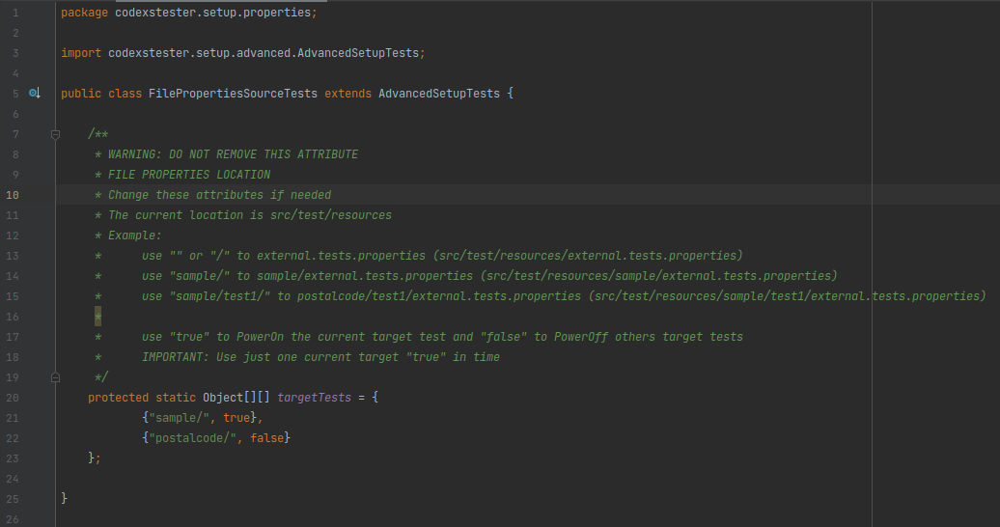

Veja que foi definido um escopo de trabalho para o CODEXS TESTER com o nome de postalcode, ou seja, no path src/test/resources da 
aplicação deverá existir uma pasta ou "package" com o nome postalcode src/test/resources/postalcode.

A proxima etapa consiste na definição dos tipos de dados, nome de campos, valores dos campos e tipos de dados dos 
campos, sendo que essa configuração deve ser feita no arquivo AdvancedSetupTests.java contido no path setup/advanced do 
CODEXS TESTER src/test/java/codexstester/setup/advanced/AdvancedSetupTests.java. Veja abaixo a configuração esperada 
para o teste em questão

<pre>
    /**
     * POSTAL CODE ADVANCED TESTS - JSON TYPED
     */
    public static String[] expectedJsonKeysPostalCode() {
        return new String[]{
                "cep",
                "logradouro",
                "complemento",
                "bairro",
                "localidade",
                "uf",
                "ibge",
                "gia",
                "ddd",
                "siafi"
        };
    }

    public static Object[] expectedJsonValuesPostalCode() {
        return new Object[]{
                "12090002",
                "Rua São Caetano",
                "",
                "Campos Elíseos",
                "Taubaté",
                "SP",
                "3554102",
                "6889",
                "12",
                "7183"
        };
    }

    public static Object[] expectedJsonTypedPostalCode() {
        return new Object[]{
                String.class,
                String.class,
                String.class,
                String.class,
                String.class,
                String.class,
                String.class,
                String.class,
                String.class,
                String.class
        };
    }
</pre>

Repare nos seguintes aspectos da configuraçao, veja que temos três métodos que possuem Arrays em seu interior, os quais 
devem ter o mesmo tamanho, por exemplo Array(10), veja também que os nomes dos metodos são auto explicativos sobre sua 
finalidade. Ainda nesse ponto, esta configurado que os campos a serem testados, serão todos do tipo String.class e que 
os valores esperados estão definidos no metodo expectedJsonValuesPostalCode().

> STRICT MODE: Quando definido um modo rigoroso de teste (strictMode=true), o CODEXS TESTER ira testar também os valores 
> contidos no informação a ser testada, ou seja, eles devem ser de mesmo nome, tipo e valor. Caso não seja viavel usar 
> essa funcionalidade, use o modo não rigoroso (strictMode-false), nesse caso sera validado apenas nome e tipo de dados.

O proximo passo consiste na configuração do arquivo src/test/resources/postalcode/internal.tests.properties e também do 
arquivo src/test/resources/postalcode/external.tests.properties, informando os dados conforme (nesse caso) mostrado abaixo

- internal.tests.properties

<pre>
internal.tests.base-url=/huntercodexs/codexs-tester/api
internal.tests.base-uri=/address
</pre>

- external.tests.properties

<pre>
external.tests.base-url=http://localhost:38080
external.tests.base-uri=/huntercodexs/codexs-tester/api/address
</pre>

Continuando, o proximo passo esta em programar os dados para o REQUEST (datasource), para isso sera criado um metodo 
dentro do arquivo src/test/java/codexstester/setup/datasource/DataSourcePostalCodeTests.java, ***repare que o nome no 
arquivo tem uma auto explicação sobre sua finalidade***.

> NOTA: Esse procedimento tem a finalidade de manter o código e a estrutura do projeto organizada e limpa, entretando 
> não é um obrigatório que seja feito assim, é possível inserir esses dados diretamento nos testes, ou então criar o 
> metodo dentro do proprio arquivo de teste

<pre>
    public static JSONObject dataSourceOkRequest() {
        JSONObject jsonObject = new JSONObject();
        jsonObject.appendField("rulesCode", "XYZ12345");
        jsonObject.appendField("postalCode", "12090002");
        jsonObject.appendField("webhook", "");
        return jsonObject;
    }
</pre>

Com isso, ou melhor, com as configurações expostas acima, é possível iniciar a programação dos testes conforme mostrado 
abaixo.

- Teste do tipo "external"

A imagem acima, mostra um teste avançado CODEXS TESTER, onde é possível notar os pontos importantes desse teste e que 
merecem atenção, veja abaixo:

- (1) Extensão da BRIDGE ja mencionada nesse documento e que faz a ligação do @Test com o CORE do CODEXS TESTER
- (2) Uso do arquivo (datasource) para iniciar os dados da requisição
- (3) Definição do metodo HTTP-METHOD para a requisição, nesse caso POST
- (4) O código HTTP-STATUS-CODE esperado para essa requisição
- (5) Na primeira linha o codexsTesterExternalDispatcher dispara literalmente a requisição, na segunda linha a resposta
da requisição é convertida no formato esperado JSON.
- (6) O metodo principal desse teste, o codexsTesterCompareJsonFormat, que usa toda a configuração feita anteriormente
no escopo do teste avançado, note que ele esta com o strictMode=false, ou seja, os valores não serão avaliados, pois de
acordo com o programador, eles não são relevantes para o teste.

- Teste do tipo "internal"

A imagem acima mostra um teste avançado do tipo "internal" do CODEXS TESTER, com caracteristicas bem semelhantes ao teste 
to tipo "external" mostrado acima, sendo assim dispensa detalhes mais profundos. Entretanto, repare que no item (6) da 
imagem, na primeira linha o metodo usado é codexsTesterInternalDispatcher() e nao codexsTesterExternalDispatcher(), ou seja, 
o escopo to teste é postalcode/internal.tests.properties contido no path src/test/resources/postalcode/internal.tests.properties, 
e o tipo de teste é "internal", conforme marcado no item (4).

- Exemplo de teste Avançado

<pre>
    @Test
    public void whenRequestToSummarySync_WithDispatcher_Compare_WithAdvancedTest_RetrieveCreated_201_POST() throws Exception {
        String tcn = codexsHelperGuideGenerator(null);
        JSONObject dataRequest = restRequestFakeToSummaryNetJSON(tcn, null);

        HeadersDto headersDto = new HeadersDto();
        headersDto.setAuthorizationBearer(oauth2Token());
        headersDto.setContentType(MediaType.APPLICATION_JSON_VALUE);
        headersDto.setHttpMethod(HTTP_METHOD_POST);

        RequestDto requestDto = new RequestDto();
        requestDto.setExpectedCode(CREATED_201);
        requestDto.setUri(externalProps.getProperty("external.tests.base-uri"));
        requestDto.setId("");
        requestDto.setDataRequest(dataRequest.toString());
        requestDto.setExpectedMessage(null);

        ResponseEntity<?> dispatcherResult = codexsTesterExternalDispatcher(requestDto, headersDto);

        Object[] fields = new Object[]{
                "summary",
                "searchRequest",
                "searchRequestEnrichment",
                "dataSources",
                "riskFactors",
                "records",
                "warnings"};

        org.json.JSONObject jsonResponse = codexsTesterOrgJsonFromLinkedHashMap(
                (LinkedHashMap<?, ?>) dispatcherResult.getBody(),
                fields,
                false);

        codexsTesterCompareJsonFormat(
                expectedSyncResponseFromQuantifindDataTree(tcn),
                jsonResponse,
                true,
                "complex",
                true);
    }
</pre>

# Detalhes de Funcionalidades disponiveis no CODEXS TESTER

- Helpers

<pre>
public static String codexsHelperMd5(String data);
public static String codexsHelperGuideGenerator(String tcn);
public static String codexsHelperToday();
public static String codexsHelperOneYearAgo();
public static String codexsHelperFiveYearAgo();
public static void codexsHelperLogTerm(String title, Object data, boolean line);
public static void codexsHelperLogTermTests(String title, Object data, boolean line);
public static JSONObject codexsHelperQueryStringToJson(String queryString);
public static String codexsHelperJsonToString(JSONObject json);
public static JSONObject codexsHelperStringToJson(String string);
</pre>

- Refactors e Parser

<pre>
public static String codexsTesterParseJsonString(String jsonString, boolean debug) throws Exception
public static org.json.JSONObject codexsTesterParseOrgJsonObject(Object jsonCandidate, boolean debug) throws Exception
public static net.minidev.json.JSONObject codexsTesterParseNetJsonObject(Object jsonCandidate, boolean debug) throws Exception
public static String codexsTesterJsonRefactorUrl(Object jsonString, boolean debug) throws Exception
public static String codexsTesterJsonRefactorEscapeChars(Object jsonString, boolean debug) throws Exception
public static String codexsTesterJsonRefactorSpaces(Object jsonString, boolean debug) throws Exception
public static String codexsTesterJsonRefactorArrayFix(Object jsonString, boolean debug) throws Exception
public static String codexsTesterJsonRefactorComplexArray(Object jsonString, boolean debug) throws Exception
public static String codexsTesterJsonRefactorArrayFromString(Object jsonString, boolean debug) throws Exception
public static String codexsTesterJsonRefactorObjects(Object jsonString, boolean debug) throws Exception
public static String codexsTesterJsonRefactorDatetime(Object jsonString, boolean debug) throws Exception
public static String codexsTesterJsonRefactor(String refactorMode, Object jsonString, boolean debug) throws Exception
public static org.json.JSONObject codexsTesterObjectToOrgJson(Object object, boolean debug) throws Exception
public static net.minidev.json.JSONObject codexsTesterObjectToNetJson(Object object, boolean debug) throws Exception
public static boolean codexsTesterCheckJsonCompatibility(Object jsonString, boolean debug) throws Exception
public static net.minidev.json.JSONObject codexsTesterOrgJsonToNetJson(org.json.JSONObject jsonOrg, boolean debug) throws Exception
public static org.json.JSONObject codexsTesterNetJsonToOrgJson(net.minidev.json.JSONObject jsonNet, boolean debug) throws Exception
public static org.json.JSONObject codexsTesterOrgJsonFromLinkedHashMap(LinkedHashMap<?, ?> linkedHashMap, Object[] expectedFields, boolean debug) throws Exception
</pre>

- Asserts

<pre>
protected void codexsTesterAssertExact(String ref, String text);
protected void codexsTesterAssertObject(Object obj1, Object obj2);
protected void codexsTesterAssertText(String ref, String text);
protected void codexsTesterAssertRegExp(String regExp, String text);
protected void codexsTesterAssertInt(int num1, int num2);
protected void codexsTesterAssertBool(boolean val, boolean flag);
protected void codexsTesterAssertNotNull(Object obj);
protected void codexsTesterAssertNull(Object obj);
protected void codexsTesterAssertNumber(String number);
protected void codexsTesterAssertCpf(String cpf);
protected void codexsTesterAssertEmail(String email);
protected void codexsTesterAssertPhone(String phoneNumber);
protected void codexsTesterAssertSum(int a, int b, int c);
</pre>

- Dispatchers

<pre>
protected ResponseEntity&lt;?&lt; codexsTesterExternalDispatcher(RequestDto requestDto, HeadersDto headersDto);
protected String codexsTesterInternalDispatcher(RequestDto requestDto, HeadersDto headersDto) throws Exception
protected static ResponseEntity&lt;Oauth2ResponseTokenDto&gt; codexsTesterExternalOAuth2GetToken(Oauth2RequestTokenDto oauth2RequestTokenDto);
protected static ResponseEntity&lt;Object&gt; codexsTesterExternalOAuth2CheckToken(Oauth2RequestCheckTokenDto oauth2RequestCheckTokenDto);
protected static ResponseEntity&lt;Oauth2ResponseTokenDto&lt; codexsTesterInternalOAuth2GetToken(Oauth2RequestTokenDto oauth2RequestTokenDto);
protected static ResponseEntity&lt;Object&lt; codexsTesterInternalOAuth2CheckToken(Oauth2RequestCheckTokenDto oauth2RequestCheckTokenDto);
</pre>

- Advanceds
<pre>
public void codexsTesterCompareJsonFormat(
            Object[][] expectedJsonDataTree,
            org.json.JSONObject jsonCompare,
            boolean strictMode,
            String refactorMode, /*none,easy,middle,regular,complex*/
            boolean debug
    ) throws Exception

public void codexsTesterCompareJsonFormat(
            Object[][] expectedJsonDataTree,
            net.minidev.json.JSONObject jsonCompare,
            boolean strictMode,
            String refactorMode, /*none,easy,middle,regular,complex*/
            boolean debug
    ) throws Exception

public void codexsTesterCompareJsonFormat(
            String[] jsonKeys,
            Object[] jsonValues,
            Object[] jsonTyped,
            net.minidev.json.JSONObject jsonCompare,
            boolean strictMode,
            String refactorMode, /*none,easy,middle,regular,complex*/
            boolean debug
    ) throws Exception

public void codexsTesterCompareJsonFormat(
            String[] jsonKeys,
            Object[] jsonValues,
            Object[] jsonTyped,
            org.json.JSONObject jsonCompare,
            boolean strictMode,
            String refactorMode, /*none,easy,middle,regular,complex*/
            boolean debug
    ) throws Exception

public void codexsTesterCompareJsonFormat(
            Object[][] expectedJsonDataTree,
            Object[] dataCompare,
            boolean strictMode
    ) throws Exception

public void codexsTesterCompareDtoFormat(
            Object[][] expectedDtoDataTree,
            Object[] dtoCompare,
            Class<?> dtoClass,
            boolean strictMode
    )

public void codexsTesterCompareDtoFormat(
            Object[][] expectedDtoDataTree,
            Object dtoCompare,
            Class<?> dtoClass,
            boolean strictMode
    )

public void codexsTesterCompareDtoFormat(
            String[] dtoValues,
            Object dtoCompare,
            Class<?> dtoClass,
            boolean strictMode
    )

 public void codexsTesterCompareHashMapFormat(
            Object[][] expectedHashMapDataTree,
            HashMap<Object, Object> hashMapCompare,
            boolean strictMode
    )

public void codexsTesterCompareHashMapFormat(
            String[] hashMapKeys,
            Object[] hashMapValues,
            Object[] hashMapTyped,
            HashMap<Object, Object> hashMapCompare,
            boolean strictMode
    )

public void codexsTesterCompareArrayListFormat(
            Object[][] expectedArrayListDataTree,
            ArrayList<Object> arrayListCompare,
            boolean strictMode
    )

public void codexsTesterCompareArrayListFormat(
            Object[] arrayListValues,
            Object[] arrayListTyped,
            ArrayList<Object> arrayListCompare,
            boolean strictMode
    )

public void codexsTesterCompareLinkedListFormat(
            Object[][] expectedLinkedListDataTree,
            LinkedList<Object> linkedListCompare,
            boolean strictMode
    )

public void codexsTesterCompareLinkedListFormat(
            Object[] linkedListValues,
            Object[] linkedListTyped,
            LinkedList<Object> linkedListCompare,
            boolean strictMode
    )

public void codexsTesterCompareListFormat(
            Object[][] expectedListDataTree,
            List<String> listCompare,
            boolean strictMode
    )

public void codexsTesterCompareListFormat(
            Object[] listValues,
            Object[] listTyped,
            List<String> listCompare,
            boolean strictMode
    )

public void codexsTesterCompareLinkedHashMapFormat(
            Object[][] expectedLinkedHashMapDataTree,
            LinkedHashMap<Object, Object> linkedHashMapCompare,
            boolean strictMode
    )

public void codexsTesterCompareLinkedHashMapFormat(
            String[] linkedHashMapKeys,
            Object[] linkedHashMapValues,
            Object[] linkedHashMapTyped,
            LinkedHashMap<Object, Object> linkedHashMapCompare,
            boolean strictMode
    )
</pre>

- Requesters

<pre>
protected void codexsTesterExternal_StatusCode400_RetrieveBadRequest(HeadersDto headersDto, RequestDto requestDto) throws Exception
protected void codexsTesterExternal_StatusCode401_RetrieveUnauthorized(HeadersDto headersDto, RequestDto requestDto) throws Exception
protected void codexsTesterExternal_StatusCode402_RetrievePaymentRequired(HeadersDto headersDto, RequestDto requestDto) throws Exception
protected void codexsTesterExternal_StatusCode403_RetrieveForbidden(HeadersDto headersDto, RequestDto requestDto) throws Exception
protected void codexsTesterExternal_StatusCode404_RetrieveNotFound(HeadersDto headersDto, RequestDto requestDto) throws Exception
protected void codexsTesterExternal_StatusCode405_RetrieveMethodNotAllowed(HeadersDto headersDto, RequestDto requestDto) throws Exception
protected void codexsTesterExternal_StatusCode406_RetrieveNotAcceptable(HeadersDto headersDto, RequestDto requestDto) throws Exception
protected void codexsTesterExternal_StatusCode407_RetrieveProxyAuthenticationRequired(HeadersDto headersDto, RequestDto requestDto) throws Exception
protected void codexsTesterExternal_StatusCode408_RetrieveRequestTimeout(HeadersDto headersDto, RequestDto requestDto) throws Exception
protected void codexsTesterExternal_StatusCode409_RetrieveConflict(HeadersDto headersDto, RequestDto requestDto) throws Exception
protected void codexsTesterExternal_StatusCode410_RetrieveGone(HeadersDto headersDto, RequestDto requestDto) throws Exception
protected void codexsTesterExternal_StatusCode411_RetrieveLengthRequired(HeadersDto headersDto, RequestDto requestDto) throws Exception
protected void codexsTesterExternal_StatusCode412_RetrievePreconditionFailed(HeadersDto headersDto, RequestDto requestDto) throws Exception
protected void codexsTesterExternal_StatusCode413_RetrievePayloadTooLarge(HeadersDto headersDto, RequestDto requestDto) throws Exception
protected void codexsTesterExternal_StatusCode414_RetrieveUriTooLong(HeadersDto headersDto, RequestDto requestDto) throws Exception
protected void codexsTesterExternal_StatusCode415_RetrieveUnsupportedMediaType(HeadersDto headersDto, RequestDto requestDto) throws Exception
protected void codexsTesterExternal_StatusCode416_RetrieveRequestedRangeNotSatisfiable(HeadersDto headersDto, RequestDto requestDto) throws Exception
protected void codexsTesterExternal_StatusCode417_RetrieveExpectationFailed(HeadersDto headersDto, RequestDto requestDto) throws Exception
protected void codexsTesterExternal_StatusCode418_RetrieveImATeapotLengthRequired(HeadersDto headersDto, RequestDto requestDto) throws Exception
protected void codexsTesterExternal_StatusCode421_RetrieveMisDirectedRequest(HeadersDto headersDto, RequestDto requestDto) throws Exception
protected void codexsTesterExternal_StatusCode422_RetrieveUnprocessableEntity(HeadersDto headersDto, RequestDto requestDto) throws Exception
protected void codexsTesterExternal_StatusCode423_RetrieveLocked(HeadersDto headersDto, RequestDto requestDto) throws Exception
protected void codexsTesterExternal_StatusCode424_RetrieveFailedDependency(HeadersDto headersDto, RequestDto requestDto) throws Exception
protected void codexsTesterExternal_StatusCode425_RetrieveTooEarly(HeadersDto headersDto, RequestDto requestDto) throws Exception
protected void codexsTesterExternal_StatusCode426_RetrieveUpgradeRequired(HeadersDto headersDto, RequestDto requestDto) throws Exception
protected void codexsTesterExternal_StatusCode428_RetrievePreConditionRequired(HeadersDto headersDto, RequestDto requestDto) throws Exception
protected void codexsTesterExternal_StatusCode429_RetrieveTooManyRequest(HeadersDto headersDto, RequestDto requestDto) throws Exception
protected void codexsTesterExternal_StatusCode431_RetrieveRequestHeaderFieldsTooLarge(HeadersDto headersDto, RequestDto requestDto) throws Exception
protected void codexsTesterExternal_StatusCode451_RetrieveUnavailableForLegalReasons(HeadersDto headersDto, RequestDto requestDto) throws Exception
protected void codexsTesterExternal_StatusCode100_RetrieveContinue(HeadersDto headersDto, RequestDto requestDto) throws Exception
protected void codexsTesterExternal_StatusCode101_RetrieveSwitchingProtocol(HeadersDto headersDto, RequestDto requestDto) throws Exception
protected void codexsTesterExternal_StatusCode102_RetrieveProcessing(HeadersDto headersDto, RequestDto requestDto) throws Exception
protected void codexsTesterExternal_StatusCode103_RetrieveEarlyHints(HeadersDto headersDto, RequestDto requestDto) throws Exception
protected void codexsTesterExternal_StatusCode500_RetrieveInternalServerError(HeadersDto headersDto, RequestDto requestDto) throws Exception
protected void codexsTesterExternal_StatusCode501_RetrieveNotImplemented(HeadersDto headersDto, RequestDto requestDto) throws Exception
protected void codexsTesterExternal_StatusCode502_RetrieveBadGateway(HeadersDto headersDto, RequestDto requestDto) throws Exception
protected void codexsTesterExternal_StatusCode503_RetrieveServiceUnavailable(HeadersDto headersDto, RequestDto requestDto) throws Exception
protected void codexsTesterExternal_StatusCode504_RetrieveGatewayTimeout(HeadersDto headersDto, RequestDto requestDto) throws Exception
protected void codexsTesterExternal_StatusCode505_RetrieveHttpVersionNotSupported(HeadersDto headersDto, RequestDto requestDto) throws Exception
protected void codexsTesterExternal_StatusCode506_RetrieveVariantAlsoNegotiates(HeadersDto headersDto, RequestDto requestDto) throws Exception
protected void codexsTesterExternal_StatusCode507_RetrieveInsuficientStorage(HeadersDto headersDto, RequestDto requestDto) throws Exception
protected void codexsTesterExternal_StatusCode508_RetrieveLoopDetected(HeadersDto headersDto, RequestDto requestDto) throws Exception
protected void codexsTesterExternal_StatusCode510_RetrieveNotExtended(HeadersDto headersDto, RequestDto requestDto) throws Exception
protected void codexsTesterExternal_StatusCode511_RetrieveNetworkAuthenticationRequired(HeadersDto headersDto, RequestDto requestDto) throws Exception
protected void codexsTesterExternal_StatusCode300_RetrieveMultipleChoice(HeadersDto headersDto, RequestDto requestDto) throws Exception
protected void codexsTesterExternal_StatusCode301_RetrieveMovedPermanently(HeadersDto headersDto, RequestDto requestDto) throws Exception
protected void codexsTesterExternal_StatusCode302_RetrieveFound(HeadersDto headersDto, RequestDto requestDto) throws Exception
protected void codexsTesterExternal_StatusCode303_RetrieveSeeOther(HeadersDto headersDto, RequestDto requestDto) throws Exception
protected void codexsTesterExternal_StatusCode304_RetrieveNotModified(HeadersDto headersDto, RequestDto requestDto) throws Exception
protected void codexsTesterExternal_StatusCode305_RetrieveUseProxyDeprecated(HeadersDto headersDto, RequestDto requestDto) throws Exception
protected void codexsTesterExternal_StatusCode306_RetrieveUnusedDeprecated(HeadersDto headersDto, RequestDto requestDto) throws Exception
protected void codexsTesterExternal_StatusCode307_RetrieveTemporaryRedirect(HeadersDto headersDto, RequestDto requestDto) throws Exception
protected void codexsTesterExternal_StatusCode308_RetrievePermanentRedirect(HeadersDto headersDto, RequestDto requestDto) throws Exception
protected void codexsTesterExternal_StatusCode200_RetrieveOK(HeadersDto headersDto, RequestDto requestDto) throws Exception
protected void codexsTesterExternal_StatusCode201_RetrieveCreated(HeadersDto headersDto, RequestDto requestDto) throws Exception
protected void codexsTesterExternal_StatusCode202_RetrieveAccepted(HeadersDto headersDto, RequestDto requestDto) throws Exception
protected void codexsTesterExternal_StatusCode203_RetrieveNonAuthoritativeInformation(HeadersDto headersDto, RequestDto requestDto) throws Exception
protected void codexsTesterExternal_StatusCode204_RetrieveNoContent(HeadersDto headersDto, RequestDto requestDto) throws Exception
protected void codexsTesterExternal_StatusCode205_RetrieveResetContent(HeadersDto headersDto, RequestDto requestDto) throws Exception
protected void codexsTesterExternal_StatusCode206_RetrievePartialContent(HeadersDto headersDto, RequestDto requestDto) throws Exception
protected void codexsTesterExternal_StatusCode207_RetrieveMultStatusWebdav(HeadersDto headersDto, RequestDto requestDto) throws Exception
protected void codexsTesterExternal_StatusCode208_RetrieveMultiStatus(HeadersDto headersDto, RequestDto requestDto) throws Exception
protected void codexsTesterExternal_StatusCode226_RetrieveImUsedHttpDeltaEncoding(HeadersDto headersDto, RequestDto requestDto) throws Exception
protected void codexsTesterInternal_StatusCode100_RetrieveContinue(HeadersDto headersDto, RequestDto requestDto) throws Exception
protected void codexsTesterInternal_StatusCode101_RetrieveSwitchingProtocol(HeadersDto headersDto, RequestDto requestDto) throws Exception
protected void codexsTesterInternal_StatusCode102_RetrieveProcessing(HeadersDto headersDto, RequestDto requestDto) throws Exception
protected void codexsTesterInternal_StatusCode103_RetrieveEarlyHints(HeadersDto headersDto, RequestDto requestDto) throws Exception
protected void codexsTesterInternal_StatusCode500_RetrieveInternalServerError(HeadersDto headersDto, RequestDto requestDto) throws Exception
protected void codexsTesterInternal_StatusCode501_RetrieveNotImplemented(HeadersDto headersDto, RequestDto requestDto) throws Exception
protected void codexsTesterInternal_StatusCode502_RetrieveBadGateway(HeadersDto headersDto, RequestDto requestDto) throws Exception
protected void codexsTesterInternal_StatusCode503_RetrieveServiceUnavailable(HeadersDto headersDto, RequestDto requestDto) throws Exception
protected void codexsTesterInternal_StatusCode504_RetrieveGatewayTimeout(HeadersDto headersDto, RequestDto requestDto) throws Exception
protected void codexsTesterInternal_StatusCode505_RetrieveHttpVersionNotSupported(HeadersDto headersDto, RequestDto requestDto) throws Exception
protected void codexsTesterInternal_StatusCode506_RetrieveVariantAlsoNegotiates(HeadersDto headersDto, RequestDto requestDto) throws Exception
protected void codexsTesterInternal_StatusCode507_RetrieveInsuficientStorage(HeadersDto headersDto, RequestDto requestDto) throws Exception
protected void codexsTesterInternal_StatusCode508_RetrieveLoopDetected(HeadersDto headersDto, RequestDto requestDto) throws Exception
protected void codexsTesterInternal_StatusCode510_RetrieveNotExtended(HeadersDto headersDto, RequestDto requestDto) throws Exception
protected void codexsTesterInternal_StatusCode511_RetrieveNetworkAuthenticationRequired(HeadersDto headersDto, RequestDto requestDto) throws Exception

protected void codexsTesterInternal_StatusCode200_RetrieveOK(HeadersDto headersDto, RequestDto requestDto) throws Exception
protected void codexsTesterInternal_StatusCode201_RetrieveCreated(HeadersDto headersDto, RequestDto requestDto) throws Exception
protected void codexsTesterInternal_StatusCode202_RetrieveAccepted(HeadersDto headersDto, RequestDto requestDto) throws Exception
protected void codexsTesterInternal_StatusCode203_RetrieveNonAuthoritativeInformation(HeadersDto headersDto, RequestDto requestDto) throws Exception
protected void codexsTesterInternal_StatusCode204_RetrieveNoContent(HeadersDto headersDto, RequestDto requestDto) throws Exception
protected void codexsTesterInternal_StatusCode205_RetrieveResetContent(HeadersDto headersDto, RequestDto requestDto) throws Exception
protected void codexsTesterInternal_StatusCode206_RetrievePartialContent(HeadersDto headersDto, RequestDto requestDto) throws Exception
protected void codexsTesterInternal_StatusCode207_RetrieveMultStatusWebdav(HeadersDto headersDto, RequestDto requestDto) throws Exception
protected void codexsTesterInternal_StatusCode208_RetrieveMultiStatus(HeadersDto headersDto, RequestDto requestDto) throws Exception
protected void codexsTesterInternal_StatusCode226_RetrieveImUsedHttpDeltaEncoding(HeadersDto headersDto, RequestDto requestDto) throws Exception
protected void codexsTesterInternal_StatusCode300_RetrieveMultipleChoice(HeadersDto headersDto, RequestDto requestDto) throws Exception
protected void codexsTesterInternal_StatusCode301_RetrieveMovedPermanently(HeadersDto headersDto, RequestDto requestDto) throws Exception
protected void codexsTesterInternal_StatusCode302_RetrieveFound(HeadersDto headersDto, RequestDto requestDto) throws Exception
protected void codexsTesterInternal_StatusCode303_RetrieveSeeOther(HeadersDto headersDto, RequestDto requestDto) throws Exception
protected void codexsTesterInternal_StatusCode304_RetrieveNotModified(HeadersDto headersDto, RequestDto requestDto) throws Exception
protected void codexsTesterInternal_StatusCode305_RetrieveUseProxyDeprecated(HeadersDto headersDto, RequestDto requestDto) throws Exception
protected void codexsTesterInternal_StatusCode306_RetrieveUnusedDeprecated(HeadersDto headersDto, RequestDto requestDto) throws Exception
protected void codexsTesterInternal_StatusCode307_RetrieveTemporaryRedirect(HeadersDto headersDto, RequestDto requestDto) throws Exception
protected void codexsTesterInternal_StatusCode308_RetrievePermanentRedirect(HeadersDto headersDto, RequestDto requestDto) throws Exception
protected void codexsTesterInternal_StatusCode400_RetrieveBadRequest(HeadersDto headersDto, RequestDto requestDto) throws Exception
protected void codexsTesterInternal_StatusCode401_RetrieveUnauthorized(HeadersDto headersDto, RequestDto requestDto) throws Exception
protected void codexsTesterInternal_StatusCode402_RetrievePaymentRequired(HeadersDto headersDto, RequestDto requestDto) throws Exception
protected void codexsTesterInternal_StatusCode403_RetrieveForbidden(HeadersDto headersDto, RequestDto requestDto) throws Exception
protected void codexsTesterInternal_StatusCode404_RetrieveNotFound(HeadersDto headersDto, RequestDto requestDto) throws Exception
protected void codexsTesterInternal_StatusCode405_RetrieveMethodNotAllowed(HeadersDto headersDto, RequestDto requestDto) throws Exception
protected void codexsTesterInternal_StatusCode406_RetrieveNotAcceptable(HeadersDto headersDto, RequestDto requestDto) throws Exception
protected void codexsTesterInternal_StatusCode407_RetrieveProxyAuthenticationRequired(HeadersDto headersDto, RequestDto requestDto) throws Exception
protected void codexsTesterInternal_StatusCode408_RetrieveRequestTimeout(HeadersDto headersDto, RequestDto requestDto) throws Exception
protected void codexsTesterInternal_StatusCode409_RetrieveConflict(HeadersDto headersDto, RequestDto requestDto) throws Exception
protected void codexsTesterInternal_StatusCode410_RetrieveGone(HeadersDto headersDto, RequestDto requestDto) throws Exception
protected void codexsTesterInternal_StatusCode411_RetrieveLengthRequired(HeadersDto headersDto, RequestDto requestDto) throws Exception
protected void codexsTesterInternal_StatusCode412_RetrievePreconditionFailed(HeadersDto headersDto, RequestDto requestDto) throws Exception
protected void codexsTesterInternal_StatusCode413_RetrievePayloadTooLarge(HeadersDto headersDto, RequestDto requestDto) throws Exception
protected void codexsTesterInternal_StatusCode414_RetrieveUriTooLong(HeadersDto headersDto, RequestDto requestDto) throws Exception
protected void codexsTesterInternal_StatusCode415_RetrieveUnsupportedMediaType(HeadersDto headersDto, RequestDto requestDto) throws Exception
protected void codexsTesterInternal_StatusCode416_RetrieveRequestedRangeNotSatisfiable(HeadersDto headersDto, RequestDto requestDto) throws Exception
protected void codexsTesterInternal_StatusCode417_RetrieveExpectationFailed(HeadersDto headersDto, RequestDto requestDto) throws Exception
protected void codexsTesterInternal_StatusCode418_RetrieveImATeapotLengthRequired(HeadersDto headersDto, RequestDto requestDto) throws Exception
protected void codexsTesterInternal_StatusCode421_RetrieveMisDirectedRequest(HeadersDto headersDto, RequestDto requestDto) throws Exception
protected void codexsTesterInternal_StatusCode422_RetrieveUnprocessableEntity(HeadersDto headersDto, RequestDto requestDto) throws Exception
protected void codexsTesterInternal_StatusCode423_RetrieveLocked(HeadersDto headersDto, RequestDto requestDto) throws Exception
protected void codexsTesterInternal_StatusCode424_RetrieveFailedDependency(HeadersDto headersDto, RequestDto requestDto) throws Exception
protected void codexsTesterInternal_StatusCode425_RetrieveTooEarly(HeadersDto headersDto, RequestDto requestDto) throws Exception
protected void codexsTesterInternal_StatusCode426_RetrieveUpgradeRequired(HeadersDto headersDto, RequestDto requestDto) throws Exception
protected void codexsTesterInternal_StatusCode428_RetrievePreConditionRequired(HeadersDto headersDto, RequestDto requestDto) throws Exception
protected void codexsTesterInternal_StatusCode429_RetrieveTooManyRequest(HeadersDto headersDto, RequestDto requestDto) throws Exception
protected void codexsTesterInternal_StatusCode431_RetrieveRequestHeaderFieldsTooLarge(HeadersDto headersDto, RequestDto requestDto) throws Exception
protected void codexsTesterInternal_StatusCode451_RetrieveUnavailableForLegalReasons(HeadersDto headersDto, RequestDto requestDto) throws Exception
</pre>

Aproveite da melhor forma possível esse pequeno trabalho !

----
Todos os direitos reservados a Huntercodexs &copy; 2022 - Desenvolvimento de Software
Mantido por Jereelton Teixeira (jereelton-devel)
